# 知识库模块全功能巡检报告

巡检时间：2026-07-13 22:03:11 +08:00  
巡检环境：当前用户已登录的 Chrome 浏览器，站点 `http://localhost:8080`，账号显示为“张工 / 运行值班”。  
巡检方式：使用 Chrome 调试能力连接用户当前已打开的 Chrome 标签页，按页面实际交互点击入口、按钮、下拉、弹窗、抽屉；高风险动作只打开到确认前，未主动最终确认删除、停用、撤回、重试、替换、权限保存等动作。  
需求依据：

- `docs/需求设计/知识库/his/Ⅰ.知识库模块 · 业务需求说明/index.md`
- `docs/需求设计/知识库/Ⅱ.知识库模块 · 系统需求说明.md`

## 1. 页面地址与巡检状态

| 页面 | 地址 | 实际状态 | 截图 |
| --- | --- | --- | --- |
| 知识总览 | `/knowledge` | 已巡检左侧专业库、个人库、快速访问、搜索、元数据筛选、卡片/表格切换、文件预览页 | `assets/01-知识总览.png`, `assets/02-知识库文件列表.png` |
| 我的空间 | `/knowledge/mine` | 已巡检最近访问、我的收藏、个人知识库、全部/工作笔记/学习摘录、新建个人入口占位 | `assets/03-我的空间.png` |
| 我的上传 | `/knowledge/uploads` | 已巡检全部上传、审核进度、解析进度、解析异常待重试、发布阶段筛选、上传弹窗 | `assets/04-我的上传-审核进度.png`, `assets/05-我的上传-解析进度.png`, `assets/06-我的上传-发布状态.png` |
| 知识管理 | `/knowledge/admin` | 已巡检分类管理、库清单、新建、编辑、权限、审批台、解析异常 | `assets/07-库清单.png` 至 `assets/15-解析异常.png` |

## 2. 管理端页面及菜单结构

`/knowledge/admin` 左侧实际入口为：

```text
分类管理
库清单
审批台 5
解析异常 2
```

与需求文档相比，`分类管理` 符合 SR-36，但用户任务示例未把它列为重点；Demo 默认进入 `/knowledge/admin` 时落在审批台，而不是库清单，建议演示前手动点击“库清单”。

## 3. 重点点击结果摘要

| 一级页面 | 左侧入口 | 功能区域 | 操作入口 | 实际结果 | 是否可用 | 是否仅 Demo | Console / Network | 对应需求 | 问题 |
| --- | --- | --- | --- | --- | --- | --- | --- | --- | --- |
| 知识管理 | 分类管理 | 分类树 | 新建根分类 | 打开“新建根分类”，字段“分类名称*”，按钮“取消/创建” | 部分可用 | 前端内存 | 无后端请求 | SR-36 | 未验证同名、后端持久化 |
| 知识管理 | 分类管理 | 分类树 | 子分类 | 打开“新建子分类”，提示将在指定分类下创建 | 部分可用 | 前端内存 | 无后端请求 | SR-36/SR-49 | 目录移动与库内文件夹边界需强调 |
| 知识管理 | 分类管理 | 分类树 | 重命名 | 打开重命名弹窗并回显原名称 | 部分可用 | 前端内存 | 无后端请求 | SR-36 | 未验证保存后刷新 |
| 知识管理 | 库清单 | 统计与列表 | 搜索 | 输入 `AGC` 后过滤为 AGC 相关知识库 | 可正常使用 | 前端过滤 | 无后端请求 | SR-32 | 受数据量限制，未验证服务端分页 |
| 知识管理 | 库清单 | 筛选 | 分类 / 状态 / 排序 | 分类、启停状态、名称/文件数/最近更新下拉存在 | 可正常使用 | 前端过滤 | 无后端请求 | SR-32/SR-44 | 排序持久化未接入 |
| 知识管理 | 库清单 | 行操作 | 编辑 | 打开编辑弹窗，修改基本信息；专业库只展示权限概览 | 基本完成 | 前端内存 | 无后端请求 | SR-34 | 保存未接后端 |
| 知识管理 | 库清单 | 行操作 | 权限 | 专业库打开完整权限配置；公共库打开只读权限说明 | 基本完成 | 前端状态 | 无后端请求 | SR-37/SR-38/权限模型 | 权限申请数据较少，未见审批落库 |
| 知识管理 | 库清单 | 行操作 | 启用/停用开关 | 开关存在；因安全原因未点击最终变更 | 未最终确认 | 前端内存 | 代码显示 confirm | SR-35 | 单行开关应强制确认并记录操作人 |
| 知识管理 | 新建知识库 | 公共库 | 类型切换 | 公共库隐藏权限配置，显示默认权限说明，按钮为“创建知识库” | 基本完成 | 前端内存 | 无后端请求 | SR-33/权限模型 | 缺少名称长度、同名接口校验 |
| 知识管理 | 新建知识库 | 专业库 | 下一步 | 基本信息后进入权限分配；创建人默认管理 | 基本完成 | 前端内存 | 无后端请求 | SR-33/BR-37/BR-38 | 权限保存只随新建内存提交 |
| 知识管理 | 编辑知识库 | 类型变更 | 公共转专业 | 有风险提示，要求继续配置权限 | 基本完成 | 前端内存 | 无后端请求 | 权限模型 | 未最终保存；后端历史权限规则待定 |
| 知识管理 | 编辑知识库 | 类型变更 | 专业转公共 | 有二次确认，说明全体浏览、历史配置保留并暂时失效 | 基本完成 | 前端内存 | 无后端请求 | 权限模型 | 正式需求未明确历史权限保留策略 |
| 知识管理 | 审批台 | 文件上传 | 详情 | 打开审批详情抽屉，展示知识库、提交人、时间、说明、风险提示 | 可正常使用 | 前端数据 | 无后端请求 | SR-37 | 抽屉 Esc 关闭不稳定 |
| 知识管理 | 审批台 | 文件上传 | 通过 | 实测单条“通过”直接移除记录并 toast，无确认 | 高风险 | 前端内存 | 无后端请求 | SR-37 | 不符合“高风险操作确认”要求 |
| 知识管理 | 审批台 | 文件上传 | 驳回 | 代码使用浏览器 prompt；实测时与抽屉/原生弹窗状态不稳定 | 部分可用 | 前端内存 | 可能触发原生 prompt | SR-37 | 不适合正式演示 |
| 知识管理 | 解析异常 | 列表 | 查看日志 | 打开解析日志抽屉，展示失败原因、日志、重试入口 | 可正常使用 | 前端数据 | 无后端请求 | SR-39/BR-46 | 重新解析是 toast，未接任务流 |
| 知识总览 | 专业库树 | 文档列表 | 搜索 / 筛选 / 视图切换 | 搜索、元数据筛选、卡片/表格切换可用 | 基本完成 | 前端过滤 | 无后端请求 | SR-01~SR-10/SR-41~SR-44 | 文件状态与解析状态表达混合 |
| 知识总览 | 文件列表 | 行操作 | 预览 | 进入文件详情页，左侧库内文件切换、中间预览、右侧 AI 辅助 | 仅 UI 示意 | 明确写“接入真实接口后替换” | 无后端请求 | SR-11~SR-18 | 不是正式阅读器 |
| 我的空间 | 个人事务 | 最近访问 | 访问 | 列出今天、本周、更早访问记录 | 基本完成 | 前端/localStorage | 无后端请求 | SR-21/BR-19 | “查看更多历史”入口不明显 |
| 我的空间 | 个人事务 | 我的收藏 | 查看 | 按文件、知识点、题目分类；只见查看，未见取消收藏按钮 | 部分完成 | 前端数据 | 无后端请求 | SR-20/BR-16 | 需求要求取消收藏 |
| 我的空间 | 个人知识库 | 新建个人目录/库 | 点击后仅 toast “已预留入口” | 仅 UI 示意 | 是 | 无后端请求 | SR-19/SR-24 | 正式功能未实现 |
| 我的上传 | 上传跟踪 | 全部上传 | 阶段筛选 | 支持全部/审核/解析/发布阶段筛选 | 基本完成 | 前端过滤 | 无后端请求 | SR-25~SR-31/SR-51 | 无独立“发布状态”入口 |
| 我的上传 | 审核进度 | 驳回原因 | 点击后出现应用错误页 `This page didn't load` | 异常 | 前端运行时错误 | 控制台应记录异常 | SR-28 | 演示风险高 |
| 我的上传 | 上传文件 | 上传弹窗 | 打开上传 | 默认目标库、可更换、拖拽/选择文件说明；未实际选择文件 | 部分可用 | 前端 toast | 无后端请求 | SR-25/BR-28 | 未见类型/大小限制细则 |

## 4. 公共库与专业库实测

| 检查项 | 公共知识库 | 专业知识库 |
| --- | --- | --- |
| 示例库 | 规章制度汇编库 | 并网运行管理库 |
| 是否需要权限配置 | 不需要；打开为“权限说明” | 需要；打开“权限配置” |
| 默认可见范围 | 全体系统用户浏览 | 角色授权 + 个人授权 |
| 浏览权限 | 全体系统用户 | 授权角色/成员获得 |
| 上传权限 | 知识库管理员 | 授权为“上传/管理”的角色或成员 |
| 管理权限 | 系统管理员/知识库管理员 | 授权为“管理”的角色或成员 |
| 创建流程 | 基本信息 -> 创建 | 基本信息 -> 权限分配 -> 创建 |
| 编辑流程 | 基本信息，可变更类型 | 基本信息 + 权限概览，可变更类型 |
| 权限按钮表现 | 按钮仍叫“权限”，弹窗标题为“权限说明” | 按钮“权限”，弹窗含角色、成员、申请 |
| 用户范围 | 全员可浏览 | 受角色和成员授权控制 |
| 权限申请 | 公共库不需要申请浏览 | 专业库应支持申请；Demo 仅少量静态申请 |

## 5. 权限配置实测

专业库“并网运行管理库”：

- 弹窗标题：`权限配置`，副标题显示库名、类型、分类。
- 概览：授权角色 2 个、单独授权成员 2 人、管理者 1 人、待处理申请 0 项。
- 页签：角色授权、成员授权、权限申请。
- 角色授权：支持添加角色、搜索角色、选择权限等级、移除角色；重复角色在添加弹窗中被过滤。
- 成员授权：展示成员、部门、角色权限、个人权限、最终权限；明确提示最终权限取更高一级。
- 权限申请：当前为空态。
- 最后一名管理员：成员移除有保护；角色移除没有独立确认。实测移除“知识库管理员”角色后未触发确认，但因仍有张工个人管理权限，未构成最后管理员场景。

## 6. 我的上传实测

左侧实际结构：

```text
上传跟踪
├─ 全部上传 7
├─ 审核进度 1
├─ 解析进度 1
└─ 解析异常待重试 1
```

“发布状态”不是独立入口，需在“全部上传”里通过阶段筛选选择“发布阶段”。这与用户建议结构及演示脚本期望不一致。

## 7. Console 与 Network

巡检中观察到的主要异常：

- React hydration mismatch：页面存在 `data-immersive-translate-page-theme` 属性差异，疑似浏览器翻译插件注入导致。
- React DOM 警告：存在 `<button>` 嵌套 `<button>` 的无效结构，表格行或卡片作为按钮时内部又包含复选框/行内按钮，可能导致点击命中混乱。
- “我的上传 > 审核进度 > 驳回原因”点击后进入应用错误页：`This page didn't load / Something went wrong on our end`。
- 审批台单条“通过”无确认直接移除记录，存在误触风险。

Network / 接口边界：

- 源码未发现 `fetch`、`axios` 或知识库后端 API 调用。
- 数据主要来自 `src/lib/knowledge/data.ts`，状态来自 `src/lib/knowledge/store.ts` 的前端内存，以及少量 localStorage。
- 多数保存、下载、刷新、重试、审批、上传结果为 toast 或内存状态，属于 Demo 或前端原型，不应认定为已后端联调完成。

## 8. 不可逆操作检查情况

已打开或观察但未最终确认：

- 删除知识库、停用知识库、启用知识库。
- 删除文件、停用文件、批量删除、批量停用。
- 撤回申请、终止解析、重新解析、替换文件、上传新版本。
- 保存权限配置、移除最后一名管理员。
- 删除解析异常记录、批量删除异常记录。

异常说明：审批台“通过”在实测中直接执行了前端状态移除，未出现确认框；该行为已记录为风险。

## 9. 截图索引

- 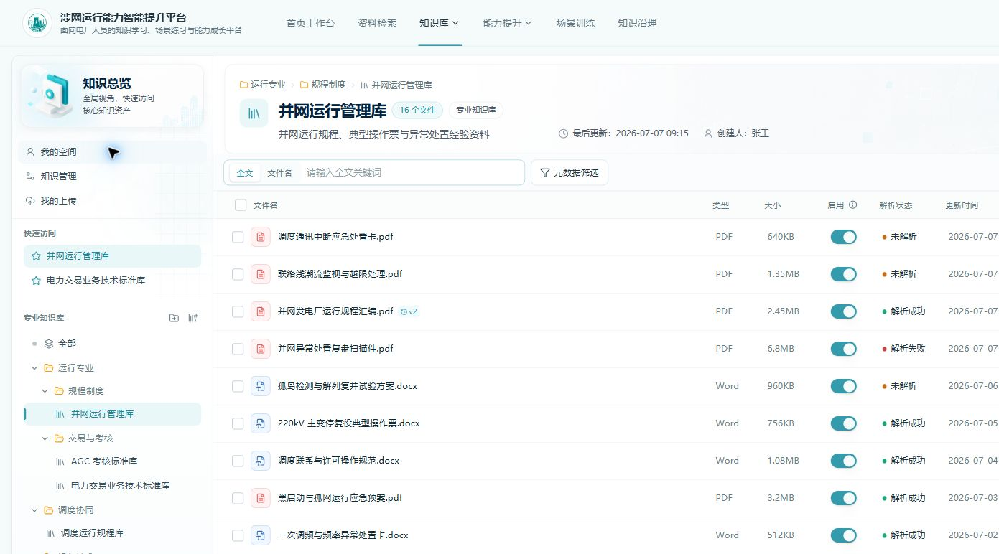
- 
- 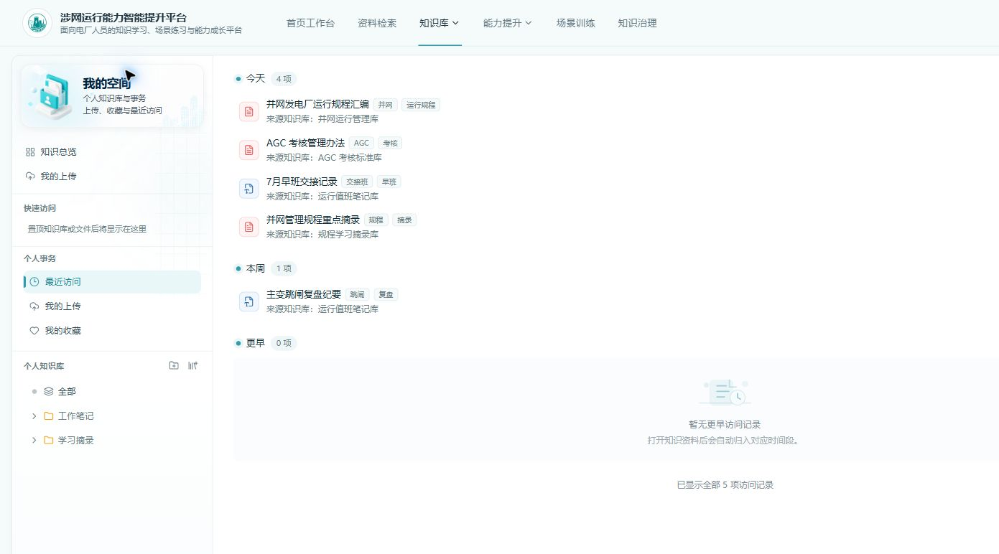
- 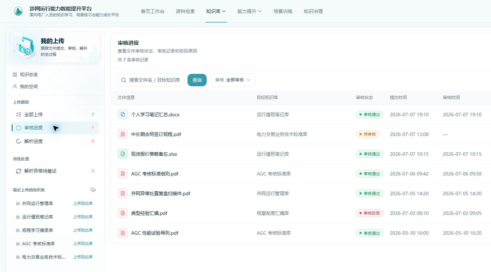
- 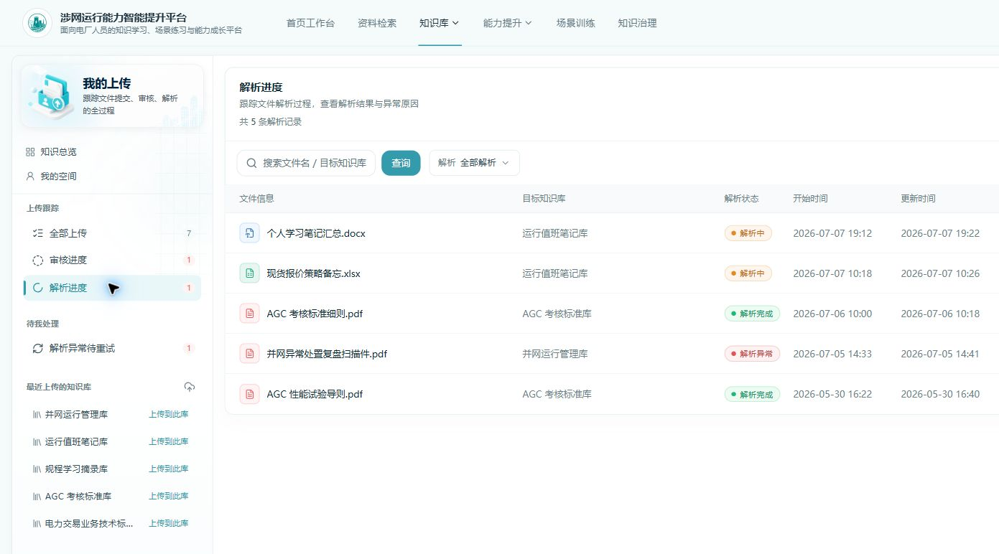
- 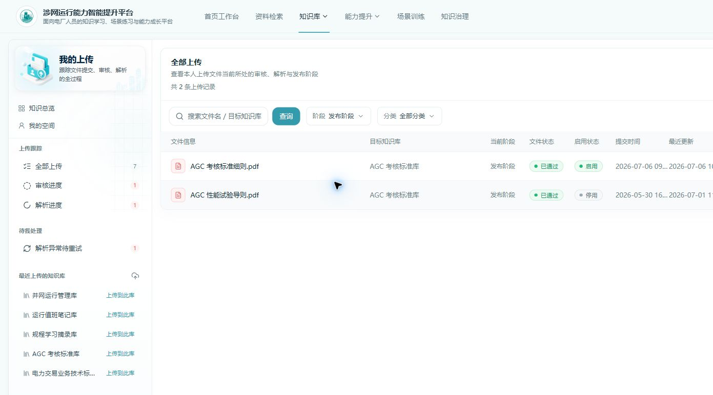
- 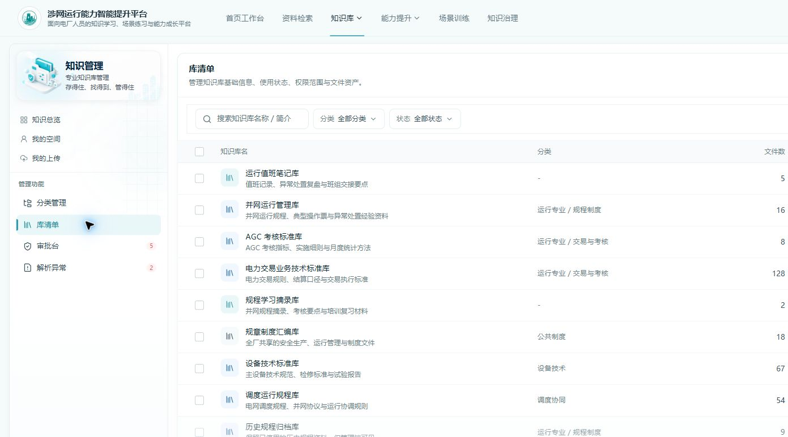
- 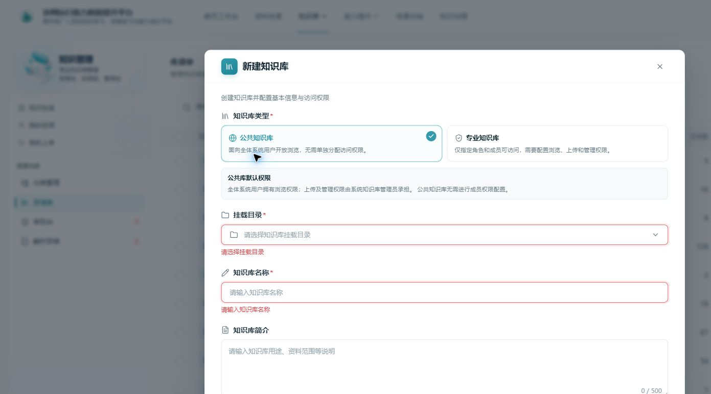
- 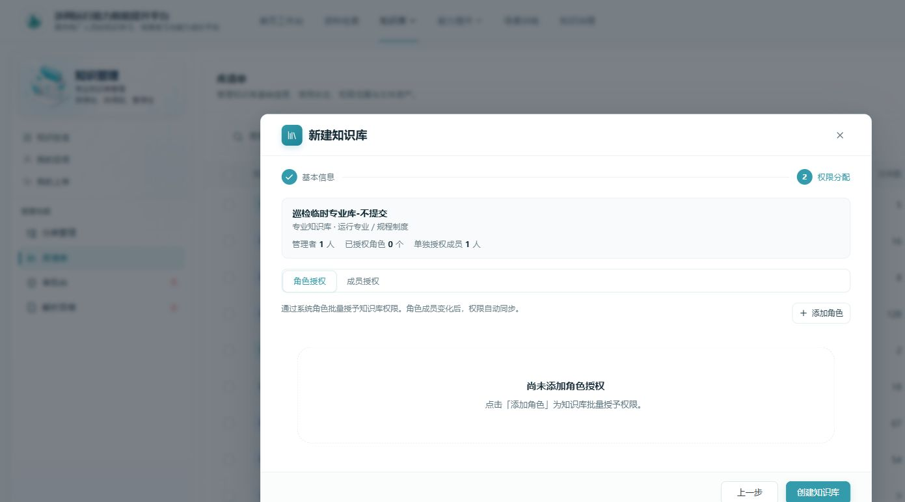
- 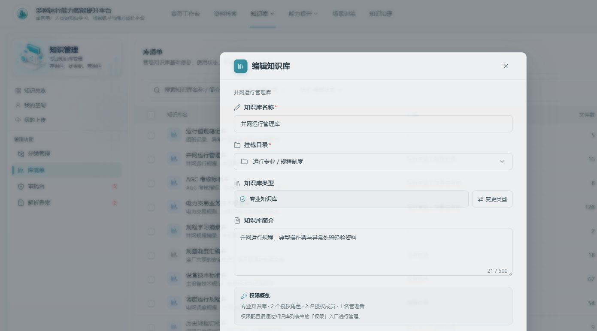
- 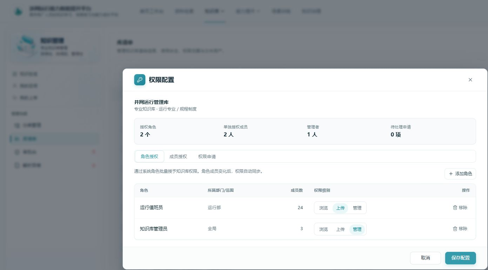
- 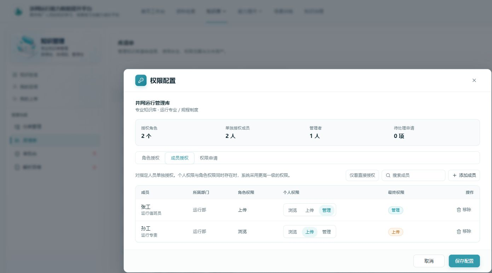
- 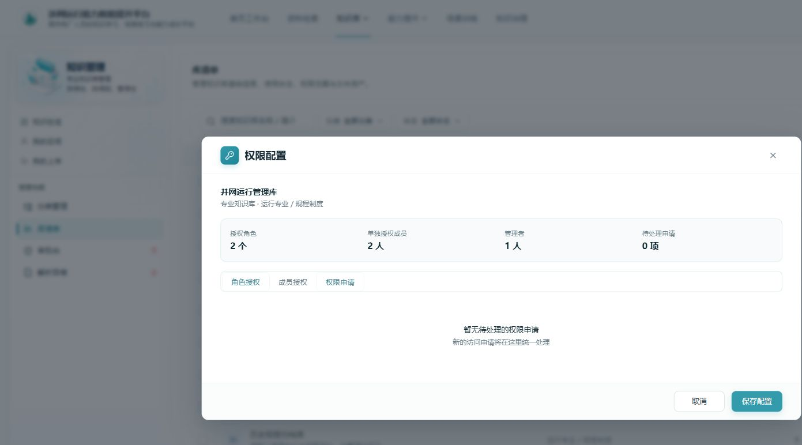
- 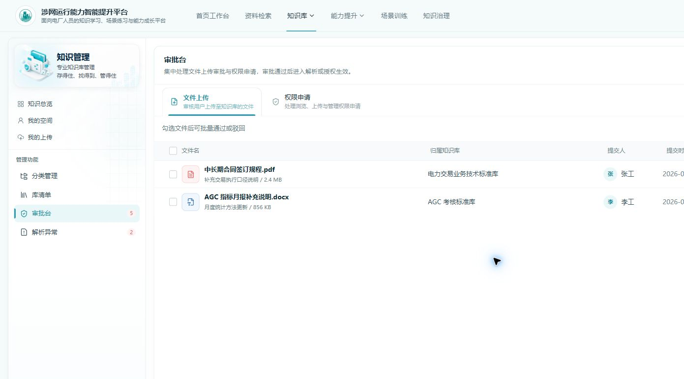
- 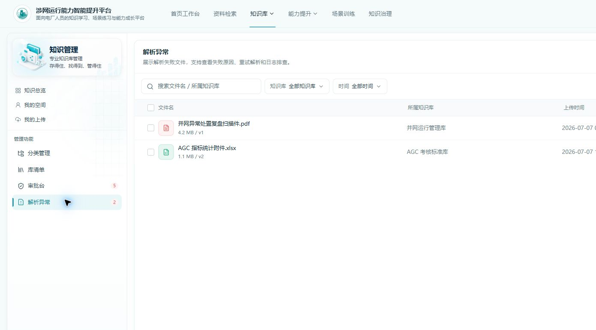

## 10. 总体结论

Demo 已较完整覆盖知识库一期的页面骨架、核心入口、权限模型表达和管理端工作台，但目前大部分功能仍是前端 Demo：静态数据、内存状态、toast 模拟、无后端接口、无真实审批/解析/上传任务链路。明天面向开发人员宣讲时，应把它定位为“需求讲解与交互样机”，重点讲清正式业务规则和系统边界，避免把 Demo 当前表现直接作为最终实现标准。

