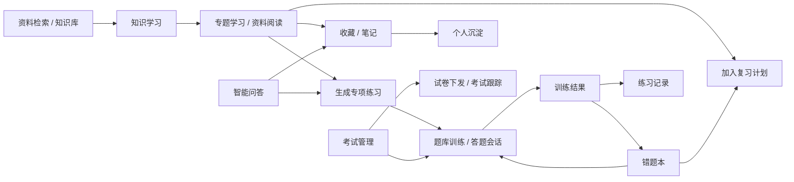
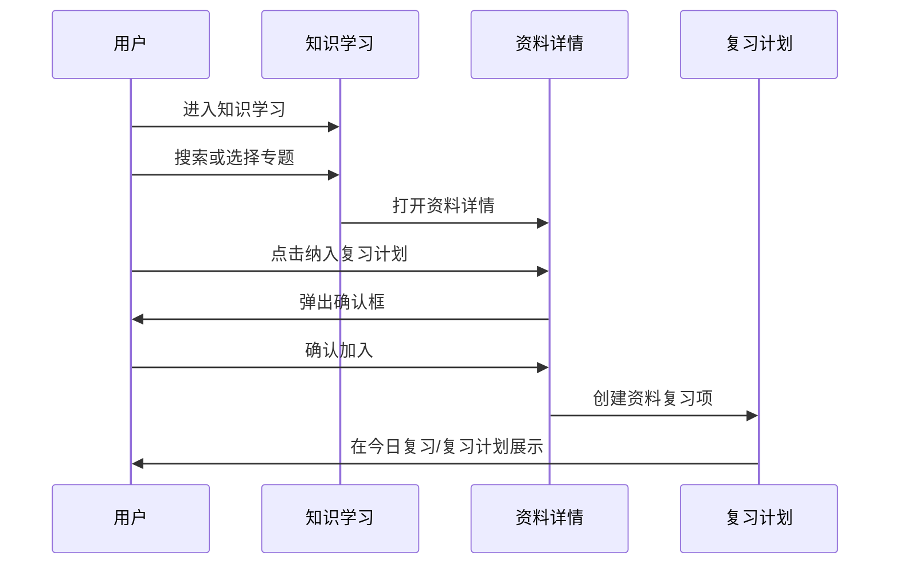
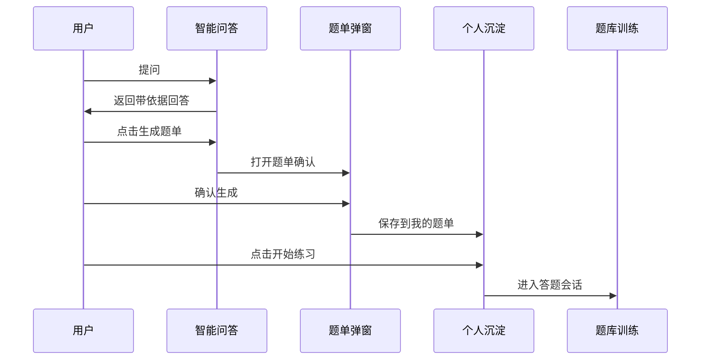
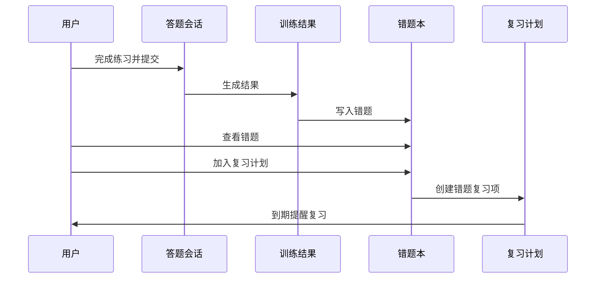
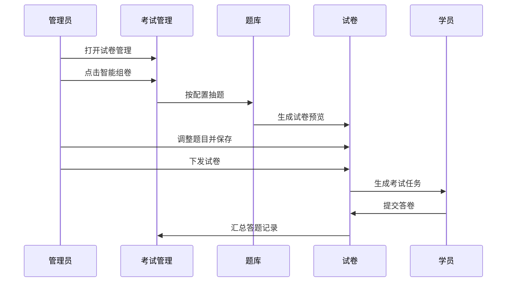

# 涉网运行能力智能提升平台 - 能力提升模块需求设计说明

## 1. 文档概述

### 1.1 文档目的

本文档面向当前项目中“能力提升”相关功能进行需求设计梳理，覆盖顶部导航“能力提升”下的四个子模块：

- 知识学习
- 题库训练
- 考试管理
- 个人沉淀

同时补充系统内的两个关联智能模块：

- 智能问答
- 智能检索 / 资料检索

文档重点说明模块定位、页面结构、核心功能、交互流程、状态流转、跨模块联动和验收标准。

### 1.2 产品定位

平台面向电厂涉网运行相关岗位人员，提供从资料学习、知识问答、专项训练、考试考核到个人知识沉淀的完整能力提升闭环。

核心目标：

- 将规程、SOP、案例、题库、场景训练内容统一组织为可学习、可检索、可追溯的知识资产。
- 通过 AI 问答、智能题单、智能组卷、复习计划降低学习和备考成本。
- 通过错题、笔记、收藏、练习记录沉淀个人能力画像。
- 通过考试管理支持管理员完成题目审核、题库治理、组卷、下发和答题跟踪。

### 1.3 相关现有路由

| 模块 | 路由 | 说明 |
| --- | --- | --- |
| 首页工作台 | `/` | 总览、今日任务、入口聚合 |
| 知识学习 | `/learn` | 专题、资料、我的学习、复习计划、最近更新 |
| 专题详情 | `/learn/topic/:id` | 专题资料、题目、学习路径 |
| 资料详情 | `/learn/doc/:id` | 资料正文、目录、收藏、笔记、复习计划 |
| 题库训练 | `/training` | 训练概览、专项/模拟/错题/智能题单入口 |
| 专项练习 | `/training/practice` | 按知识点、难度、题量发起练习 |
| 模拟考试 | `/training/exam` | 学员侧模拟考试 |
| 答题会话 | `/training/session/:id` | 练习/复习/考试答题过程 |
| 训练结果 | `/training/result/:id` | 答题结果、错题、解析与依据 |
| 错题本 | `/training/wrong` | 错题复习与掌握度管理 |
| 能力成长 | `/training/growth` | 雷达图、趋势、薄弱点分析 |
| 考试管理 | `/exam-admin` | 管理员侧题目审核、题库、试卷 |
| 个人沉淀 | `/assets` | 收藏、笔记、题单、错题、练习记录 |
| 沉淀目录 | `/assets/collection/:id` | 收藏夹/目录详情 |
| 智能问答 | `/chat` | 基于知识库的多轮问答 |
| 资料检索 | `/search` | 关键词和筛选检索资料 |
| 知识库 | `/knowledge` | 知识空间与资料目录 |

## 2. 用户角色

| 角色 | 核心诉求 | 主要使用模块 |
| --- | --- | --- |
| 运行值班人员 / 学员 | 快速学习规程、完成训练、复习错题、通过考试 | 知识学习、题库训练、个人沉淀、智能问答、资料检索 |
| 值班长 / 班组长 | 关注班组薄弱点、组织复习、查看考试完成情况 | 题库训练、考试管理、能力成长 |
| 培训管理员 | 维护题库、审核 AI 生成题、组卷下发、跟踪成绩 | 考试管理、资料检索、知识库 |
| 技术管理人员 | 追溯资料依据、维护规程/SOP/案例、支持问答可信输出 | 智能检索、智能问答、知识库、考试管理 |

## 3. 总体信息架构

### 3.1 顶部导航

顶部导航包含：

- 首页工作台
- 资料检索
- 知识库
- 智能问答
- 能力提升
  - 知识学习
  - 题库训练
  - 考试管理
  - 个人沉淀
- 场景训练
- 知识治理

### 3.2 能力提升闭环

### 3.3 核心设计原则

- 所有学习结论应可追溯到资料来源、章节或案例依据。
- AI 能力用于推荐、生成、诊断和辅助，不替代人工审核和现场规程。
- 训练结果必须沉淀为错题、记录、题单和能力画像。
- 个人学习资产要支持再次复习、再次练习和回到原始资料。
- 管理端高风险操作必须二次确认。

## 4. 能力提升模块一：知识学习

### 4.1 模块定位

知识学习是能力提升的起点，负责把规程标准、典型操作、故障处置、厂站资料、历史案例、厂家 SOP、两细则考核等资料组织为可浏览、可搜索、可复习、可转练习的学习内容。

### 4.2 页面入口

- 顶部导航：能力提升 -> 知识学习
- 首页工作台：核心能力入口、推荐学习路径、近期资料更新
- 智能问答引用依据：点击资料引用跳转资料详情
- 资料检索结果：点击资料进入资料详情
- 复习计划：资料类复习项跳转资料详情

### 4.3 页面结构

知识学习首页包含：

- 页面标题：知识学习
- 学习状态区：
  - 继续学习卡片
  - 今日复习卡片
  - 已学专题、已读资料、今日动态等统计
- Tab 面板：
  - 专题学习
  - 全部资料
  - 我的学习
  - 复习计划
  - 最近更新

### 4.4 功能需求

#### 4.4.1 继续学习

用户进入知识学习页后，系统展示最近学习专题、上次阅读资料和专题进度。

功能点：

- 展示当前继续学习专题名称。
- 展示上次阅读资料标题。
- 展示专题进度百分比和进度条。
- 点击“继续阅读”进入对应资料详情页。

交互要求：

- 点击继续阅读后跳转 `/learn/doc/:id`。
- 若无继续学习记录，应展示推荐专题或空状态。
- 进度条不可因标题长短导致布局跳动。

#### 4.4.2 今日复习

系统基于复习计划和错题状态展示今日待复习项。

功能点：

- 汇总今日待复习数量。
- 区分资料复习和错题复习。
- 展示首个到期复习项标题。
- 支持“开始复习”和“查看复习计划”。

交互要求：

- 点击“开始复习”跳转答题会话 `/training/session/:id`，模式为复习。
- 点击“查看复习计划”切换到知识学习页的“复习计划”Tab。
- 到期、逾期、未到期状态应有视觉区分。

#### 4.4.3 专题学习

按专题组织学习路径。

专题字段：

- 专题名称
- 专题说明
- 适用角色标签
- 资料数
- 题目数
- 场景数
- 学习进度
- 更新时间

现有专题包括：

- 新员工入门包
- 典型操作专题
- 故障复盘专题
- AGC / 两细则专项

交互要求：

- 点击专题卡片进入 `/learn/topic/:id`。
- 支持专题名称、说明、角色标签搜索。
- 专题卡片展示进度，便于继续学习。
- 推荐专题应有明显标记。

#### 4.4.4 全部资料

面向全库资料浏览。

功能点：

- 支持关键词搜索。
- 支持按资料类型筛选。
- 支持卡片视图和表格视图切换。
- 资料卡片展示标题、类型、来源、厂站、设备、更新时间、学习状态、关键词。

资料类型：

- 规程标准
- 典型操作
- 故障处置
- 厂站资料
- 历史案例
- 厂家 SOP
- 两细则 / 考核

交互要求：

- 用户输入关键词后点击搜索或回车触发过滤。
- 筛选项切换后列表即时刷新。
- 点击资料进入 `/learn/doc/:id`。
- 空结果展示空状态和调整筛选提示。

#### 4.4.5 我的学习

展示用户当前处于“学习中”或“需复习”的资料。

功能点：

- 展示学习中资料。
- 展示需复习资料。
- 支持搜索和类型筛选。
- 支持继续阅读。

交互要求：

- 切换到“我的学习”Tab 时保留该 Tab 独立筛选状态。
- 切换 Tab 时清空搜索输入，避免跨 Tab 干扰。

#### 4.4.6 复习计划

基于艾宾浩斯间隔复习机制组织资料和错题复习。

复习间隔：

- 第 1 次：1 天
- 第 2 次：2 天
- 第 3 次：4 天
- 第 4 次：7 天
- 第 5 次：15 天
- 第 6 次：30 天

视图模式：

- 列表
- 月视图
- 周视图
- 日视图

状态：

- 已逾期
- 待复习
- 预期

交互要求：

- 用户可在列表、月、周、日之间切换。
- 月/周/日视图支持前后翻页和回到今天。
- 点击资料类复习项可查看资料或提前阅读。
- 点击错题类复习项可查看错题或提前复习。
- 到期项应优先排序。

#### 4.4.7 最近更新

展示最新入库或更新的规程、SOP、案例、通知。

功能点：

- 展示资料类型、专题、更新时间、学习状态。
- 支持类型筛选和关键词搜索。
- 支持进入资料详情。

交互要求：

- 最近更新列表适合横向表格展示。
- 移动端应降级为列表卡片。

### 4.5 资料详情页

资料详情用于阅读正文、查看目录、追溯来源和进行学习操作。

核心功能：

- 资料标题、类型、来源、厂站、设备、更新时间。
- 左侧或顶部目录。
- 正文分章节展示。
- 高亮重点段落。
- 相关资料推荐。
- 收藏到个人沉淀。
- 新建或编辑笔记。
- 纳入复习计划。

交互要求：

- 点击目录锚点定位到对应章节。
- 点击收藏后写入个人沉淀“我的收藏”。
- 点击记笔记打开笔记编辑器或跳转沉淀模块。
- 点击“纳入复习计划”弹出确认框：
  - 确认后生成资料复习项。
  - 若已在计划内，应提示无需重复添加。
- 资料正文中的依据/章节信息应可被智能问答和训练结果引用。

### 4.6 专题详情页

专题详情聚合某个专题下的资料、题目、场景和学习进度。

核心功能：

- 专题说明和适用角色。
- 专题进度。
- 关联资料列表。
- 关联题目或练习入口。
- 关联场景训练入口。
- 最近更新和学习建议。

交互要求：

- 点击资料进入资料详情。
- 点击练习进入专项练习，自动带入该专题关键词。
- 点击场景进入对应场景训练。

### 4.7 验收标准

- 用户可从知识学习首页完成专题浏览、资料搜索、资料阅读、加入复习计划。
- 每个 Tab 的搜索和筛选相互独立，不出现状态串扰。
- 复习计划能同时展示资料和错题，并支持列表/月/周/日视图。
- 资料收藏、笔记、复习计划可以在个人沉淀中看到联动结果。

## 5. 能力提升模块二：题库训练

### 5.1 模块定位

题库训练负责承接知识学习、智能问答、错题本和考试管理产生的练习需求，提供专项练习、模拟考试、错题复习、智能题单和训练结果分析。

### 5.2 页面入口

- 顶部导航：能力提升 -> 题库训练
- 知识学习：专题或资料生成练习
- 智能问答：基于回答生成题单
- 个人沉淀：我的题单、错题本、练习记录
- 首页工作台：今日任务、薄弱点强化

### 5.3 题库训练首页结构

- 页面标题：题库训练
- 顶部操作：今日建议复习
- 训练概览：
  - 本周答题
  - 正确率
  - 待复习错题
  - 智能生成题单
  - 连续练习天数
- 今日推荐练习卡片
- 训练入口：
  - 专项练习
  - 模拟考试
  - 错题本
  - 智能生成题单
- Tab 面板：
  - 推荐练习
  - 最近练习记录

### 5.4 功能需求

#### 5.4.1 训练概览

功能点：

- 展示近期练习数据。
- 待复习错题卡片可点击进入错题本。
- 智能题单数量来自个人沉淀中的题单资产。

交互要求：

- 点击待复习错题，跳转 `/training/wrong`。
- 点击今日建议复习，跳转答题会话，模式为 review。

#### 5.4.2 训练入口

专项练习：

- 按知识点、岗位能力、场景发起定向练习。
- 跳转 `/training/practice`。

模拟考试：

- 限时答题，贴近考评场景。
- 跳转 `/training/exam`。

错题本：

- 自动汇总错题，支持错因分析和重复练习。
- 跳转 `/training/wrong`。

智能生成题单：

- 展示由智能问答、知识学习、错题本产生的题单。
- 跳转 `/assets?tab=quizsets`。

交互要求：

- 入口卡片应展示统计摘要和明确操作按钮。
- 卡片点击区域和按钮点击均应可进入对应页面。

#### 5.4.3 推荐练习

系统根据薄弱知识点、错题、智能问答生成题单和学习路径推荐练习。

推荐字段：

- 练习标题
- 推荐理由
- 题量
- 掌握度
- 标签
- 来源
- 进度

交互要求：

- 点击“开始练习”进入 `/training/session/:id`。
- 跳转时传入模式、知识点筛选、题量等参数。
- 推荐理由需解释“为什么推荐”，例如近 7 日正确率低、错题重复错误。

#### 5.4.4 最近练习记录

展示历史训练记录。

字段：

- 练习名称
- 来源
- 完成时间
- 正确率
- 错题数
- 操作

交互要求：

- 点击“查看结果”进入 `/training/result/:id`。
- 点击“再练一次”进入答题会话。
- 错题数大于 0 时可引导进入错题复习。

### 5.5 专项练习

用户可配置知识点、难度和题量。

配置项：

- 知识点 / 分类
- 难度：全部、基础、进阶
- 题量：5、10、15、20

交互流程：

1. 用户选择知识点。
2. 系统展示该知识点下匹配题量。
3. 用户选择难度。
4. 用户选择题量。
5. 右侧展示本次练习概览。
6. 点击“开始专项练习”进入答题会话。

交互要求：

- 选中的知识点、难度、题量应有明显选中态。
- 若题目不足，应展示可用题数并允许降低题量。
- 下方展示该知识点典型题，支持“查依据”跳转资料详情。

### 5.6 答题会话

答题会话统一承载专项练习、今日复习、智能题单和模拟考试。

基础能力：

- 单题展示。
- 支持单选、多选、判断、简答。
- 支持上一题、下一题。
- 支持提交。
- 展示答题进度。
- 提交后展示答案和解析。
- 错题自动加入错题本。

交互要求：

- 未答题时提交需提示。
- 练习模式允许随时退出。
- 考试模式应遵循限时和提交规则。
- 有资料依据的题目应支持查看依据。

### 5.7 错题本

错题本用于自动汇总用户错题，并支持复习、掌握度推进和移除。

错题字段：

- 题目 ID
- 题干
- 题型
- 知识点
- 来源题单/练习
- 最近错误时间
- 错误次数
- 掌握度

掌握度：

- 新增
- 初步掌握
- 需巩固
- 基本掌握
- 熟练
- 长期掌握

交互要求：

- 支持按知识点筛选和关键词搜索。
- 点击复习进入答题会话。
- 支持加入复习计划。
- 支持推进掌握度。
- 支持从错题本移除，需二次确认或明确提示。

### 5.8 训练结果

训练结果用于反馈本次训练表现，并推动后续复习。

功能点：

- 总得分 / 正确率。
- 用时。
- 正确题、错误题统计。
- 错题列表。
- 每题解析。
- 关联资料依据。
- 推荐后续练习。

交互要求：

- 错题可加入错题本。
- 可一键复习错题。
- 可查看相关资料。
- 可回到题库训练首页。

### 5.9 能力成长

能力成长用于展示用户能力画像。

功能点：

- 雷达图展示多个能力维度。
- 趋势图展示近 7 日、30 日或全周期正确率变化。
- 薄弱点 Top 列表。
- 推荐练习入口。

能力维度示例：

- 规程制度
- 典型操作
- 故障复盘
- AGC / 调频
- 运行值班

交互要求：

- 点击薄弱点进入对应专项练习。
- 支持不同时间范围切换。

### 5.10 验收标准

- 用户可从训练首页进入专项、模拟、错题、题单四类训练入口。
- 专项练习可配置知识点、难度、题量并发起答题。
- 答题错误能进入错题本，并可在个人沉淀查看。
- 训练记录能进入结果页，结果页可追溯题目解析和资料依据。

## 6. 能力提升模块三：考试管理

### 6.1 模块定位

考试管理是管理员侧能力提升模块，覆盖题目审核、正式题库维护、智能组卷、试卷下发、答题跟踪和试卷优化。

### 6.2 页面入口

- 顶部导航：能力提升 -> 考试管理

### 6.3 页面结构

页面包含：

- 页面标题：考试管理
- 统计卡片：
  - 待审核题目
  - 正式题库
  - 已下发试卷
  - 完成情况
  - 平均正确率
  - 平均用时
- Tab 面板：
  - 题目审核
  - 题库管理
  - 试卷管理

### 6.4 题目审核

用于处理 AI 生成或人工录入的待审核题目。

列表字段：

- 题干
- 题型
- 知识点
- 难度
- 来源资料
- 相似题风险
- 生成方式
- 审核状态

状态：

- 待审核
- 已入库
- 已合并
- 已退回

操作：

- 查看依据
- 编辑
- 通过入库
- 删除
- 合并相似题
- 批量通过
- 批量删除
- 批量查重

交互要求：

- 支持勾选单题或全选。
- 已选数量实时展示。
- 若选中题目包含高相似风险，应提示风险。
- 查看依据打开右侧抽屉。
- 编辑打开右侧抽屉，保存后仍需审核确认。
- 通过入库打开确认弹窗。
- 删除打开确认弹窗。
- 合并相似题打开抽屉，支持保留已有题、保留当前题、合并生成题、保留两题。
- 批量删除必须二次确认。
- 所有 AI 生成题入库前必须人工确认。

### 6.5 题库管理

用于维护正式题库资产。

功能点：

- 查询题目。
- 按知识点、题型、难度、状态筛选。
- 查看题目详情。
- 编辑题目。
- 智能改写题目。
- 相似题检测。
- 启用 / 禁用题目。
- 查看使用记录。
- 加入试卷。

交互要求：

- 题目详情以抽屉展示完整题干、答案、解析、依据、使用情况。
- 编辑正式题库题目需保存确认。
- 禁用题目需确认禁用原因。
- 智能改写不得直接覆盖原题，需用户选择覆盖或另存为新题。
- 相似题检测结果应展示相似度、冲突点和建议处理动作。
- 加入试卷时只允许选择草稿试卷或可编辑试卷。

### 6.6 试卷管理

用于创建、编辑、复制、优化、下发和跟踪试卷。

试卷字段：

- 试卷名称
- 考试目标
- 分类
- 题量
- 时长
- 创建时间
- 来源
- 下发人数
- 完成人数
- 平均正确率
- 平均得分
- 平均用时
- 状态

状态：

- 草稿
- 已下发
- 已结束

核心操作：

- 新建试卷
- 智能组卷
- 编辑试卷
- 预览试卷
- 复制试卷
- 下发试卷
- 查看答题记录
- 试卷诊断 / 优化

交互要求：

- 智能组卷打开右侧抽屉，配置目标、分类、题型比例、难度、题量等。
- 生成后展示试卷预览，包括知识点覆盖、题型比例、难度分布、重复风险和题目明细。
- 编辑试卷支持按题型分组管理题目。
- 题目分组支持折叠、上移、下移、删除、添加题目、AI 补题、换题。
- 下发试卷打开弹窗选择人员、班组或岗位。
- 下发确认后更新下发人数和状态。
- 答题跟踪展示人员、班组、岗位、状态、分数、正确率、用时、提交时间。
- 复制试卷需输入新名称。
- 试卷优化应给出结构诊断和可勾选建议，用户确认后应用。

### 6.7 验收标准

- 待审核题目必须经过人工确认才能进入正式题库。
- 高相似风险题目在入库前有明显提示。
- 正式题库题目可查看详情、编辑、禁用、查重、改写、加入试卷。
- 试卷可完成智能组卷、编辑、预览、下发和记录跟踪。
- 高风险操作均有确认弹窗或抽屉确认步骤。

## 7. 能力提升模块四：个人沉淀

### 7.1 模块定位

个人沉淀集中管理用户在学习和训练过程中产生的个人资产，包括收藏、笔记、智能题单、错题和练习记录。

### 7.2 页面入口

- 顶部导航：能力提升 -> 个人沉淀
- 题库训练：智能生成题单入口
- 智能问答：收藏依据、加入笔记、生成题单
- 资料详情：收藏、笔记
- 训练结果：错题、记录

### 7.3 页面结构

- 页面标题：个人沉淀
- 概览卡片：
  - 收藏资料
  - 学习笔记
  - 智能题单
  - 错题待复习
  - 练习记录
- 学习跟进卡片：
  - 今日建议复习错题数
  - 薄弱点
  - 上次练习正确率
  - 快捷操作：复习错题、查看能力成长
- Tab 面板：
  - 我的收藏
  - 我的笔记
  - 我的题单
  - 错题本
  - 练习记录

### 7.4 我的收藏

功能点：

- 展示用户收藏的资料或问答依据。
- 支持按类型筛选：全部、规程、SOP、案例、问答、题单。
- 支持搜索收藏资料标题或专题。
- 支持取消收藏。
- 支持查看资料。
- 支持加入目录。

交互要求：

- 点击收藏资料进入资料详情。
- 点击取消收藏后从列表移除并提示。
- 收藏来源需展示，例如“智能问答依据”“资料学习”。

### 7.5 我的笔记

功能点：

- 展示学习笔记。
- 支持新增笔记、编辑笔记、删除笔记。
- 支持按标签筛选。
- 支持搜索标题或内容。
- 支持关联资料。
- 支持加入目录。

交互要求：

- 点击新增或编辑打开笔记编辑器。
- 保存后显示成功提示。
- 删除需明确操作反馈。
- 笔记可关联资料，点击关联资料可跳转资料详情。

### 7.6 我的题单

功能点：

- 展示 AI 智能生成题单。
- 支持按状态筛选：未开始、进行中、已完成。
- 支持搜索题单名称。
- 支持开始练习、继续练习、查看结果。
- 展示来源，例如智能问答生成、知识学习生成、错题本生成。

交互要求：

- 未开始题单点击后进入答题会话。
- 已完成题单点击后进入训练结果。
- 题单应保留关联问答或资料来源，便于追溯。

### 7.7 错题本

个人沉淀中的错题本与题库训练错题本保持一致。

功能点：

- 展示错题题干、知识点、来源、最近错误时间、复习次数。
- 支持复习错题。
- 支持移除错题。
- 支持加入今日复习。

交互要求：

- 点击复习进入 `/training/session/:id`。
- 移除错题后从错题列表删除并提示。
- 加入今日复习后写入复习计划。

### 7.8 练习记录

功能点：

- 展示历次练习记录。
- 支持按来源筛选。
- 支持搜索练习名称。
- 支持查看结果。
- 支持再练一次。

交互要求：

- 点击查看结果进入 `/training/result/:id`。
- 点击再练一次进入答题会话。
- 记录来源包括智能问答生成、知识学习生成、错题本、模拟考试等。

### 7.9 目录 / 收藏夹

功能点：

- 用户可创建个人目录。
- 可将资料、笔记、场景等加入目录。
- 目录详情展示目录内资产。

交互要求：

- 创建目录成功后提示。
- 加入目录时避免重复加入。
- 目录详情支持回到个人沉淀。

### 7.10 验收标准

- 收藏、笔记、题单、错题、记录均可从其他模块沉淀到个人沉淀。
- 个人沉淀中的资产均能回到原始上下文，如资料、问答、结果页。
- 搜索、筛选、Tab 切换状态清晰。
- 关键删除/移除操作有明确反馈。

## 8. 智能问答模块

### 8.1 模块定位

智能问答提供基于内部知识库的多轮问答能力，用于帮助用户快速理解规程、SOP、历史案例和题库知识点。回答必须带引用依据、适用范围和不确定性提示，支持继续追问、复制、收藏、转笔记和生成题单。

### 8.2 页面入口

- 顶部导航：智能问答
- 资料检索无结果提示跳转智能问答
- 首页工作台智能问答入口
- 其他模块可通过预填问题跳转 `/chat?prefill=...`

### 8.3 页面结构

建议结构：

- 左侧会话列表：
  - 新建会话
  - 搜索历史会话
  - 置顶会话
  - 今天、七天内、一个月内分组
  - 会话更多操作：重命名、置顶/取消置顶、删除
- 中间问答区：
  - 常用问题
  - 消息列表
  - 回答卡片
  - 输入框
- 右侧或浮层设置：
  - 知识库范围
  - 是否显示依据追溯
  - 发送后是否自动滚动

### 8.4 功能需求

#### 8.4.1 新建和发送问题

功能点：

- 新建会话。
- 支持输入问题。
- 支持常用问题一键填入。
- 支持选择知识库范围。
- 支持附件选择提示。

交互要求：

- 回车或点击发送后生成用户消息。
- 若输入为空，发送按钮不可用或提示。
- 发送后自动滚动到底部，除非用户关闭该设置。
- 新问题生成回答后更新会话标题和更新时间。

#### 8.4.2 回答卡片

回答内容包括：

- 摘要回答
- 引用依据
- 适用范围
- 不确定性提示

引用依据字段：

- 资料 ID
- 章节
- 引用片段
- 来源标签
- 位置

交互要求：

- 点击引用依据可跳转或打开对应资料详情。
- 支持复制回答。
- 支持点赞 / 点踩反馈。
- 支持收藏相关依据资料。
- 支持加入笔记。
- 支持基于回答生成题单。

#### 8.4.3 会话管理

功能点：

- 历史会话按时间分组。
- 支持置顶。
- 支持重命名。
- 支持删除。
- 支持搜索会话。

交互要求：

- 置顶会话显示在置顶分组。
- 删除会话后从列表移除并提示。
- 搜索无结果时展示空状态。
- 折叠分组状态应本地保存。

#### 8.4.4 知识库范围

可选范围：

- 全部资料
- 规程标准
- 典型操作
- 故障处置
- 厂家 SOP
- 历史案例

交互要求：

- 切换知识库范围后，新回答应基于该范围生成。
- 切换成功后提示当前范围。
- 回答中应体现范围或适用限制。

#### 8.4.5 生成题单

用户可从回答卡片生成专项题单。

流程：

1. 用户点击“生成题单”。
2. 系统根据回答内容推断知识点和题量。
3. 打开题单确认弹窗。
4. 用户确认生成。
5. 题单写入个人沉淀“我的题单”。
6. 用户可立即开始练习或稍后在个人沉淀中查看。

交互要求：

- 若已生成过同一回答的题单，应展示已有题单状态。
- 题单需记录关联会话、关联消息和来源问题。
- 生成成功提示“题单已生成，可在个人沉淀查看”。

### 8.5 可信回答要求

- 回答必须标明依据资料。
- 对地区版本、厂站差异、参数口径等内容必须展示不确定性提示。
- 对关键操作类问题，应提示以现场规程、操作票和岗位要求为准。
- AI 回答不得直接替代操作许可、调度命令或安全确认。

### 8.6 验收标准

- 用户可完成多轮问答，并查看带依据的回答。
- 回答可复制、收藏依据、加入笔记、生成题单。
- 会话可置顶、重命名、删除和搜索。
- 知识库范围切换后有明确反馈。
- 题单生成后可在个人沉淀查看，并能进入练习。

## 9. 智能检索 / 资料检索模块

### 9.1 模块定位

资料检索用于按关键词、设备、任务、故障现象、资料类型、厂站快速查找资料，为知识学习、智能问答、考试管理提供依据入口。

### 9.2 页面入口

- 顶部导航：资料检索
- 首页工作台近期资料更新
- 知识学习全部资料
- 智能问答引用追溯

### 9.3 页面结构

- 页面标题：资料检索
- 搜索框
- 搜索按钮
- 高级筛选按钮
- 热门检索词
- 结果统计
- 检索结果列表
- 资料详情抽屉

### 9.4 功能需求

#### 9.4.1 关键词检索

检索范围：

- 标题
- 摘要
- 设备名称
- 高亮关键词

交互要求：

- 输入关键词后点击搜索或按 Enter 触发检索。
- 未提交关键词时展示热门检索词。
- 点击热门检索词直接发起检索。
- 检索结果展示命中高亮。

#### 9.4.2 高级筛选

筛选项：

- 资料类型
- 厂站

交互要求：

- 点击“高级筛选”展开或收起筛选区。
- 资料类型支持多选。
- 厂站为单选下拉。
- 筛选变化后结果即时刷新。

#### 9.4.3 检索结果

结果字段：

- 资料类型
- 来源
- 厂站优先标识
- 标题
- 摘要
- 厂站
- 设备
- 更新时间
- 操作

操作：

- 查看资料
- 收藏到个人沉淀
- 加入笔记草稿
- 去智能问答提问

交互要求：

- 点击标题打开资料详情抽屉。
- 点击收藏切换收藏状态，并同步个人沉淀。
- 点击加入笔记草稿给出成功提示。
- 无结果时提示“可尝试放宽筛选，或前往智能问答提问”。

#### 9.4.4 资料详情抽屉

功能点：

- 展示资料标题、类型、来源、摘要、章节内容。
- 高亮当前检索关键词。
- 支持跳转资料详情页。
- 支持收藏。

交互要求：

- 抽屉关闭后保留当前检索条件。
- 高亮关键词应只作用于当前提交的搜索词。

### 9.5 智能检索扩展建议

当前检索以本地关键词过滤为主，后续可升级为智能检索：

- 语义检索：支持同义词、故障现象、操作场景表达。
- 意图识别：识别用户是在找规程、案例、SOP 还是题目依据。
- 混合排序：关键词命中、资料优先级、更新时间、厂站适配度综合排序。
- 追问补全：当关键词过宽时提示用户选择厂站、设备或场景。
- 检索转问答：将检索结果作为上下文带入智能问答。
- 检索转题单：从检索结果选择资料后生成专项练习。

### 9.6 验收标准

- 用户可通过关键词、资料类型、厂站筛选找到资料。
- 检索结果可高亮命中词。
- 可打开资料抽屉查看详情。
- 收藏行为同步到个人沉淀。
- 无结果时可跳转智能问答。

## 10. 跨模块联动需求

### 10.1 资料到学习资产

来源：

- 资料检索
- 知识学习
- 智能问答引用

沉淀动作：

- 收藏资料
- 加入笔记
- 加入复习计划
- 生成题单

目标：

- 个人沉淀
- 复习计划
- 题库训练

### 10.2 问答到训练

流程：

1. 用户在智能问答中提问。
2. 系统给出带依据回答。
3. 用户点击生成题单。
4. 系统生成专项题单。
5. 题单进入个人沉淀。
6. 用户开始练习。
7. 错题进入错题本。

### 10.3 训练到复习

流程：

1. 用户完成练习。
2. 系统生成训练结果。
3. 错题写入错题本。
4. 错题可加入艾宾浩斯复习计划。
5. 到期后在知识学习“今日复习”和“复习计划”中展示。

### 10.4 考试到题库治理

流程：

1. 管理员通过 AI 或人工录入生成题目。
2. 题目进入审核池。
3. 审核通过进入正式题库。
4. 题库题目参与智能组卷。
5. 试卷下发给学员。
6. 答题记录反哺题目正确率、使用次数和薄弱点分析。

## 11. 数据对象设计

### 11.1 资料 Doc

关键字段：

- id
- title
- docType
- source
- plant
- equipment
- year
- updatedAt
- snippet
- highlight
- toc
- body
- status
- topicId
- related
- scenarioType

### 11.2 专题 Topic

关键字段：

- id
- title
- desc
- roleTags
- docCount
- questionCount
- scenarioCount
- progress
- updatedAt

### 11.3 题目 Question

关键字段：

- id
- type
- stem
- options
- answer
- analysis
- knowledgePoints
- relatedDocId

### 11.4 错题 WrongItem

关键字段：

- qid
- wrongCount
- lastWrongAt
- mastery

### 11.5 复习计划 SpacedReviewItem

关键字段：

- id
- kind：doc / wrong
- sourceId
- title
- addedAt
- round

### 11.6 笔记 NoteItem

关键字段：

- id
- docId
- title
- body
- tag
- createdAt
- updatedAt
- collectionIds

### 11.7 题单 QuizSet

关键字段：

- id
- title
- source
- questionCount
- status
- accuracy
- relatedChat
- relatedMsgId
- relatedConvId
- createdAt
- filter
- questionIds

### 11.8 练习记录 PracticeRecord

关键字段：

- id
- title
- source
- completedAt
- questionCount
- accuracy
- wrongCount
- duration
- filter

### 11.9 会话 Conversation

关键字段：

- id
- title
- updatedAt
- messages
- pinned

### 11.10 回答 AnswerCard

关键字段：

- summary
- body
- citations
- scope
- uncertainty

## 12. 状态与反馈设计

### 12.1 学习状态

- 未学
- 学习中
- 已学
- 需复习

### 12.2 题单状态

- 未开始
- 进行中
- 已完成

### 12.3 题目审核状态

- 待审核
- 已入库
- 已合并
- 已退回

### 12.4 试卷状态

- 草稿
- 已下发
- 已结束

### 12.5 操作反馈

以下操作需 toast 或明确状态反馈：

- 收藏 / 取消收藏
- 保存 / 更新笔记
- 删除笔记
- 加入复习计划
- 生成题单
- 完成练习
- 移除错题
- 通过入库
- 删除题目
- 生成试卷
- 下发试卷
- 保存诊断报告

### 12.6 二次确认

以下操作必须二次确认：

- 删除待审核题目
- 批量删除题目
- 禁用正式题库题目
- 覆盖原题
- 下发试卷
- 删除会话
- 删除笔记或移除重要个人资产，建议至少提供明确反馈

## 13. 非功能需求

### 13.1 可追溯性

- 智能问答回答必须带资料引用。
- 题目需保留来源资料和生成依据。
- 训练解析需能跳转关联资料。
- 题单需记录来源模块和关联上下文。

### 13.2 安全与合规

- AI 生成题目不得自动入库。
- AI 回答不得替代现场规程、调度命令和操作票。
- 高风险相似题、删除、禁用、下发等操作必须人工确认。

### 13.3 易用性

- 高频入口在首页工作台和模块首页均应可见。
- 搜索、筛选、Tab 切换响应应即时。
- 列表空状态需给出下一步建议。
- 长标题、长题干、长引用需折行或截断，不影响布局。

### 13.4 响应式

- 桌面端以表格、卡片混合展示。
- 中小屏表格需降级为卡片或支持横向滚动。
- 抽屉、弹窗在小屏下需保证可滚动。

## 14. 关键交互流程

### 14.1 从资料学习到复习计划

### 14.2 从智能问答到题单练习

### 14.3 从训练结果到错题复习

### 14.4 管理员智能组卷下发

## 15. 待补充与优化建议

### 15.1 当前原型已有但后端需补齐

- 用户体系与角色权限。
- 资料、题库、考试真实接口。
- 搜索服务。
- 问答模型服务。
- 题单生成服务。
- 学习行为埋点。
- 考试下发与成绩持久化。

### 15.2 产品增强建议

- 增加班组维度能力看板。
- 增加资料版本差异提示。
- 增加错题错因分类。
- 增加 AI 问答回答质量反馈闭环。
- 增加题库重复率趋势和题目生命周期管理。
- 增加复习提醒通知。
- 增加知识点掌握度与推荐题目之间的可解释性。

## 16. 需求优先级建议

| 优先级 | 功能 |
| --- | --- |
| P0 | 知识学习资料浏览、搜索、详情、收藏、复习计划 |
| P0 | 题库训练专项练习、答题会话、训练结果、错题本 |
| P0 | 个人沉淀收藏、笔记、题单、错题、记录 |
| P0 | 智能问答带依据回答、生成题单 |
| P1 | 考试管理题目审核、题库管理、试卷管理 |
| P1 | 智能检索高级筛选、资料抽屉、收藏联动 |
| P1 | 能力成长雷达、趋势、薄弱点推荐 |
| P2 | 智能改写、相似题检测、试卷诊断优化 |
| P2 | 语义检索、检索转问答、检索转题单 |

