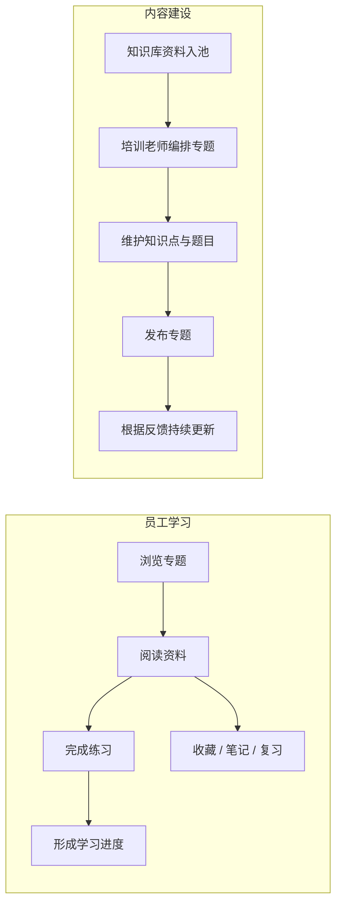
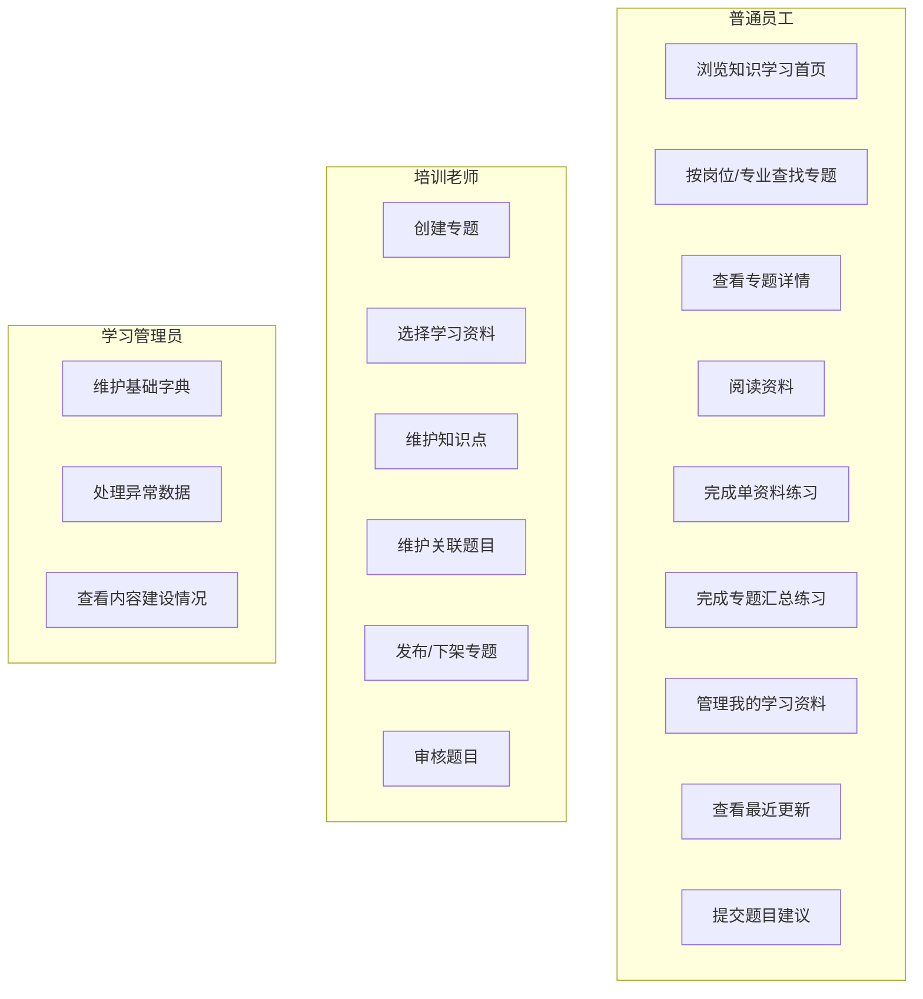

# 知识学习模块 · 业务需求说明

> **版本**：v1.0 · 2026-07-09  
> **依据**：[知识库业务需求说明](../知识库/01-知识库业务需求说明.md) · 现有知识学习需求草稿  
> **范围**：第一期（MVP）  
> **说明**：本文档仅描述**用户要做什么、为什么做**，不涉及具体页面布局与技术实现方案。

---

## 一、模块定位

知识学习是能力提升体系中的**学习承接模块**，用于把知识库中的文档转化为可学习、可跟踪、可练习、可复盘的学习资源。

知识库解决“资料存放与治理”，知识学习解决“员工如何围绕岗位能力持续学习”。专题、资料、题目、学习记录均围绕员工能力提升闭环展开。

**第一期业务目标**：找得到可学资料、学得下去、练得起来、进度可见、专题可维护。

---

## 二、用户角色

| 角色 | 典型使用者 | 业务诉求 |
|------|------------|----------|
| **普通员工** | 运行值班员、检修人员、技术员、新员工等 | 浏览岗位相关专题；检索可学习资料；阅读资料；完成练习；跟踪自己的学习进度；收藏或复习高频资料 |
| **培训老师** | 培训负责人、专业讲师、班组培训员 | 创建和维护专题；从资料池选择资料；整理知识点；维护或审核题目；发布专题并持续更新 |
| **题目审核人** | 培训老师或题库管理员 | 审核员工或老师提交的题目；给出退回意见；通过后纳入正式题库 |
| **学习管理员** | 平台管理员、培训管理人员 | 查看学习内容整体建设情况；维护基础字典；处理异常数据；协调知识库、题库、学习模块之间的数据关系 |

> 同一用户可同时具备多个角色，如培训老师也可以作为普通员工参与专题学习。

---

## 三、业务场景概览



---

## 四、业务需求清单（第一期）

### 4.1 知识学习首页

| 编号 | 业务需求 | 用户价值 | 优先级 |
|------|----------|----------|--------|
| BR-01 | 我进入知识学习模块后，有统一首页，可看到**专题学习、全部知识资料、我的学习资料、最近更新**等入口 | 形成清晰学习入口，减少跳转成本 | P0 |
| BR-02 | 首页展示学习概览，包括专题总数、正在学习、可学习资料数量、最近阅读等信息 | 快速了解当前学习状态 | P0 |
| BR-03 | 当我存在被审核退回的题目时，首页概览中优先展示**待修改题目**数量 | 及时处理题目贡献闭环 | P1 |
| BR-04 | 首页可展示推荐专题、最近更新资料、最近学习记录 | 引导员工继续学习和关注新内容 | P0 |
| BR-05 | 首页入口与专题、资料、我的学习记录之间应互通 | 避免学习路径断裂 | P0 |

### 4.2 专题学习

| 编号 | 业务需求 | 用户价值 | 优先级 |
|------|----------|----------|--------|
| BR-06 | 我能按专业、岗位、业务场景浏览专题，如电气、锅炉、运行值班、新员工入门等 | 按岗位能力找到适合自己的学习内容 | P0 |
| BR-07 | 专题卡片展示专题名称、适用岗位、专业标签、资料数量、题目数量、更新时间、我的学习状态 | 不进入详情也能判断是否值得学习 | P0 |
| BR-08 | 我能按岗位、专业、专题状态、关键词筛选和搜索专题 | 专题数量增多后快速定位 | P0 |
| BR-09 | 我能收藏专题，后续在我的学习中快速回访 | 高频专题快速进入 | P1 |
| BR-10 | 我能查看专题详情，了解专题简介、学习目标、业务场景、资料清单、知识点和练习入口 | 明确学什么、为什么学、学到什么程度 | P0 |
| BR-11 | 专题详情中资料按培训老师编排顺序展示 | 保证学习路径有组织，而不是资料堆叠 | P0 |
| BR-12 | 专题详情中的资料列表展示学习状态：未开始、学习中、已学 | 让员工知道下一步该学哪份资料 | P0 |
| BR-13 | 专题进度按专题内已学资料数汇总展示 | 直观看到专题完成度 | P0 |
| BR-14 | 专题被更新后，我能看到更新提示 | 已学专题发生变化时可及时回顾 | P1 |

### 4.3 专题汇总练习

| 编号 | 业务需求 | 用户价值 | 优先级 |
|------|----------|----------|--------|
| BR-15 | 专题详情提供**汇总练习**入口，将专题内资料关联的已发布题目汇总为一份练习 | 跨资料一次性检验掌握情况 | P0 |
| BR-16 | 汇总练习中的题目按专题资料顺序拼接，并标注题目所属资料 | 作答时能回溯题目来源 | P0 |
| BR-17 | 汇总练习支持开始练习、继续练习、重新练习 | 适配首次学习、中途退出、复习重做场景 | P0 |
| BR-18 | 汇总练习支持暂存，下一次可恢复作答与题号位置 | 长卷练习不必一次完成 | P0 |
| BR-19 | 重新练习前需要二次确认，并说明会清空当前暂存和本次作答 | 避免误删学习记录 | P0 |
| BR-20 | 提交练习后，我能查看对错、答案、解析和得分情况 | 形成练习反馈闭环 | P0 |
| BR-21 | 汇总练习提交后，应按题目所属资料回写单资料练习进度 | 专题练习和资料学习进度互通 | P0 |

### 4.4 资料学习

| 编号 | 业务需求 | 用户价值 | 优先级 |
|------|----------|----------|--------|
| BR-22 | 我能从专题、全部知识资料、最近更新、我的学习资料进入资料学习页 | 支持多入口学习 | P0 |
| BR-23 | 资料学习页展示资料正文或预览内容，并保留来源知识库、资料类型、更新时间等基础信息 | 阅读时明确资料来源和可信度 | P0 |
| BR-24 | 我能开始学习、继续学习、标记已学、收藏资料 | 支撑个人学习过程管理 | P0 |
| BR-25 | 对没有关联题目的资料，我可以手动标记为已学 | 非题目型资料也能进入学习进度 | P0 |
| BR-26 | 对有关联题目的资料，完成全部题目后可自动标记为已学 | 用练习结果支撑学习完成判定 | P0 |
| BR-27 | 我能在资料学习页查看或进入该资料的配套练习 | 阅读与练习形成闭环 | P0 |
| BR-28 | 我能查看资料摘要、知识点、关联专题等辅助信息 | 帮助理解资料与能力主题的关系 | P1 |
| BR-29 | 我能对资料做笔记或学习备注 | 留存个人学习理解 | P1 |

### 4.5 全部知识资料

| 编号 | 业务需求 | 用户价值 | 优先级 |
|------|----------|----------|--------|
| BR-30 | 我能在**全部知识资料**中检索所有可学习资料 | 自主学习时不用先进入专题 | P0 |
| BR-31 | 全部知识资料不是知识库全量文件，只展示被纳入学习资料池的资料 | 避免制度、台账、通知等非学习内容混杂 | P0 |
| BR-32 | 学习资料来源于知识库已发布、已解析、具备学习属性的文档 | 保证学习资料有治理来源 | P0 |
| BR-33 | 我能按资料类型、来源知识库、适用专业、标签、更新时间筛选资料 | 大量资料下快速定位 | P0 |
| BR-34 | 资料列表展示标题、摘要、类型、来源、适用专业、更新时间、学习状态 | 判断是否需要学习 | P0 |
| BR-35 | 我能从资料列表直接开始学习、继续学习、收藏或加入我的学习资料 | 减少进入学习的操作成本 | P0 |
| BR-36 | 知识库文件版本更新后，学习资料应能提示新版本 | 员工知道学习内容已变化 | P1 |

### 4.6 我的学习资料

| 编号 | 业务需求 | 用户价值 | 优先级 |
|------|----------|----------|--------|
| BR-37 | 我能在**我的学习资料**查看自己开始过、收藏过、已完成的资料 | 个人学习过程集中管理 | P0 |
| BR-38 | 我的学习资料区分正在学习、已学完、收藏、最近阅读等状态 | 便于继续学习或复习 | P0 |
| BR-39 | 我能查看每份资料的最近打开时间、学习状态、题目完成情况 | 快速恢复学习上下文 | P0 |
| BR-40 | 我能从我的学习资料继续阅读或继续练习 | 学习不中断 | P0 |
| BR-41 | 已学资料可进入复习提醒，第一期可先记录复习计划或展示复习入口 | 支撑后续周期复习 | P1 |
| BR-42 | 我能看到本人提交题目中被退回待修改的事项 | 题目贡献形成闭环 | P1 |

### 4.7 最近更新

| 编号 | 业务需求 | 用户价值 | 优先级 |
|------|----------|----------|--------|
| BR-43 | 我能在最近更新中看到近期新增专题、新增学习资料、专题内容更新、资料版本更新 | 及时发现值得关注的新内容 | P0 |
| BR-44 | 我能点击更新项进入专题详情或资料学习页 | 从更新直接进入学习 | P0 |
| BR-45 | 我能一键将更新资料加入我的学习资料 | 对重要更新先收纳后学习 | P1 |
| BR-46 | 更新列表应展示更新时间、更新类型、来源、是否已读 | 降低重复查看成本 | P1 |

### 4.8 题目贡献与审核闭环

| 编号 | 业务需求 | 用户价值 | 优先级 |
|------|----------|----------|--------|
| BR-47 | 我能在资料学习页基于当前资料提交题目建议 | 一线员工可补充真实场景题目 | P1 |
| BR-48 | 我提交题目时需要填写题干、题型、选项、正确答案、解析，并绑定当前资料 | 保证题目可审核、可入库 | P1 |
| BR-49 | 提交后题目进入审核流程，审核通过后纳入正式题库 | 保证题目质量 | P1 |
| BR-50 | 题目被退回时，我能查看退回意见并修改后重新提交 | 贡献闭环，不让问题停在审核端 | P1 |
| BR-51 | 培训老师或题目审核人能审核题目，通过或退回并填写意见 | 建立内容质量把关机制 | P1 |

### 4.9 专题维护

| 编号 | 业务需求 | 用户价值 | 优先级 |
|------|----------|----------|--------|
| BR-52 | 培训老师能创建专题，维护专题名称、专业、岗位、业务场景、学习目标、简介等信息 | 让专题围绕能力目标建设 | P0 |
| BR-53 | 培训老师能从学习资料池选择资料加入专题 | 复用知识库治理后的资料 | P0 |
| BR-54 | 培训老师能调整专题资料顺序 | 控制学习路径 | P0 |
| BR-55 | 培训老师能维护专题知识点 | 将长文档提炼为可学习要点 | P0 |
| BR-56 | 培训老师能维护资料关联题目，或从题库选择已发布题目 | 让学习有练习支撑 | P0 |
| BR-57 | 专题支持草稿、已发布、已下架状态 | 管理专题生命周期 | P0 |
| BR-58 | 已发布专题更新后，应保留更新时间并提醒学习员工 | 保证内容更新可感知 | P1 |
| BR-59 | 培训老师能预览专题后再发布 | 发布前确认员工侧效果 | P0 |

---

## 五、用例图（Use Case）



---

## 六、核心业务流程

### 6.1 员工专题学习流程

```
员工进入知识学习
  → 选择专题学习
  → 按岗位/专业/场景筛选专题
  → 进入专题详情
  → 查看学习目标、知识点、资料清单
  → 打开资料学习页阅读资料
  → 完成资料关联练习或手动标记已学
  → 返回专题详情查看进度
  → 进入专题汇总练习
  → 提交练习并查看结果
  → 专题进度更新
```

### 6.2 员工自主资料学习流程

```
员工进入全部知识资料
  → 搜索或筛选资料
  → 点击开始学习
  → 进入资料学习页
  → 阅读资料、收藏、记录笔记
  → 若有题目：完成配套练习
  → 若无题目：手动标记已学
  → 资料进入我的学习资料
```

### 6.3 专题汇总练习流程

```
员工进入专题详情
  → 点击汇总练习
  → 系统按专题资料顺序汇总已发布题目
  → 员工作答
      ├─ 暂存并退出 → 保存答案和题号位置
      ├─ 继续练习 → 恢复上次暂存
      └─ 提交答卷 → 生成结果
  → 系统按题目所属资料回写资料练习进度
  → 更新专题学习进度
```

### 6.4 培训老师维护专题流程

```
培训老师进入专题维护
  → 新建专题并填写基础信息
  → 从学习资料池选择资料
  → 调整资料顺序
  → 维护知识点
  → 维护或选择关联题目
  → 预览专题
  → 发布专题
  → 根据资料更新、学习反馈持续维护
```

### 6.5 题目贡献审核流程

```
员工在资料学习页提交题目建议
  → 题目进入待审核
  → 审核人审核
      ├─ 通过 → 纳入正式题库，可用于资料练习和专题汇总练习
      └─ 退回 → 员工收到退回意见
  → 员工修改后重新提交
```

---

## 七、业务规则摘要

### 7.1 学习资料入池规则

| 条件 | 规则 |
|------|------|
| 来源 | 必须来自知识库中已发布的文档 |
| 解析 | 文档须解析完成，能够支持在线阅读、摘要、题目关联等能力 |
| 属性 | 文档须被标记为可学习资料，如文件性质为知识类或被人工纳入资料池 |
| 权限 | 员工只能看到自己有权限访问的学习资料 |
| 版本 | 默认学习当前有效版本；历史版本不作为默认学习资料 |

### 7.2 学习状态规则

| 状态 | 触发条件 |
|------|----------|
| 未开始 | 员工尚未打开资料或专题 |
| 学习中 | 员工打开过资料，或专题内至少一份资料开始学习但未完成 |
| 已学 | 资料被手动标记已学，或资料关联题目全部完成 |
| 已完成 | 专题内全部资料已学，且汇总练习达到完成规则 |

### 7.3 练习状态规则

| 状态 | 说明 |
|------|------|
| 未练习 | 尚未进入练习 |
| 暂存中 | 有未提交答卷，保存答案和当前题号 |
| 已提交 | 练习已交卷，可查看结果 |
| 重新练习 | 需确认后清空当前暂存和本次作答 |

### 7.4 专题发布规则

| 专题状态 | 员工可见 | 培训老师操作 |
|----------|:--------:|--------------|
| 草稿 | 否 | 编辑、选择资料、维护知识点、预览、发布 |
| 已发布 | 是 | 更新、下架、预览 |
| 已下架 | 否 | 重新编辑、重新发布 |

---

## 八、第一期明确不做（Backlog）

| 需求 | 原因 | 建议阶段 |
|------|------|----------|
| 完整学习路径编排（多专题阶段路线） | 一期先完成专题和资料学习闭环 | 二期 |
| 基于个人画像的智能推荐 | 需要学习数据积累 | 二期及以后 |
| 全量艾宾浩斯复习计划 | 一期可预留复习提醒入口 | 二期 |
| AI 自动生成专题 | 涉及资料筛选、知识点提炼、题目生成质量 | 后续 |
| 学习排行榜、热门趋势大屏 | 非核心学习闭环 | 后续 |
| 移动端专项适配 | 一期聚焦 PC 端 | 后续 |
| 章节级题目生成与章节目录学习 | 一期题目绑定到文档级 | 后续 |

---

## 九、业务需求与后续文档关系

```
本文档（业务需求）
    ↓ 页面与模块拆分
02-知识学习系统需求说明.md
    ↓ 性能、安全、权限、数据口径
非功能性需求 / UI 设计说明（待编写）
```

---

## 十、需求闭环检查表

| 检查项 | 状态 |
|--------|------|
| 有资料来源 → 有知识库入池规则 | 已覆盖 |
| 有专题 → 有创建、发布、下架、更新规则 | 已覆盖 |
| 有学习 → 有状态、进度、继续学习 | 已覆盖 |
| 有练习 → 有暂存、提交、结果、回写进度 | 已覆盖 |
| 有题目贡献 → 有审核、退回、重提闭环 | 已覆盖 |
| 有最近更新 → 有专题和资料更新入口 | 已覆盖 |
| 有我的学习 → 有个人学习记录承接 | 已覆盖 |

---

*下一步：参见 [02-知识学习系统需求说明](./02-知识学习系统需求说明.md)*
