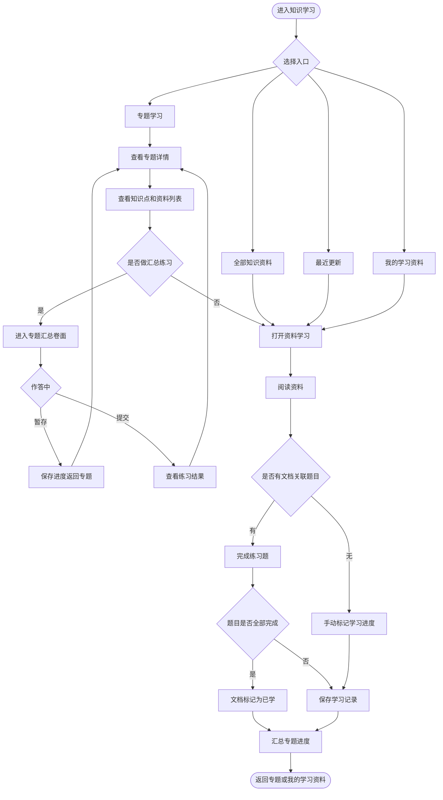
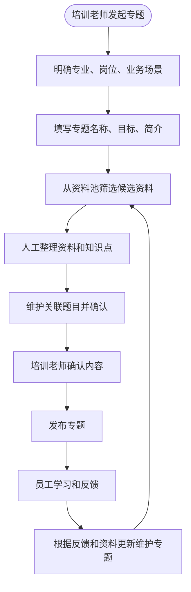

# 能力提升 - 知识学习模块需求说明（简洁版）

## 一、建设内容

- 专题学习:  按专业、岗位、业务场景组织学习内容
- 全部知识资料: 提供可学习资料的检索浏览
- 我的学习资料：员工正在学，已学完的资料
- 最近更新： 最近知识库更新资料和更新的专题
- 专题由培训老师维护

## 二、用户角色

| ---- | ----------------------- | --- |
| 普通员工 | 浏览专题、检索资料、开始学习、做文档关联题目  |     |
| 培训老师 | 创建专题、选择资料、维护知识点和题目、发布更新 |     |

## 三、建设范围

- 知识学习首页：专题学习, 全部知识资料,我的学习资料,最近更新
- 专题列表：专题卡片, 按岗位分类, 专题学习进度
- 专题详情：专题简介, 知识点, 资料列表, 专题汇总练习（资料区不展开单文件题目）
- 资料学习：查看资料, 开始学习, 继续学习, 收藏，已学标记（手动标记/题目全对自动标记）
- 专题维护：培训老师创建专题, 筛选资料, 维护题目

## 四、功能模块说明

### 4.1 专题学习

专题卡片展示内容：

- 专题名称：如「新员工运行专业入门」「电气专业基础」
- 专业/岗位标签：电气、锅炉、化学、运行值班等
- 学习对象：新员工、运行人员、检修人员、班组长等
- 资料数量、题目数量、更新时间
- 我的学习状态：未开始、学习中、已完成
- 专题进度：按专题内文档学习完成情况汇总

#### 专题详情页信息架构

页面采用左右分栏：**左侧**以学习与浏览为主，**右侧**以进度与汇总练习为主。

**顶部信息区**

- 专题名称、专业/岗位标签、业务场景、学习目标、专题简介
- 汇总统计：资料份数、题目总数、适合岗位
- 专题学习进度条与「继续学习 / 回顾资料」「收藏专题」等操作

**左侧主栏**

| 区块 | 说明 |
| ---- | ---- |
| 资料清单 | 按专题编排顺序列出资料；展示标题、类型、来源、摘要、学习状态；提供「开始学习 / 继续 / 回顾」进入资料学习页 |
| 重点知识点 | 培训老师维护的核心知识点卡片 |

资料清单**不展示**每份资料下的题目列表，也不在资料行内展开「章节后习题」。题目在维护侧仍绑定到具体文档，但员工在专题详情页通过右侧「汇总练习」统一作答。

**右侧栏**

| 区块 | 说明 |
| ---- | ---- |
| 专题进度 | 完成度、已学资料数、学习中资料数、汇总练习进度（已答 / 总题） |
| 汇总练习 | 本专题全部资料关联题目的汇聚入口，见下节 |

#### 专题汇总练习

**题目来源**：按资料清单顺序，将各资料下已发布的关联题目依次拼接为一份完整卷面（如 资料 A 3 题 + 资料 B 5 题 → 共 8 题）。

**卷面交互**（与现有练习/考试卷面一致，可先做界面模拟）：

- 顶栏：专题名称、模式标签「专题练习」、当前题号 / 总题数、用时
- 主题干区：题型、题干、选项/作答区、上一题 / 下一题 / 提交答卷
- 右侧答题卡：题号网格，已答 / 未答 / 当前题高亮
- 题目可标注所属资料名称，便于员工对照原文（不在专题详情资料列表中展开）

**暂存与入口状态**

| 状态 | 右侧按钮 | 行为 |
| ---- | -------- | ---- |
| 无暂存 | 开始练习 | 进入卷面，从第 1 题开始 |
| 有未提交暂存 | 继续练习 | 恢复上次暂存的作答与当前题位置 |
| 有暂存或已练过 | 重新练习 | 弹窗确认：「重新练习将清空当前暂存与作答记录，是否继续？」确认后从第 1 题重新开始 |

- **暂存练习**：卷内提供「暂存并退出」，或在退出确认框中选择暂存；暂存数据与专题 ID 绑定，仅当前员工可见
- **提交答卷**：交卷后进入结果页，可查看对错与解析；按各题所属资料回写单文档答题进度，进而影响资料「已学」判定

**与资料学习的关系**

- 资料学习页：阅读正文，可按单文档做配套练习（如有）
- 专题汇总练习：跨资料一次性检验掌握情况，是专题详情页的主要练题入口
- 两者题目来源相同（文档级关联题），进度可互通汇总

#### 学习规则

- 员工从专题进入某份资料阅读；无关联题的资料可手动标记已学
- 某份资料关联题目全部完成（单文档练习或汇总练习回写）后，可标记为已学
- 专题进度 = 已学资料数 / 专题资料总数
- 专题汇总练习全部提交且各资料题目均完成后，可认为专题学习完成；完成后仍可回看资料与重新练习

### 4.2 全部知识资料

全部知识资料： 用于员工自由检索浏览所有可学习的资料，不是知识库全量文件

知识资料来源： 在知识库侧管理，新上传文件时增加 【文件性质】 标签，如知识类、制度类、通知类、台账类、记录类等等； 

选择知识类时，默认将该文件纳入学习资料池候选范围，文件解析完成，并且文件基础信息如资料类型、来源、更新时间等信息自动补充/手动录入后，才可在 全部知识资料 中被检索；

主要能力：

- 按资料类型、来源、标签、适用专业、更新时间筛选
- 展示资料标题、摘要、类型、来源、适用专业、更新时间
- 支持开始学习、继续学习、收藏或加入我的学习资料
- 培训老师在维护专题时，可从学习资料池中选择资料加入专题
- 知识库文件更新版本后，可在最近更新中提示员工

### 4.3 我的学习资料

我的学习资料：用于承接员工个人学习过程中 所有学过的资料

数据来源：

- 从专题中开始学习的文档
- 从全部知识资料中点击开始学习的文档
- 从最近更新中加入学习的文档

展示内容：

- 正在学习的资料
- 已阅读或已完成的资料
- 最近打开时间、关联题目完成情况
- 笔记、收藏、简单的一轮周期复习提醒（资料学完后自动安排一轮复习周期，2d, 4d,7d, 14, 31d, 61d）

### 4.4 最近更新

最近更新: 用于展示近期新增或更新的专题和资料，让员工知道哪些内容值得关注

展示内容：

- 新增的专题
- 专题内容更新
- 新增学习资料
- 资料版本更新

交互：

- 点击专题进入专题详情
- 点击资料进入资料学习页
- 支持一键加入我的学习资料

## 五、专题维护设计

### 5.1 维护入口

当前用户具备培训老师角色时，可在后台维护专题，包括创建、更新、下架专题

维护功能：

- 创建专题
- 编辑基本信息
- 从资料池选择资料
- 维护知识点
- 生成/修订关联题目
- 预览专题
- 发布、下架、更新

### 5.2 专题基础字段

| 字段   | 说明                   |
| ---- | -------------------- |
| 专题名称 | 简明描述学习主题             |
| 所属专业 | 电气、锅炉、化学、运行值班等       |
| 适用岗位 | 新员工、运行人员、检修人员、管理人员等  |
| 学习目标 | 学完后应掌握什么、能解决什么问题     |
| 业务场景 | 入职培训、故障复盘、标准操作、制度学习等 |
| 专题简介 | 简短说明                 |
| 资料清单 | 专题包含的学习资料            |
| 知识点  | 由培训老师人工维护            |
| 关联题目 | 由培训老师维护，查阅并确认后发布     |
| 状态   | 草稿、已发布、已下架           |

### 5.3 如何创建一个对员工有价值的专题

一个有价值的专题应从岗位能力和真实业务场景出发，而不是从“有多少资料”出发

建议步骤：

1. 明确学习对象：例如新员工、运行值班人员、电气专业人员
2. 明确业务场景：例如新员工入门、典型故障处理、红线操作、设备巡检
3. 明确学习目标：员工学完后要能识别什么、判断什么、执行什么
4. 筛选精品资料：从知识库中选择权威、清晰、经过评价的资料，避免全量堆叠
5. 提炼知识点：把资料中的核心概念、操作要点、风险点整理成可浏览的知识点
6. 绑定练习题：题目在维护侧绑定到具体文档；员工在专题详情通过汇总练习统一作答
7. 发布专题：由培训老师确认资料、知识点和题目后直接发布
8. 发布后复盘：根据学习数据、员工反馈、现场变化持续更新

## 六、业务流程图

### 6.1 员工学习流程

### 6.2 专题维护流程

