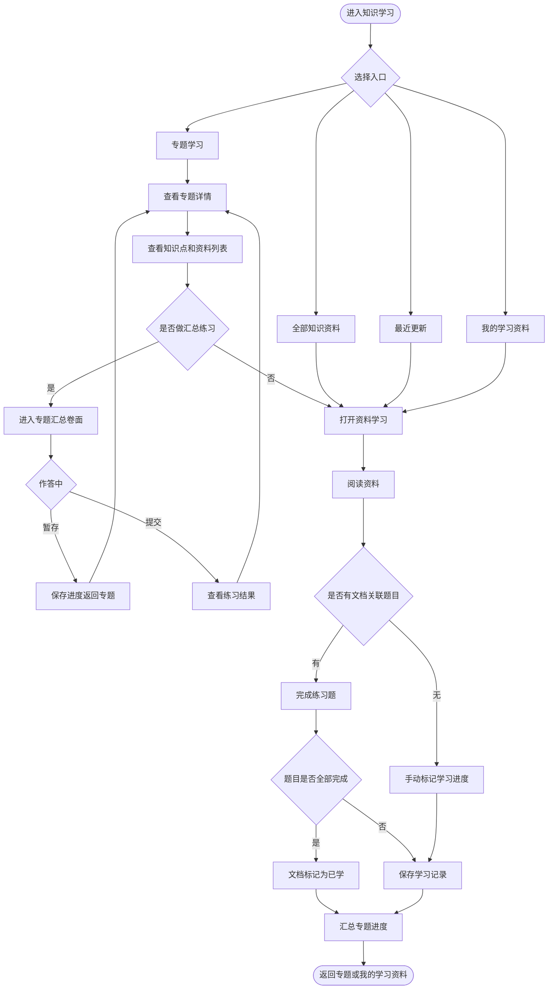
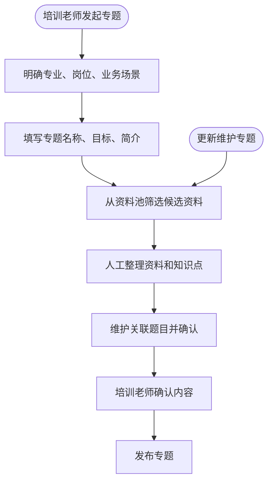
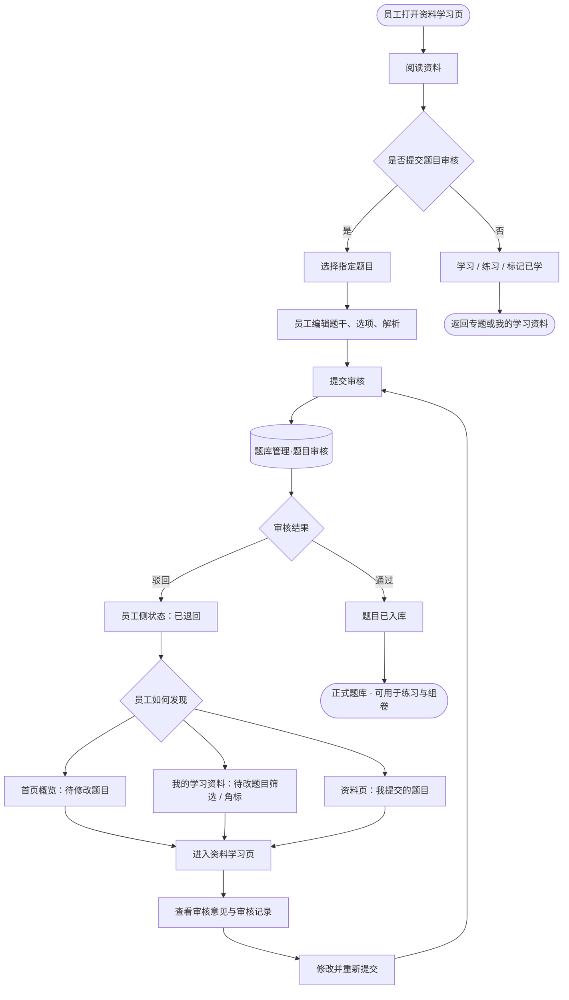

# 能力提升 - 知识学习模块需求说明（简洁版）

## 一、建设内容

- 以「专题学习」作为主入口，按专业、岗位、业务场景组织学习内容
- 「全部知识资料」提供可学习资料池的检索浏览
- 「我的学习资料」员工正在学、已学完的资料，并承接**待修改题目**待办提醒
- 「最近更新」最近知识库更新资料和更新的专题
- 专题由培训老师维护

## 二、用户角色

| 角色   | 主要能力                                               |
| ---- | -------------------------------------------------- |
| 普通员工 | 浏览专题、检索资料、开始学习、做文档关联练习；从资料解析题目并提交审核；查看退回意见、修改后重新提交 |
| 培训老师 | 创建专题、选择资料、维护知识点和题目、发布更新；在**题库管理·题目审核**中审核员工提交的题目   |

## 三、建设范围

### 3.1 高优先级

- 知识学习首页：专题学习、全部知识资料、我的学习资料、最近更新
- 首页概览：专题总数、正在学习、**资料库总量 / 待修改题目**、最近阅读
- 专题列表：专题卡片，按岗位分类，专题学习进度
- 专题详情：专题简介、知识点、资料列表、专题汇总练习
- 资料学习：查看资料, 开始学习, 继续学习, 收藏，已学标记（手动标记/题目全对自动标记）
- 专题维护：培训老师创建专题、筛选资料、维护题目

### 3.2 暂缓

- 具体的学习路径步骤编排
- 全库艾宾浩斯复习计划
- 基于个人画像的智能推荐
- 章节级题目生成，第一版只绑定到文档级
- AI 辅助创建专题（含 AI 推荐资料、提炼知识点、生成题目草稿、维护建议等）
- 全部资料「阅读热度」看板（趋势曲线、热门排行、高峰时段、增长趋势标签等）；第一版资料卡片/列表仅展示近 7 日阅读人数

## 四、功能模块说明

### 4.1 专题学习

专题是由培训老师围绕岗位能力和业务场景筛选出来的精品学习资料集合

专题列表展示内容：

- 专题名称：如「新员工运行专业入门」「电气专业基础」「故障诊断复盘」
- 专业/岗位标签：电气、锅炉、化学、运行值班等
- 学习对象：新员工、运行人员、检修人员、班组长等
- 资料数量、题目数量、更新时间
- 我的学习状态：未开始、学习中、已完成
- 专题进度：按专题内文档学习完成情况汇总

专题详情展示内容：

- 专题简介：说明适用对象、学习目标、业务价值
- 知识点罗列：提炼专题下必须掌握的核心知识点
- 资料列表：支持按标签、分类、来源、难度筛选
- 关联题目

专题汇总练习：

- 将本专题内**所有资料下的关联题目汇聚为一份完整习题册**，员工一次进入即可逐题作答
- 展示形态：左侧题目区 + 右侧答题卡，与常规练习一致
- 支持**暂存练习**：中途保存作答进度，下次从专题详情「继续练习」恢复
- 入口按钮按状态切换：
  - **开始练习**：尚无暂存记录时展示
  - **继续练习**：存在未提交的暂存记录时展示，显示已答 / 总题数
  - **重新练习**：存在暂存或已完成记录时展示；点击前需二次确认，**清空当前暂存与本次作答记录**

学习规则：

- 某份资料关联题目全部完成且都正确后，该资料自动标记为已学；也可在阅读页手动标记
- 专题进度 = 已学资料数 / 专题资料总数
- 专题内题目全部完成后，可认为专题学习完成，仍可回看

### 4.2 全部知识资料

全部知识资料： 所有可学习的资料，不是知识库全量文件

知识资料来源： 在知识库侧管理，新上传文件时增加 【文件性质】 标签，如知识类、制度类、通知类、台账类、记录类等； 

主要功能：

- 按资料类型、来源、标签、适用专业、更新时间筛选
- 展示资料标题、摘要、类型、来源、适用专业、更新时间
- 支持开始学习、继续学习、收藏或加入我的学习资料
- 培训老师在维护专题时，可从学习资料池中选择资料加入专题
- 知识资料文件更新版本后，可在最近更新中提示员工

### 4.3 我的学习资料

我的学习资料：用于承接员工个人学习过程中所有学过的知识资料，并作为**题目退回待办**的提醒入口

数据来源：

- 从专题中开始学习的文档
- 从全部知识资料中点击开始学习的文档
- 从最近更新中加入学习的文档

展示内容：

- 正在学习的资料
- 已阅读或已完成的资料
- 最近打开时间、关联题目完成情况
- 笔记、收藏

### 4.4 最近更新

最近更新: 展示近期新增或更新的专题和资料

展示内容：

- 新增的专题
- 专题内容更新
- 新增学习资料
- 资料版本更新

交互：

- 点击专题进入专题详情
- 点击资料进入资料学习页
- 支持一键加入我的学习资料

### 4.5 知识学习首页概览

顶部指标区（与题库训练首页风格一致）：

| 指标                | 说明              |
| ----------------- | --------------- |
| 专题总数              | 全部可学专题数量        |
| 正在学习              | 进度进行中的专题数       |
| 资料库数量 **或** 待修改题目 | **互斥展示**，占同一槽位  |
| 最近阅读              | 近期阅读资料列表与学习状态汇总 |

**资料库 / 待修改题目互斥规则：**

- 员工当前**无**审核退回题目 → 显示 **资料库**（可学资料总量）
- 员工当前**有**审核退回题目 → 显示 **待修改题目**（退回待处理数量）

### 4.6 资料学习与题目贡献

**我提交的题目（资料页右侧）**

- **编辑**：修改题干、选项、解析后提交审核
- **状态**：草稿、待审核、已退回、已入库
- **已退回**：展示审核意见，支持修改并重新提交
- **审核记录**：查看本人题目提交与审核流转历史

## 五、专题维护设计

### 5.1 维护入口

培训老师角色在后台维护专题，包括创建、更新、下架专题

维护功能：

- 创建专题
- 编辑基本信息
- 从资料池选择资料
- 维护知识点
- 生成/修订关联题目
- 预览专题
- 发布、下架、更新

### 5.2 专题基础字段

| 字段   | 说明                   |
| ---- | -------------------- |
| 专题名称 | 简明描述学习主题             |
| 所属专业 | 电气、锅炉、化学、运行值班等       |
| 适用岗位 | 新员工、运行人员、检修人员、管理人员等  |
| 学习目标 | 学完后应掌握什么、能解决什么问题     |
| 业务场景 | 入职培训、故障复盘、标准操作、制度学习等 |
| 专题简介 | 简短说明                 |
| 资料清单 | 专题包含的学习资料            |
| 知识点  | 由培训老师人工维护            |
| 关联题目 | 由培训老师维护，查阅并确认后发布     |
| 状态   | 草稿、已发布、已下架           |

## 六、业务流程图

### 6.1 员工学习流程

### 6.2 专题维护流程

### 6.3 题目审核闭环

