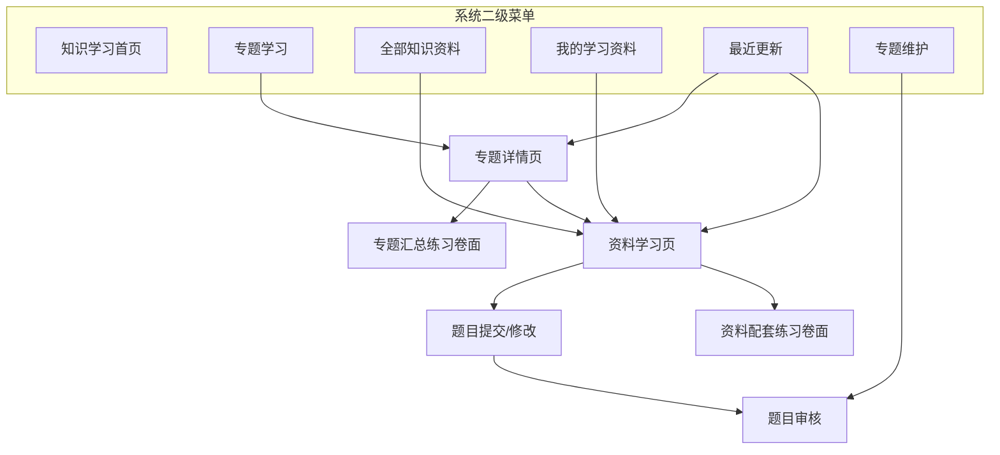

# 知识学习模块 · 系统需求说明

> **版本**：v1.0 · 2026-07-09  
> **依据**：[01-知识学习业务需求说明](./01-知识学习业务需求说明.md) · [知识库系统需求说明](../知识库/02-知识库系统需求说明.md)  
> **范围**：第一期（MVP）  
> **说明**：本文档将业务需求按**系统实现视角**拆分为页面、模块、状态、数据关系和核心流程。不涉及具体 UI 视觉稿。

---

## 一、页面模型总览

知识学习模块由 **6 个核心页面** + **3 个独立功能模块** 组成：



| 页面 / 模块 | 定位 | 默认落地 |
|-------------|------|----------|
| **知识学习首页** | 学习入口与个人概览 | 进入知识学习模块默认页 |
| **专题学习** | 专题列表、筛选、进入专题详情 | 二级菜单直达 |
| **专题详情页** | 展示专题目标、资料、知识点、进度、汇总练习 | 从专题列表点击进入 |
| **资料学习页** | 阅读单份学习资料，承接练习、收藏、标记已学、题目贡献 | 从专题、资料池、我的学习、最近更新进入 |
| **全部知识资料** | 学习资料池检索，不等于知识库全量文件 | 二级菜单直达 |
| **我的学习资料** | 个人学习记录、收藏、已学、待处理题目 | 二级菜单直达 |
| **最近更新** | 新增/更新专题和资料列表 | 二级菜单直达 |
| **专题维护** | 培训老师维护专题 | 培训老师可见 |
| **题目审核** | 审核员工提交或老师维护的题目 | 审核人可见 |

---

## 二、系统菜单结构

### 2.1 主导航（系统级）

```
知识学习（一级）
├── 知识学习首页（二级）      ← 默认落地页
├── 专题学习（二级）
├── 全部知识资料（二级）
├── 我的学习资料（二级）
├── 最近更新（二级）
└── 专题维护（二级）          ← 培训老师/管理员可见
```

| 菜单 | 可见角色 | 说明 |
|------|----------|------|
| 知识学习首页 | 全员 | 概览学习状态，提供主要入口 |
| 专题学习 | 全员 | 按专业、岗位、业务场景浏览专题 |
| 全部知识资料 | 全员 | 检索有权限的学习资料池 |
| 我的学习资料 | 全员 | 查看自己的学习记录、收藏、待处理题目 |
| 最近更新 | 全员 | 查看近期新增和更新的专题/资料 |
| 专题维护 | 培训老师、学习管理员 | 创建、编辑、发布、下架专题 |

### 2.2 页面间跳转关系

| 起点 | 操作 | 目标 |
|------|------|------|
| 知识学习首页 | 点击专题卡片 | 专题详情页 |
| 知识学习首页 | 点击最近阅读资料 | 资料学习页 |
| 知识学习首页 | 点击待修改题目 | 资料学习页 / 题目提交页 |
| 专题学习 | 点击专题 | 专题详情页 |
| 专题详情页 | 点击资料「开始学习/继续/回顾」 | 资料学习页 |
| 专题详情页 | 点击「开始练习/继续练习/重新练习」 | 专题汇总练习卷面 |
| 全部知识资料 | 点击资料 | 资料学习页 |
| 我的学习资料 | 点击资料 | 资料学习页 |
| 最近更新 | 点击专题 | 专题详情页 |
| 最近更新 | 点击资料 | 资料学习页 |
| 资料学习页 | 点击资料配套练习 | 资料配套练习卷面 |
| 资料学习页 | 提交或修改题目 | 题目提交页 |
| 专题维护 | 预览专题 | 专题详情预览 |

---

## 三、知识学习首页

### 3.1 页面结构

```
┌──────────────────────────────────────────────────────────────────────┐
│ 知识学习首页                                      [最近更新] [我的学习] │
├──────────────────────────────────────────────────────────────────────┤
│ 概览：专题总数 | 正在学习 | 资料库数量/待修改题目 | 最近阅读            │
├──────────────────────────────────────────────────────────────────────┤
│ 推荐专题 / 继续学习                                                   │
│ ┌──────────┐ ┌──────────┐ ┌──────────┐                               │
│ │专题卡片  │ │专题卡片  │ │资料卡片  │                               │
│ └──────────┘ └──────────┘ └──────────┘                               │
├──────────────────────────────────────────────────────────────────────┤
│ 最近更新：新增专题、资料版本更新、专题内容更新                         │
└──────────────────────────────────────────────────────────────────────┘
```

### 3.2 首页系统需求

| 编号 | 功能描述 | 来源 |
|------|----------|------|
| SR-01 | 进入知识学习模块默认落地知识学习首页 | BR-01 |
| SR-02 | 首页展示专题学习、全部知识资料、我的学习资料、最近更新快捷入口 | BR-01 |
| SR-03 | 首页概览展示专题总数、正在学习、资料库数量、最近阅读 | BR-02 |
| SR-04 | 若当前用户存在被退回待修改题目，概览第三项由资料库数量切换为待修改题目 | BR-03、BR-42 |
| SR-05 | 首页展示继续学习入口，优先展示最近打开但未完成的资料或专题 | BR-04 |
| SR-06 | 首页展示最近更新摘要，点击进入最近更新页或对应详情页 | BR-04、BR-43 |
| SR-07 | 首页所有卡片和统计项必须能跳转到对应列表或详情 | BR-05 |

---

## 四、专题学习页

### 4.1 页面定位

专题学习页用于展示所有当前用户可学习的已发布专题，并提供按专业、岗位、业务场景的筛选。

### 4.2 页面结构

```
┌──────────────────────────────────────────────────────────────────────┐
│ 专题学习                                      [搜索专题...]            │
├──────────────────────────────────────────────────────────────────────┤
│ 筛选：[全部专业 ▼] [全部岗位 ▼] [业务场景 ▼] [学习状态 ▼] [排序 ▼]   │
├──────────────────────────────────────────────────────────────────────┤
│ ┌──────────────┐ ┌──────────────┐ ┌──────────────┐                   │
│ │ 专题卡片      │ │ 专题卡片      │ │ 专题卡片      │                   │
│ │ 标签/对象     │ │ 资料/题目数   │ │ 我的进度      │                   │
│ └──────────────┘ └──────────────┘ └──────────────┘                   │
└──────────────────────────────────────────────────────────────────────┘
```

### 4.3 专题学习系统需求

| 编号 | 功能描述 | 来源 |
|------|----------|------|
| SR-10 | 仅展示已发布且当前用户有权限查看的专题 | BR-06 |
| SR-11 | 支持按专业、岗位、业务场景、学习状态筛选 | BR-06、BR-08 |
| SR-12 | 支持专题名称、简介、知识点关键词搜索 | BR-08 |
| SR-13 | 专题卡片展示名称、专业/岗位标签、学习对象、资料数、题目数、更新时间 | BR-07 |
| SR-14 | 专题卡片展示当前用户学习状态：未开始、学习中、已完成 | BR-07 |
| SR-15 | 专题卡片展示专题进度，进度=已学资料数/专题资料总数 | BR-13 |
| SR-16 | 支持收藏/取消收藏专题 | BR-09 |
| SR-17 | 点击专题卡片进入专题详情页 | BR-10 |

---

## 五、专题详情页

### 5.1 页面定位

专题详情页是员工围绕一个能力主题学习的主工作台。左侧关注资料和知识点，右侧关注进度和汇总练习。

### 5.2 页面结构

```
┌──────────────────────────────────────────────────────────────────────┐
│ 专题名称  [专业] [岗位] [业务场景]                 [收藏] [继续学习] │
│ 学习目标 / 专题简介 / 资料数 / 题目数 / 更新时间                       │
├──────────────────────────────────────────────┬───────────────────────┤
│ 资料清单                                      │ 专题进度              │
│ 1. 资料 A  未开始  [开始学习]                 │ 完成度：40%           │
│ 2. 资料 B  学习中  [继续]                     │ 已学 2 / 共 5         │
│ 3. 资料 C  已学    [回顾]                     │ 汇总练习：6 / 20      │
│                                               │ [开始/继续/重新练习]  │
│ 重点知识点                                    │                       │
│ - 知识点卡片                                  │                       │
└──────────────────────────────────────────────┴───────────────────────┘
```

### 5.3 专题详情系统需求

| 编号 | 功能描述 | 来源 |
|------|----------|------|
| SR-20 | 顶部展示专题名称、标签、学习对象、业务场景、学习目标、简介 | BR-10 |
| SR-21 | 展示资料数、题目数、更新时间、学习进度 | BR-10、BR-13 |
| SR-22 | 资料清单按培训老师维护的顺序展示 | BR-11 |
| SR-23 | 资料项展示标题、资料类型、来源、摘要、学习状态、操作按钮 | BR-12 |
| SR-24 | 资料项操作根据状态显示：开始学习、继续、回顾 | BR-12、BR-22 |
| SR-25 | 资料列表不展开每份资料下的题目列表 | BR-15 |
| SR-26 | 展示培训老师维护的重点知识点 | BR-10、BR-55 |
| SR-27 | 右侧展示专题进度、已学资料数、学习中资料数、汇总练习进度 | BR-13 |
| SR-28 | 右侧提供汇总练习入口，按钮状态根据练习记录切换 | BR-15、BR-17 |
| SR-29 | 专题更新后展示更新提示和更新时间 | BR-14 |

---

## 六、专题汇总练习卷面

### 6.1 页面定位

专题汇总练习用于把专题内全部资料关联的已发布题目汇总成一次练习。卷面交互可复用题库训练/考试卷面风格。

### 6.2 题目组织规则

| 规则 | 说明 |
|------|------|
| 题目来源 | 专题资料清单下已发布、可练习的文档级关联题目 |
| 排序 | 按专题资料顺序拼接，同一资料内按题目维护顺序展示 |
| 标注 | 每道题展示所属资料名称，便于回看原文 |
| 权限 | 员工能进入专题，即可练习该专题内可见资料对应题目 |

### 6.3 卷面系统需求

| 编号 | 功能描述 | 来源 |
|------|----------|------|
| SR-30 | 顶栏展示专题名称、模式标签「专题练习」、当前题号/总题数、用时 | BR-15、BR-16 |
| SR-31 | 主答题区展示题型、题干、选项或作答区、解析入口 | BR-20 |
| SR-32 | 右侧答题卡展示题号网格、已答/未答/当前题状态 | BR-17 |
| SR-33 | 支持上一题、下一题、暂存并退出、提交答卷 | BR-18、BR-20 |
| SR-34 | 无暂存时入口按钮显示「开始练习」 | BR-17 |
| SR-35 | 有未提交暂存时入口按钮显示「继续练习」，进入后恢复答案和题号位置 | BR-18 |
| SR-36 | 有暂存或已提交记录时支持「重新练习」，须二次确认 | BR-19 |
| SR-37 | 提交后进入结果页，展示得分、对错、答案、解析 | BR-20 |
| SR-38 | 提交后按题目所属资料回写资料练习进度 | BR-21 |
| SR-39 | 暂存数据与专题 ID、用户 ID 绑定，仅本人可见 | BR-18 |

---

## 七、资料学习页

### 7.1 页面定位

资料学习页承接单份学习资料的阅读、练习、收藏、标记已学、题目贡献和学习记录。

### 7.2 页面结构

```
┌──────────────────────────────────────────────────────────────────────┐
│ ← 返回   资料标题 / 来源知识库 / 当前版本       [收藏] [标记已学]    │
├──────────────────────────────────────────────┬───────────────────────┤
│ 资料预览 / 正文阅读区                         │ 学习辅助              │
│                                              │ 摘要                  │
│                                              │ 知识点                │
│                                              │ 关联专题              │
│                                              │ 配套练习              │
│                                              │ 我的题目提交          │
└──────────────────────────────────────────────┴───────────────────────┘
```

### 7.3 资料学习系统需求

| 编号 | 功能描述 | 来源 |
|------|----------|------|
| SR-40 | 支持从专题、全部知识资料、我的学习资料、最近更新进入 | BR-22 |
| SR-41 | 顶部展示资料标题、来源知识库、资料类型、更新时间、版本 | BR-23 |
| SR-42 | 中间区域支持资料在线预览或正文阅读 | BR-23 |
| SR-43 | 进入资料学习页时创建或更新个人学习记录 | BR-37、BR-39 |
| SR-44 | 支持开始学习、继续学习、收藏/取消收藏 | BR-24 |
| SR-45 | 无关联题目时允许手动标记已学 | BR-25 |
| SR-46 | 有关联题目时，题目全部完成后自动标记已学；仍可允许人工复核标记 | BR-26 |
| SR-47 | 展示资料配套练习入口，进入资料练习卷面 | BR-27 |
| SR-48 | 右侧展示摘要、知识点、关联专题等辅助信息 | BR-28 |
| SR-49 | 支持个人笔记或学习备注 | BR-29 |
| SR-50 | 支持基于当前资料提交题目建议 | BR-47 |
| SR-51 | 展示本人对当前资料提交的题目及状态：草稿、待审核、已退回、已入库 | BR-48、BR-50 |

---

## 八、全部知识资料页

### 8.1 页面定位

全部知识资料页是学习资料池的检索视图，只展示可学习资料，不展示知识库全量文件。

### 8.2 页面结构

```
┌──────────────────────────────────────────────────────────────────────┐
│ 全部知识资料 · 共 N 份                         [搜索资料...]          │
├──────────────────────────────────────────────────────────────────────┤
│ 筛选：[资料类型 ▼] [来源知识库 ▼] [适用专业 ▼] [标签 ▼] [更新时间 ▼] │
├──────────────────────────────────────────────────────────────────────┤
│ 资料标题          类型        来源        专业        状态      操作   │
│ AGC运行规程       规程        运行库      电气        学习中    继续   │
│ 两细则解读        知识类      制度库      运行        未开始    学习   │
└──────────────────────────────────────────────────────────────────────┘
```

### 8.3 全部知识资料系统需求

| 编号 | 功能描述 | 来源 |
|------|----------|------|
| SR-60 | 仅展示已发布、已解析、被纳入学习资料池且当前用户有权限的资料 | BR-30、BR-31、BR-32 |
| SR-61 | 支持按资料类型、来源知识库、适用专业、标签、更新时间筛选 | BR-33 |
| SR-62 | 支持关键词搜索和排序 | BR-33 |
| SR-63 | 列表展示标题、摘要、类型、来源、适用专业、更新时间、学习状态 | BR-34 |
| SR-64 | 支持开始学习、继续学习、收藏、加入我的学习资料 | BR-35 |
| SR-65 | 知识库当前版本更新后，在资料列表展示版本更新标识 | BR-36 |
| SR-66 | 培训老师维护专题时可从同一资料池选择资料 | BR-53 |

---

## 九、我的学习资料页

### 9.1 页面定位

我的学习资料页承接当前员工的学习记录、收藏、已学、最近阅读和题目待办。

### 9.2 内部 Tab

| Tab | 内容 |
|-----|------|
| **正在学习** | 已开始但未完成的资料和专题 |
| **已学完** | 已完成的资料和专题 |
| **我的收藏** | 收藏的专题和资料 |
| **最近阅读** | 最近打开的资料 |
| **待修改题目** | 本人提交后被退回、需要修改的题目 |

### 9.3 我的学习资料系统需求

| 编号 | 功能描述 | 来源 |
|------|----------|------|
| SR-70 | 展示当前用户的个人学习记录 | BR-37 |
| SR-71 | 支持按正在学习、已学完、收藏、最近阅读、待修改题目分类查看 | BR-38、BR-42 |
| SR-72 | 列表展示最近打开时间、学习状态、题目完成情况 | BR-39 |
| SR-73 | 支持继续阅读、继续练习、取消收藏 | BR-40 |
| SR-74 | 已学资料可展示复习提醒或复习计划占位 | BR-41 |
| SR-75 | 待修改题目可跳转到题目修改页，并展示退回意见 | BR-50 |

---

## 十、最近更新页

### 10.1 页面定位

最近更新页展示近期新增或变更的学习内容，包括专题和资料。

### 10.2 更新类型

| 类型 | 说明 | 点击目标 |
|------|------|----------|
| 新增专题 | 新发布的专题 | 专题详情页 |
| 专题内容更新 | 专题资料、知识点、题目发生变化 | 专题详情页 |
| 新增学习资料 | 新纳入学习资料池的资料 | 资料学习页 |
| 资料版本更新 | 学习资料对应知识库文档更新版本 | 资料学习页 |

### 10.3 最近更新系统需求

| 编号 | 功能描述 | 来源 |
|------|----------|------|
| SR-80 | 展示新增专题、专题内容更新、新增学习资料、资料版本更新 | BR-43 |
| SR-81 | 更新项展示标题、更新类型、来源、更新时间、是否已读 | BR-46 |
| SR-82 | 点击专题更新项进入专题详情页 | BR-44 |
| SR-83 | 点击资料更新项进入资料学习页 | BR-44 |
| SR-84 | 支持将资料一键加入我的学习资料 | BR-45 |
| SR-85 | 已读状态与用户 ID 绑定 | BR-46 |

---

## 十一、专题维护模块

### 11.1 页面定位

专题维护是培训老师创建和更新专题的后台模块，与员工学习界面分离。

### 11.2 维护流程

```
创建专题
  → 编辑基础信息
  → 从学习资料池选择资料
  → 调整资料顺序
  → 维护知识点
  → 维护/选择关联题目
  → 预览
  → 发布
```

### 11.3 专题基础字段

| 字段 | 说明 | 必填 |
|------|------|:----:|
| 专题名称 | 简明描述学习主题 | 是 |
| 所属专业 | 电气、锅炉、化学、运行值班等 | 是 |
| 适用岗位 | 新员工、运行人员、检修人员、管理人员等 | 是 |
| 业务场景 | 入职培训、故障复盘、标准操作、制度学习等 | 是 |
| 学习目标 | 学完后应掌握什么、能解决什么问题 | 是 |
| 专题简介 | 面向员工的简短说明 | 是 |
| 资料清单 | 专题包含的学习资料 | 是 |
| 知识点 | 培训老师人工维护 | 否 |
| 关联题目 | 绑定到具体资料的题目 | 否 |
| 状态 | 草稿、已发布、已下架 | 是 |

### 11.4 专题维护系统需求

| 编号 | 功能描述 | 来源 |
|------|----------|------|
| SR-90 | 培训老师可新建、编辑、删除草稿专题 | BR-52 |
| SR-91 | 支持维护专题基础字段 | BR-52 |
| SR-92 | 支持从学习资料池选择资料加入专题 | BR-53 |
| SR-93 | 支持调整专题资料顺序 | BR-54 |
| SR-94 | 支持维护专题知识点 | BR-55 |
| SR-95 | 支持选择已发布题目或维护资料关联题目 | BR-56 |
| SR-96 | 支持专题预览，预览效果接近员工侧专题详情 | BR-59 |
| SR-97 | 支持发布、下架、重新发布专题 | BR-57 |
| SR-98 | 已发布专题更新后记录更新时间，并生成最近更新记录 | BR-58 |

---

## 十二、题目提交与审核模块

### 12.1 题目提交字段

| 字段 | 说明 | 必填 |
|------|------|:----:|
| 所属资料 | 当前资料自动绑定 | 是 |
| 题型 | 单选、多选、判断、填空、简答等 | 是 |
| 题干 | 题目内容 | 是 |
| 选项 | 客观题必填 | 按题型 |
| 正确答案 | 标准答案 | 是 |
| 解析 | 答案说明或原文依据 | 建议必填 |
| 难度 | 简单、中等、困难 | 否 |

### 12.2 审核状态

| 状态 | 说明 |
|------|------|
| 草稿 | 员工保存但未提交 |
| 待审核 | 已提交，等待审核 |
| 已退回 | 审核未通过，需查看意见后修改 |
| 已入库 | 审核通过，进入正式题库 |

### 12.3 题目模块系统需求

| 编号 | 功能描述 | 来源 |
|------|----------|------|
| SR-100 | 员工可在资料学习页基于当前资料提交题目 | BR-47 |
| SR-101 | 题目提交必须绑定资料 ID 和提交人 ID | BR-48 |
| SR-102 | 支持草稿保存、提交审核 | BR-48 |
| SR-103 | 审核人可通过或退回题目，退回须填写意见 | BR-49、BR-51 |
| SR-104 | 退回题目在员工侧展示待修改提醒 | BR-50 |
| SR-105 | 员工可查看审核意见，修改后重新提交 | BR-50 |
| SR-106 | 审核通过后题目进入正式题库，可被资料练习和专题汇总练习引用 | BR-49 |

---

## 十三、信息架构（数据层次）

```
知识库文件
  └── 学习资料（资料池）
        ├── 学习记录（按用户）
        ├── 资料关联题目
        └── 资料版本更新记录

专题
  ├── 专题基础信息
  ├── 专题资料清单（有顺序）
  ├── 专题知识点
  ├── 专题学习记录（按用户）
  └── 专题汇总练习记录（按用户）

题目
  ├── 草稿/待审核/退回/入库状态
  └── 正式题库引用
```

---

## 十四、状态模型

### 14.1 资料学习状态

| 状态 | 触发 |
|------|------|
| 未开始 | 无学习记录 |
| 学习中 | 打开资料、开始阅读或开始练习 |
| 已学 | 手动标记已学，或关联题目完成 |
| 需复习 | 已学后达到复习提醒条件 |

### 14.2 专题学习状态

| 状态 | 触发 |
|------|------|
| 未开始 | 专题内无资料学习记录 |
| 学习中 | 至少一份资料开始学习但专题未完成 |
| 已完成 | 专题内资料均已学，且汇总练习满足完成规则 |

### 14.3 专题状态

| 状态 | 员工侧可见 | 说明 |
|------|:----------:|------|
| 草稿 | 否 | 维护中 |
| 已发布 | 是 | 可学习 |
| 已下架 | 否 | 不再对员工展示 |

---

## 十五、权限模型

| 操作 | 普通员工 | 培训老师 | 题目审核人 | 学习管理员 |
|------|:--------:|:--------:|:----------:|:----------:|
| 浏览已发布专题 | 是 | 是 | 是 | 是 |
| 阅读有权限资料 | 是 | 是 | 是 | 是 |
| 完成练习 | 是 | 是 | 是 | 是 |
| 提交题目建议 | 是 | 是 | 是 | 是 |
| 创建/维护专题 | 否 | 是 | 可配置 | 是 |
| 发布/下架专题 | 否 | 是 | 否 | 是 |
| 审核题目 | 否 | 可配置 | 是 | 是 |
| 维护基础字典 | 否 | 否 | 否 | 是 |

> 资料可见性继承知识库权限：员工只能学习自己有权限访问的知识库资料。

---

## 十六、系统模块与业务需求映射

| 系统页面/模块 | 合并的业务需求 |
|---------------|----------------|
| 知识学习首页 | BR-01～BR-05、BR-42 |
| 专题学习页 | BR-06～BR-09 |
| 专题详情页 | BR-10～BR-14、BR-15～BR-21 |
| 专题汇总练习 | BR-15～BR-21 |
| 资料学习页 | BR-22～BR-29、BR-47～BR-50 |
| 全部知识资料 | BR-30～BR-36 |
| 我的学习资料 | BR-37～BR-42 |
| 最近更新 | BR-43～BR-46 |
| 专题维护 | BR-52～BR-59 |
| 题目审核 | BR-47～BR-51 |

---

## 十七、一期交付边界

### 纳入一期

- 知识学习首页及学习概览
- 专题学习列表、筛选、收藏
- 专题详情：资料清单、知识点、学习进度、汇总练习入口
- 资料学习页：阅读、收藏、标记已学、配套练习入口
- 全部知识资料检索
- 我的学习资料：正在学习、已学、收藏、最近阅读、待修改题目
- 最近更新：专题和资料更新
- 专题维护：创建、选资料、排顺序、知识点、题目、预览、发布/下架
- 题目提交与审核闭环
- 学习记录、练习暂存、提交结果、进度回写

### 一期简化

- 资料正文可先复用知识库文件预览能力
- 资料笔记可先做基础文本备注
- 复习提醒可先记录计划或展示入口，不做复杂算法
- 题目卷面可复用现有题库训练/考试卷面样式
- AI 自动提炼知识点、自动出题可先不做，仅预留入口

### 一期不做

- 完整学习路径编排
- 个性化智能推荐
- 学习排行榜和热门趋势大屏
- 章节级学习和章节级题目
- 移动端专项适配

---

*本文档与 [01-知识学习业务需求说明](./01-知识学习业务需求说明.md) 配套使用。*
