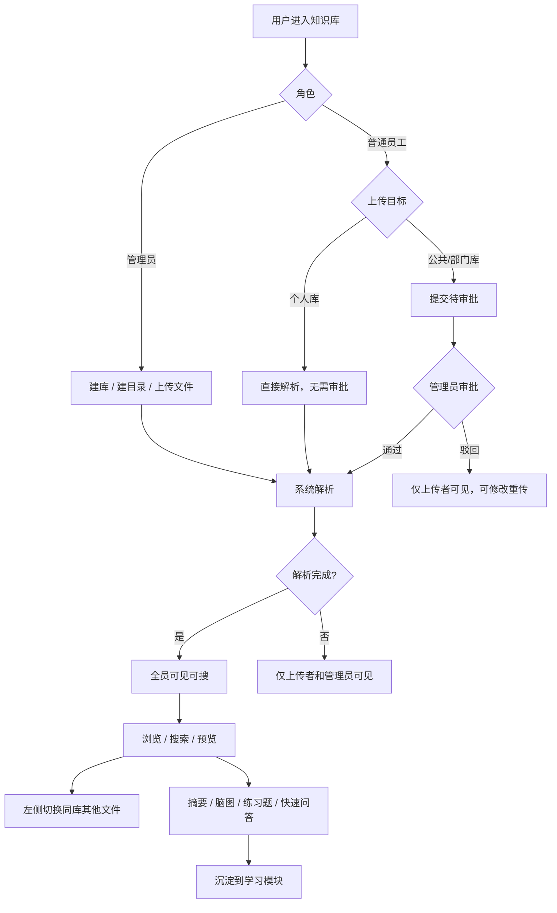
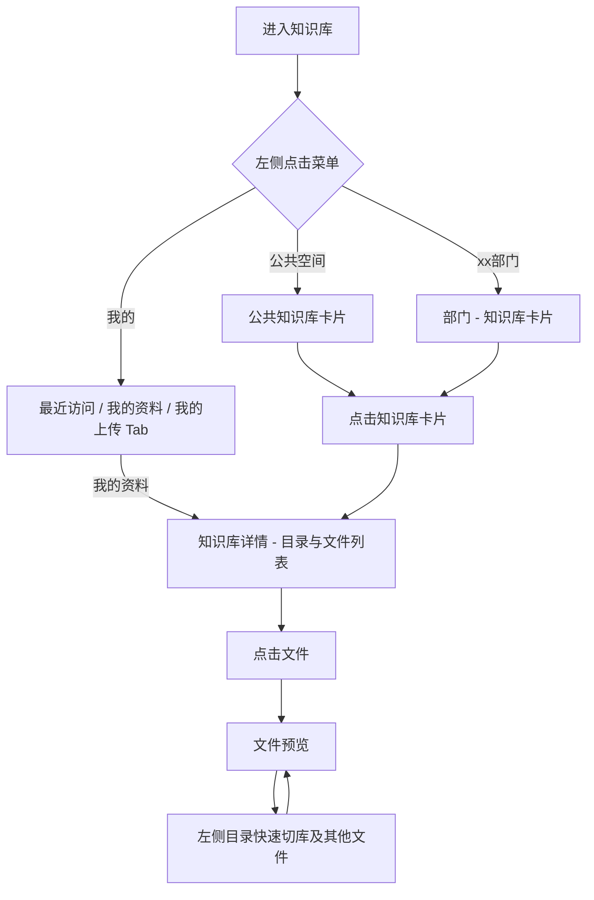
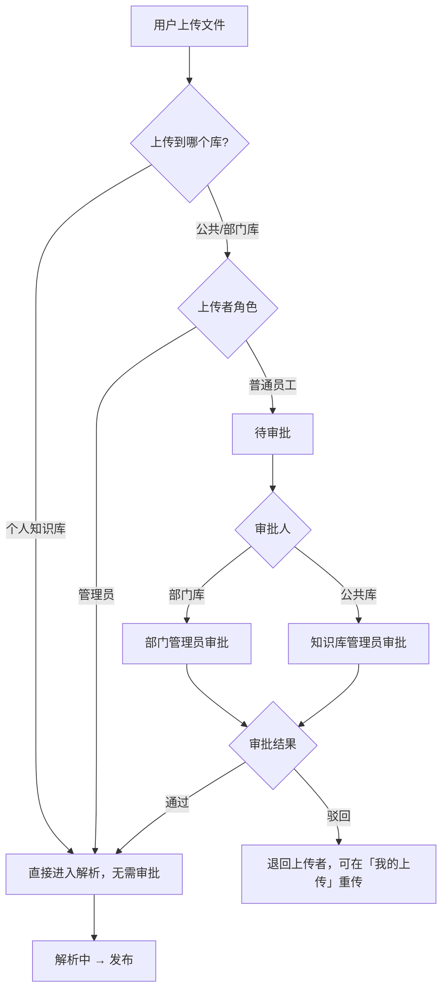
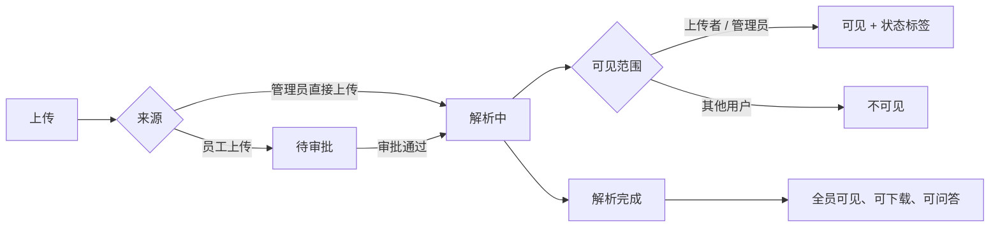
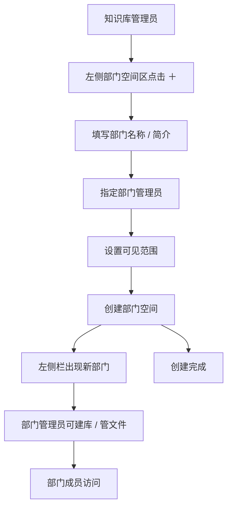
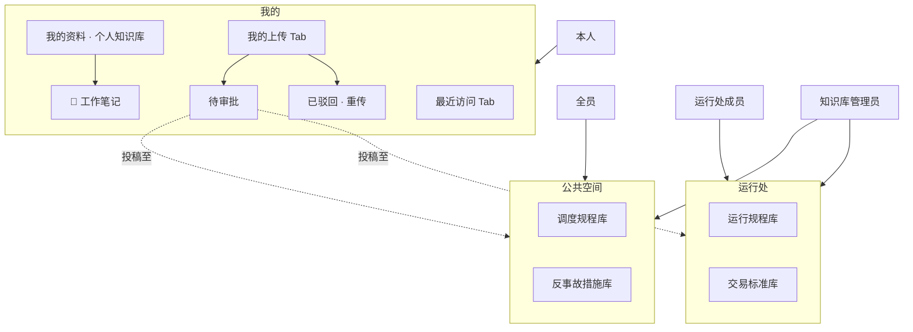

---

> **日期**：2026-07-02

---

## 一、主要内容

1. **导航简化**：「我的（含个人知识库）+ 公共空间 + 部门空间(平铺列表)」
2. **层级清晰**：空间（公共 / 部门 / 个人）→ 知识库 → 库内目录 → 文件 → 预览
3. **预览可切换**：阅读文件时，左侧展示当前库内目录与文件，可快速切换相邻文档
4. **知识库可切换**：阅读文件时，左侧顶部可切换当前部门下其他知识库
5. **状态可见**：解析中 / 待审批文件仅上传者和管理员可见，普通用户只看已发布内容
6. **权限分层**：知识库管理员、部门管理员、普通员工三类角色
7. **部门可建**：知识库管理员可创建部门空间，指定部门管理员
8. **我的聚合入口**：个人知识库、我的上传均归入「我的」，左侧不再单独设「个人空间」

---

## 二、整体信息架构

```
知识库模块
│
├── 【一级】左侧常驻栏（平铺，非树）
│   ├── 我的（统一入口，内含三个 Tab）
│   │   ├── Tab · 最近访问（最近库 / 最近文件）
│   │   ├── Tab · 我的资料 → 默认个人知识库（唯一，库内可建目录）
│   │   └── Tab · 我的上传 → 公共/部门库的上传审批记录
│   ├── 快速访问（将指定知识库置顶，直达库详情）
│   ├── 公共空间 → 知识库卡片列表（扁平，不套深层目录）
│   └── 部门空间（平铺列表）
│       ├── 运行处
│       ├── 技术处
│       ├── …
│       └── ＋ 新建部门（知识库管理员）
│
├── 【二级】空间主页
│   ├── 公共空间 / 部门空间 → 该空间下知识库
│   └── 我的 （最近访问的库和文件 / 个人知识库 / 我的上传）
│
├── 【三级】知识库详情
│   └── 库内目录 + 文件列表 + 预览
│
```

---


## 三、页面示意


### 3.1 知识库主页

```
┌────────────┬─────────────────────────────────────────┐
│            │  运行处 · 部门主页                       |
|  我的      |                [搜索本部门知识库…] 新建  │
│  快速访问  │  ┌─────────┐ ┌─────────┐ ┌─────────┐    │
│ ─────────  │  │ xxxx库  │ │  xxxx库 │ │＋新建库 │    │
│ 公共空间   │  │最近更新… │ │12 个文件│ │         │   │
│ ─────────  │  └─────────┘ └─────────┘ └─────────┘    │
| 部门空间   │                                         │
|  运行处 ◀ │                                         │
│  技术处    │                                         │
│  调度处    │                                         │
│  ＋ 新建   │  ← 仅知识库管理员可见                   │
└────────────┴─────────────────────────────────────────┘
```


### 3.2 库详情页 - 目录预览

```
┌────────────┬─────────────────────────────────────┐
│ 部门名/库名 |                                    │
|  目录/文件  │            文件列表预览区           │
│             │                                    │
│ 📁 目录A ◀ │                                    │
│  · xx文件   │           文件卡片/文件列表         │
│  · xx文件   │                                    │
│ 📁 目录B    │                                    │
│  · xx文件   │                                    │
└─────────────┴─────────────────────────────────────┘
```

---


### 3.3 库详情页-文件预览

```
┌──────────────┬─────────────────────────┬─────────────┐
│ 部门名/库名 ˅|                         |             |
|  目录/文件   │        PDF 预览区       │ 知识点 /概要│
│             │                          │  [思维脑图] │
│ 📁 目录A    │                         │             | 
│  · xx文件 ◀│                          │              │
│  · xx文件   │                          │  [相关题目]  │
│ 📁 目录B   │                          │  [推荐问题]  │
│  · xx文件  │                           │              │
└────────────┴───────────────────────────┴──────────────┘

---- ---- ---- ---- 库内快速切换当前部门下其他知识库 ---- ---- ---- ---- 
┌────────────────────────────────┐
│部门名/库名A  ˅                  │
│电气运行部 · 3 个知识库          │
│--------------------------------│
│✓ 库名A                         │
│  12 个文件 · 最近更新 今天      │
│                                │
│ 库名B                          │
│  46 个文件 · 最近更新 昨天      │
│                                │
│ 库名C                          │
│  28 个文件 · 最近更新 3 天前    │
│                                │
│________________________________│
```


### 3.4 新建部门弹窗

```
┌──────────────────────────────────────┐
│  新建部门空间                         │
├──────────────────────────────────────┤
│  部门名称 *                           │
│  [ 运行处                          ] │
│                                      │
│  部门简介                             │
│  [ 本部门运行规程、技术标准…         ] │
│                                      │
│  部门管理员 *                         │
│  [ 搜索并选择人员…                 ▼] │
│  已选：张三、李四                     │
│                                      │
│  可见范围                             │
│  ○ 全员可见                           │
│  ○ 部门内成员可见                      │
│                                      │
│              [取消]  [创建部门]       │
└──────────────────────────────────────┘
```


### 3.5 我的（最近访问 + 个人知识库 + 我的上传）

点击左侧「**我的**」进入，主区顶部三个 Tab，**不再单独设「个人空间」导航项**：

```
┌────────────┬─────────────────────────────────────────┐
│  我的 ◀    │  [ 最近访问 ]  [ 我的资料 ]  [ 我的上传 ] │
│            │─────────────────────────────────────────│
│  我的      │  Tab · 我的资料（默认个人知识库）          │
│  快速访问  │  ┌──────────┬──────────────────────────┐ │
│  公共空间  │  │ 库内目录  │  文件列表                 │ │
│  部门空间  │  │ 📁 工作笔记│  📄 学习摘录.pdf        │ │
│            │  │ 📁 待整理  │  📄 规程草稿.docx      │ │
│            │  │ ＋新建目录 │  [上传]  ← 无需审批      │ │
│            │  └──────────┴──────────────────────────┘ │
│            │──────────────────────────────────────────│
│            │  Tab · 我的上传（上传到公共/部门库的记录）  │
│            │  ┌─────────┬─────────┬─────────┬──────┐  │
│            │  │ 待审批 2│ 解析中 1│ 已发布 8│已驳回│ │  |
│            │  └─────────┴─────────┴─────────┴──────┘  │
│            │  📄 xxxx.pdf   xxx库 · 待审批       │
│            │  📄 xxxx.xlsx  xxx库 · 已驳回 [重传]│
└────────────┴──────────────────────────────────────────┘
```

**个人知识库：**

| 知识库数量 | **仅 1 个**默认个人知识库，系统按用户自动创建|
| 库内目录 |  可在个人库内**新建目录**，自行整理文件 |
| 上传至个人库 | 仅本人可见，**无需审批**，上传后直接进入解析 |
| 上传至公共/部门库 | 走审批流程，在「我的 → 我的上传」Tab 跟踪状态、重传 |

---


### 4.1 知识库整体使用




### 4.2 浏览路线




### 4.3 文件上传与审批




### 4.4 文件可见性




### 4.5 创建部门空间




---


## 五、主要功能


| 功能              | 说明                            |
| --------------- | ----------------------------- |
| **部门平铺导航**      | 左侧平铺部门，不用展开树                  |
| **我的**          | 统一入口：最近访问 + 个人知识库（我的资料）+ 我的上传 |
| **我的上传**        | 在「我的 → 我的上传」；公共/部门库审批记录       |
| **部门知识库卡片**     | 点部门看该部门下所有库                   |
| **知识库内左侧文件夹目录** | 目录 + 文件树形（公共 / 部门 / 个人库一致）    |
| **解析状态分层**      | 普通用户只看已发布内容；上传者和管理员可见中间态      |
| **文件审批**        | 投放到公共/部门库须审批；个人库上传免审批         |
| **部门创建**        | 知识库管理员可新建部门空间，指定部门管理员与可见范围    |


---


## 六、权限体系


### 6.1 角色定义


| 角色         | 管理范围              | 部门空间     | 知识库      | 文件                          | 审批          |
| ---------- | ----------------- | -------- | -------- | --------------------------- | ----------- |
| **知识库管理员** | 公共空间 + 全部部门       | 新建、编辑、停用 | 新建、编辑、删除 | 上传、编辑、删除、移动                 | 审批公共库及各部门文件 |
| **部门管理员**  | 本部门               | —        | 新建、编辑、删除 | 上传、编辑、删除、移动                 | 审批本部门文件     |
| **普通员工**   | 有访问权限的库 + **个人库** | —        | —        | 部门空间仅上传、查看详情； **个人库可文件增删改** | —           |


> - **知识库管理员**   模块级管理员，管理公共空间和各部门知识库，**可创建部门空间**
> - **部门管理员**     由知识库管理员在创建/编辑部门时指定；仅限本部门，不能操作其他部门或公共空间
> - **普通员工**       不能建部门、建库；可向公共/部门库上传，须审批 ；  ****个人库免审批，可对文件增删改
> - 管理员向公共/部门库上传的文件**无需审批**，直接进入解析队列


### 6.2 可见范围


| 角色     | 可见内容                               |
| ------ | ---------------------------------- |
| 知识库管理员 | 全部文件（含待审批、解析中、解析失败）                |
| 部门管理员  | 本部门全部文件（含待审批、解析中、解析失败）             |
| 普通员工   | 已发布文件 + 本人上传中的文件（待审批 / 解析中 / 解析失败） |


---


## 七、知识空间隔离


| 空间类型     | 定位         | 知识库    | 隔离规则               | 谁可创建          |
| -------- | ---------- | ------ | ------------------ | ------------- |
| **公共空间** | 全厂共享的规章/标准 | 多个，可新建 | 全员可读；仅知识库管理员可管     | 系统预置空间，库由管理员建 |
| **部门空间** | 某部门专属知识边界  | 多个，可新建 | 默认仅本部门成员可见；部门间互不穿透 | 知识库管理员建空间     |
| **个人空间** | 用户私有的知识整理区 | 不可新建   | 仅本人可见；可建目录、上传免审批   | 系统按用户自动创建     |


1. **部门** ：部门空间下的知识库默认不暴露给其他部门。
2. **公共空间独立**：全厂规章标准与部门资料分隔；。
3. **个人库在「我的」下**：每人一库，不参与公共/部门隔离配置；对外投稿走「我的上传」跟踪。
4. **权限向下继承**：部门/公共空间 → 知识库 → 目录 → 文件；个人库仅一层。
5. **搜索受隔离约束**：全局搜索不含他人个人库；「我的」内仅搜本人文件。




---


## 八、创建部门空间


### 8.1 入口与权限


| 项目       | 说明                   |
| -------- | -------------------- |
| **入口**   | 左侧栏「部门空间」列表底部 `＋` 按钮 |
| **触发角色** | 仅知识库管理员              |
| **无权限时** | 按钮直接隐藏               |


部门项 hover 菜单 `⋯` 中，知识库管理员额外可见「编辑部门」「停用部门」

### 8.2 表单字段


| 字段    | 必填  | 说明                         |
| ----- | --- | -------------------------- |
| 部门名称  | ✅   | 如「运行处」「继保班」，≤ 50 字，同层级不可重名 |
| 部门简介  | —   | 展示在部门主页标题下方                |
| 部门管理员 | ✅   | 至少 1 人；创建后该用户获得本部门管理权限     |
| 可见范围  | ✅   | 默认可选本部门成员，可选全员可见           |


### 8.3 创建后效果

- 新部门立即出现在左侧「部门空间」列表
- 指定管理员可在该部门下新建知识库、管理文件、审批上传
- 部门主页自动生成，初始为空库状态，引导「＋ 新建知识库」

