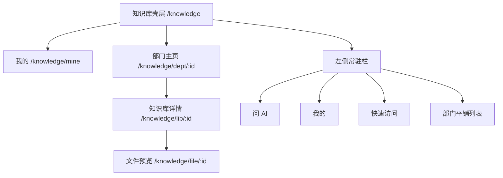
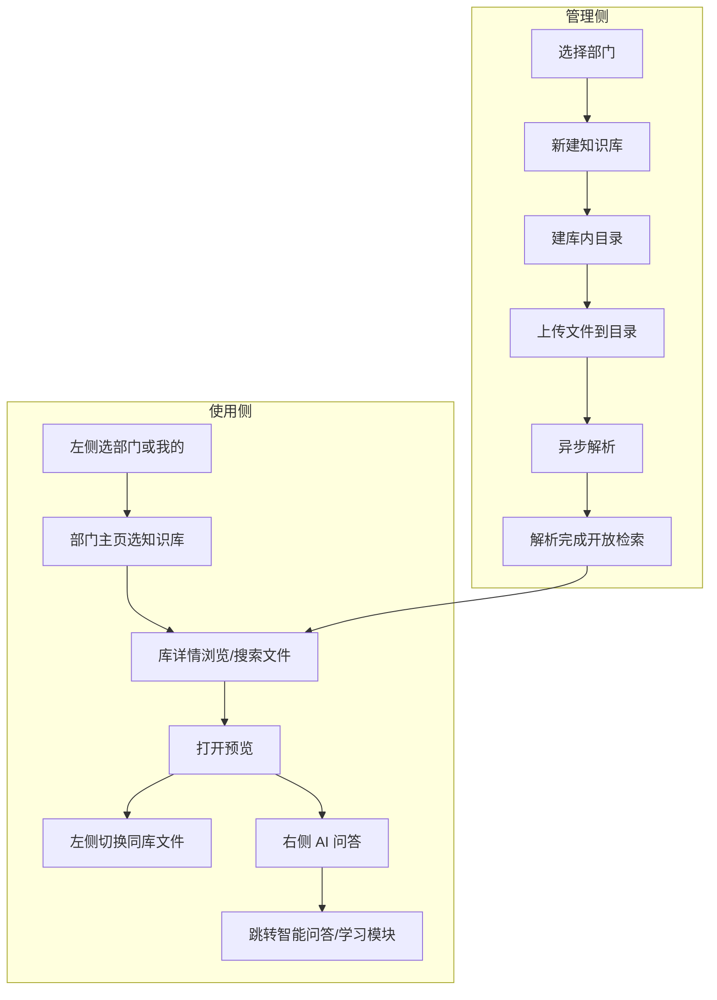
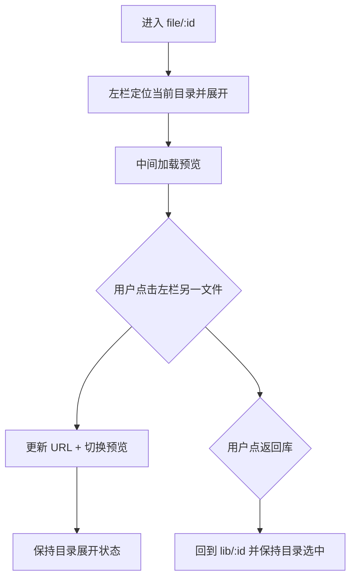

# 知识库模块需求设计说明（详细版）

> **适用对象**：前端开发、产品迭代、Cursor AI 辅助修改  
> **版本**：v1.1（左侧部门导航 + 预览页库内目录）  
> **日期**：2026-07-01  
> **关联文件**：`src/routes/knowledge.tsx`、`src/lib/mock/knowledge-space.ts`  
> **路由规划**：`/knowledge` · `/knowledge/dept/$deptId` · `/knowledge/lib/$libId` · `/knowledge/file/$fileId`

---

## 一、背景与借鉴说明

### 1.1 现状问题（0630 会议）

1. 目录与知识库**断层**：点目录进文档，看不出该层有几个知识库
2. **视图状态丢失**：卡片/列表切换后搜索框、文件列表消失
3. **左侧树过深**：公共空间 > 分类 > 目录 > 知识库，路径长、难理解
4. **预览无法快速换文件**：看一篇规程要反复退回列表
5. **解析状态混乱**：未解析文件对普通用户可见
6. **管理按钮过多**：未按角色裁剪

### 1.2 乐享借鉴 vs 我们的适配（v1.1 更新）

| 借鉴点 | 乐享做法 | 我们的适配 |
|--------|----------|------------|
| 左侧一级导航 | 平铺「常用团队」列表，非树 | 平铺「常用部门/空间」列表，**不叫团队** |
| 我的 | 左侧独立「我的」入口 | 同样独立置顶：最近库、最近文件、收藏 |
| 部门/团队主页 | 主区知识库卡片网格 | **部门主页** = 该部门下知识库卡片 |
| 知识库详情 | 左侧库内目录树 + 最近更新 | 知识库详情页：主区目录+文件；**预览页**左侧目录+文件 |
| 快速访问 | 个人常用库 shortcut | 可选：pin 到左侧「快速访问」 |
| 权限可视化 | 创建库时展示继承关系 | 新建知识库弹窗保留 |
| 视图不丢状态 | 切换视图保留上下文 | URL query + localStorage |

### 1.3 不照抄

- 不做「团队」产品概念与团队可见性/申请加入
- 不做评论、点赞、协同编辑、外部导入（腾讯文档等）
- 不做在线文档编辑器（本期以 PDF/Office 上传预览为主）
- 「我的」不与乐享完全等同：收藏可与「个人沉淀」联动，避免重复建设

---

## 二、信息架构与页面层级

### 2.1 四级页面模型



| 层级 | 路由示例 | 左侧栏 | 主内容区 |
|------|----------|--------|----------|
| 壳层 | `/knowledge` | 常驻部门列表 | 默认进「我的」或上次部门 |
| 我的 | `/knowledge/mine` | 同上 | 最近知识库 / 最近文件 / 收藏 Tab |
| 部门主页 | `/knowledge/dept/run` | 高亮当前部门 | 知识库卡片网格 + 部门内搜索 |
| 知识库详情 | `/knowledge/lib/trade-spec` | 同上（或收起为图标条） | 面包屑 + 工具栏 + 目录区 + 文件列表 |
| 文件预览 | `/knowledge/file/kf1` | **库内目录+文件树** | 预览区 + 右侧 AI 面板 |

### 2.2 概念映射（避免「团队」用语）

| 乐享 UI 概念 | 我们 UI 文案 | 业务含义 |
|--------------|-------------|----------|
| 常用团队 | 常用部门 / 知识空间 | 运行处、技术处、公共空间等 |
| 团队主页 | 部门主页 | 某部门下知识库聚合页 |
| 团队知识库 | 部门知识库 | 归属部门的 AI 可检索容器 |
| 我的 | 我的 | 个人最近访问与收藏 |
| 快速访问 | 快速访问 | 用户 pin 的知识库 |

---

## 三、数据模型

### 3.1 部门（Dept）— 左侧导航单元

```typescript
type KbDept = {
  id: string;              // e.g. "dept-run"
  name: string;            // "运行处"
  kind: "public" | "dept" | "personal";
  icon?: string;
  libraryCount: number;    // 侧边栏可选展示
  description?: string;
};
```

### 3.2 知识库（Library）— 部门下卡片

```typescript
type KbLibrary = {
  id: string;
  deptId: string;          // 归属部门
  name: string;
  description?: string;
  coverColor?: string;     // 卡片头图色
  fileCount: number;
  parsedCount: number;
  recentFiles: { id: string; name: string; updatedAt: string }[];  // 卡片摘要
  updatedAt: string;
};
```

### 3.3 库内目录（Folder）— 仅存在于知识库内部

```typescript
type KbFolder = {
  id: string;
  libraryId: string;
  parentId: string | null; // null = 库根下的一级目录
  name: string;
  sortOrder: number;
};
```

### 3.4 文件（File）

```typescript
type KbFile = {
  id: string;
  libraryId: string;
  folderId: string;        // 必须在某目录下，不允许「悬空」在库根（库根用「未分类」目录）
  name: string;
  summary: string;
  fileType: "pdf" | "docx" | "xlsx" | "ppt" | "txt" | "other";
  scope: "公共" | "部门" | "个人";
  parseStatus: "pending" | "processing" | "done" | "failed" | "disabled";
  uploaderId: string;
  updatedAt: string;
  size: string;
};
```

**parseStatus 可见性**（不变）：

| parseStatus | 上传者 | 其他用户 | 管理员 |
|-------------|--------|----------|--------|
| pending/processing | ✅ | ❌ | ✅ |
| done | ✅ | ✅ | ✅ |
| failed/disabled | ✅ | ❌ | ✅ |

---

## 四、整体业务闭环



---

## 五、页面设计规格

### 5.1 知识库壳层 + 左侧常驻栏

**布局（参考乐享截图）：**

```
┌─────────────────────────────────────────────────────────────────┐
│ 全局 Header                                                      │
├──────────────┬──────────────────────────────────────────────────┤
│ 乐享式侧栏    │  主内容区（随路由变化）                            │
│              │                                                  │
│ [+ 新建]     │                                                  │
│ [↑ 上传]     │                                                  │
│ ───────────  │                                                  │
│ 🔍 搜索      │                                                  │
│ ───────────  │                                                  │
│ 🤖 问 AI     │                                                  │
│ 👤 我的      │  ← 独立入口，默认路由可落此处                        │
│ ───────────  │                                                  │
│ ⭐ 快速访问   │                                                  │
│   · 电力交易库│                                                  │
│ ───────────  │                                                  │
│ 常用部门      │                                                  │
│   公共空间    │                                                  │
│ ▶ 运行处     │  ← 当前选中高亮（浅蓝底+左边条）                    │
│   技术处     │                                                  │
│   调度处     │                                                  │
│   个人空间    │                                                  │
│ ───────────  │                                                  │
│ [用户/通知]   │                                                  │
└──────────────┴──────────────────────────────────────────────────┘
```

#### 5.1.1 左侧栏元素规格

| 元素 | 类型 | 行为 | 权限 |
|------|------|------|------|
| `+ 新建` | 主按钮 | 下拉：新建知识库 / 新建目录（上下文依赖当前页） | 管理员 |
| `↑ 上传` | 次按钮 | 在知识库详情/预览页可用；部门主页灰显或隐藏 | 管理员 |
| `搜索` | 入口行 | 打开全局搜索浮层（跨部门/跨库） | 全员 |
| `问 AI` | 导航项 | 跳转 `/chat`，可带最近库 context | 全员 |
| `我的` | 导航项 | `/knowledge/mine` | 全员 |
| `快速访问` | 可折叠区 | 用户 pin 的知识库，点击直达 `/knowledge/lib/:id` | 全员 |
| 部门列表项 | 平铺列表 | 点击 `/knowledge/dept/:id`，**不展开子级** | 按权限过滤可见部门 |
| 部门项 `⋯` | hover 菜单 | 复制链接、管理（管理员） | 分角色 |
| 部门列表底部 `+` | 图标按钮 | 新建部门（仅系统管理员，后期） | 系统管理员 |

#### 5.1.2 左侧栏交互原则

- **永远平铺**：不出现空间>分类>目录的多级树
- **选中态**：当前部门/我的/问AI 高亮；进入某库详情或预览时，仍高亮该库所属部门
- **宽度**：固定约 220–248px，可收起为图标条（仅保留搜索、我的、部门图标）
- **状态持久**：`localStorage` 记录上次部门、`sidebarCollapsed`

---

### 5.2 「我的」页 `/knowledge/mine`

#### 5.2.1 Tab 结构

| Tab | 列表字段 | 说明 |
|-----|----------|------|
| 最近知识库 | 库名、所属部门、最近更新时间 | 卡片横滑 + 列表 |
| 最近文件 | 文件名、所属库、浏览时间、类型图标 | 点击进预览 |
| 我的收藏 | 文件名、所属库、收藏时间 | 与「个人沉淀」可后续打通 |

#### 5.2.2 空状态

- 最近知识库为空：`还没有浏览记录，去选一个部门看看吧` + 按钮 `浏览部门知识库`
- 最近文件为空：同上

#### 5.2.3 按钮

- 顶部引导：`去部门知识库逛逛` → 聚焦左侧部门列表

---

### 5.3 部门主页 `/knowledge/dept/:deptId`

#### 5.3.1 布局

```
┌────────────────────────────────────────────────────────────┐
│ 运行处                                    [搜索知识库…]      │
│ 本部门运行规程、技术标准与经验资料                            │
├────────────────────────────────────────────────────────────┤
│  部门知识库                                                 │
│  ┌──────────────┐ ┌──────────────┐ ┌──────────────┐       │
│  │ 📚 电力交易库 │ │ 📚 并网运规库 │ │  ＋ 新建知识库 │       │
│  │ 最近：        │ │ 12 个文件     │ │              │       │
│  │ · 基本规则    │ │ 更新于昨天    │ │              │       │
│  │ · 中长期规则  │ │              │ │              │       │
│  └──────────────┘ └──────────────┘ └──────────────┘       │
└────────────────────────────────────────────────────────────┘
```

#### 5.3.2 知识库卡片字段

- 名称、简介一行、文件数/已解析数
- 最近 1–2 条文件标题 + 相对时间（乐享同款）
- hover：`⋯` 菜单 → 新标签打开、复制链接、收藏、添加到快速访问、管理

#### 5.3.3 按钮与交互

| 元素 | 行为 |
|------|------|
| 卡片点击 | 进入 `/knowledge/lib/:id` |
| `＋ 新建知识库` | 弹窗（见 5.6） |
| 部门内搜索 | 过滤卡片名称；无结果 → `暂无搜索结果` |
| 卡片 `⋯` | 见上 |

---

### 5.4 知识库详情 `/knowledge/lib/:libId`

> 此页**不在左侧做库内树**；库内结构在主区展示。左侧仍保持部门导航。

#### 5.4.1 布局

```
┌────────────────────────────────────────────────────────────┐
│ ← 运行处  /  电力交易业务技术标准库          [收藏][分享][⋯]│
│ 库简介…                                                     │
├────────────────────────────────────────────────────────────┤
│ [🔍 搜索本库文件…]  [排序▼] [卡片|列表]  [上传] [新建目录]   │
├──────────────┬─────────────────────────────────────────────┤
│ 库内目录区    │  文件列表区                                  │
│ （主区左栏）  │                                              │
│              │                                              │
│ 📁 现货市场规则│  □ 电力现货市场基本规则.pdf   已解析  04-22  │
│ 📁 中长期交易 │  □ 电力中长期交易基本规则.pdf 已解析  04-22  │
│ 📁 辅助服务   │                                              │
│ ＋ 新建目录   │                                              │
└──────────────┴─────────────────────────────────────────────┘
│ [底部 AI 栏] 📚 电力交易库  请输入问题…              [发送]  │
└────────────────────────────────────────────────────────────┘
```

#### 5.4.2 库内目录区（主区左栏，非全局左侧）

- 展示**当前知识库**下的一级目录列表（可扩展二级，默认一级够用）
- 点击目录：右侧文件列表过滤到该目录
- 选中目录高亮；显示该目录下文件数 `(6)`
- `全部文件` 虚拟项：显示库内所有可见文件
- 管理员：`＋ 新建目录`、目录项 `⋯` 重命名/删除

#### 5.4.3 工具栏

| 控件 | 规格 |
|------|------|
| 搜索框 | **始终显示**，过滤当前库+当前目录；切换卡片/列表不隐藏 |
| 排序 | 最近更新 / 名称 / 大小 |
| 视图 | 卡片 / 列表；状态写入 `localStorage[kb-view-{libId}]` |
| 上传 | 上传到**当前选中目录**；未选目录时默认「未分类」 |
| 新建目录 | 弹窗：目录名 |

#### 5.4.4 文件列表行/卡片点击

- `parseStatus === done`：进入 `/knowledge/file/:id`
- `processing` 且为上传者：可进预览，顶部黄条 `解析中，AI 问答暂不可用`
- 其他状态按可见性规则拦截 + toast

---

### 5.5 文件在线预览 `/knowledge/file/:fileId` ★ 重点更新

> **左侧改为当前知识库内的「目录 + 文件」导航**，用于快速切换预览，不再使用全局部门侧栏占满导航职责。

#### 5.5.1 三栏布局

```
┌──────────────┬──────────────────────────────┬─────────────────┐
│ 库内导航      │  文档预览                     │  AI 问答         │
│ (可折叠)      │                              │                 │
│              │  [← 返回库] 文件名.pdf  [↓][⋯]│  当前库：电力交易库│
│ 电力交易库    │  ─────────────────────────── │  ─────────────  │
│              │                              │  基于本文推荐：   │
│ 📁 现货市场规则│                              │  · 现货市场定义？ │
│   · 基本规则 ◀│      [ PDF 阅读器 / 预览 ]    │  · 出清流程？     │
│   · 中长期规则│                              │                 │
│ 📁 中长期交易 │                              │  [输入问题… 发送] │
│   · 基本规则  │                              │                 │
│ 📁 辅助服务   │                              │                 │
│   · 基本规则  │                              │                 │
└──────────────┴──────────────────────────────┴─────────────────┘
```

#### 5.5.2 左侧库内导航规格

| 项 | 说明 |
|----|------|
| 结构 | 目录为父节点，其下**平铺文件列表**（不再嵌套三级树） |
| 展开 | 默认展开当前文件所在目录；其他目录可折叠 |
| 当前文件 | 高亮 + 左侧蓝色指示条 |
| 点击文件 | 同页切换预览内容，URL 更新为 `/knowledge/file/:newId`，**不整页刷新** |
| 解析状态 | `processing/failed` 文件仅对可见用户展示在列表中，灰显+标签 |
| 顶部 | 显示知识库名称；点击返回 `/knowledge/lib/:libId` |
| 折叠 | 按钮收起左栏，预览区全宽；AI 面板可独立折叠 |
| 搜索 | 左栏顶部小搜索框，过滤文件名（仅本库） |

#### 5.5.3 中间预览区

| 元素 | 行为 |
|------|------|
| 返回 | 回知识库详情，保持目录选中 |
| 文件名 | 展示完整名；过长截断 + tooltip |
| 下载 | `done` 可用 |
| `⋯` | 复制链接、收藏、移动到、重命名、删除（按权限） |
| 预览器 | PDF 内嵌；docx 转预览或提示下载（第一版 PDF 优先） |
| 解析中条 | 顶栏 `文件解析中，请稍候…` |

#### 5.5.4 右侧 AI 面板

- 默认展开，宽度约 280–320px
- 显示绑定知识库名；问答 context = 当前文件 + 所属库
- 推荐问题 2–3 条（mock 可写死）
- 输入发送 → 跳转 `/chat?fileId=&libId=&prefill=`

#### 5.5.5 预览页导航流程



---

### 5.6 新建知识库弹窗

**触发**：部门主页 `＋ 新建知识库`；或全局 `新建` 下拉（需先选归属部门）

```
新建知识库
├── 知识库名称*（50字）
├── 简介（200字）
├── 归属部门*（下拉，当前部门默认选中）
└── 权限
    ├── ☑ 继承部门空间权限（默认）
    └── 添加成员/部门（选填）

[取消]  [新建]  ← 名称空则置灰
```

创建成功 → 跳转 `/knowledge/lib/:newId`

---

### 5.7 上传流程（摘要）

- 入口：全局侧栏 `上传`（须在库详情/预览上下文）、库详情工具栏 `上传`
- 目标：当前库 + 当前选中目录
- 同名处理：替换 / 保留两者 / 取消（见简版流程图）
- 上传后：`parseStatus = processing`，列表中立即可见（上传者）

---

## 六、路由与状态

### 6.1 路由表

| 路径 | 页面 | 左侧栏 |
|------|------|--------|
| `/knowledge` | 重定向到 `/knowledge/mine` 或上次部门 | 壳层 |
| `/knowledge/mine` | 我的 | 壳层 |
| `/knowledge/dept/:deptId` | 部门主页 | 壳层，高亮部门 |
| `/knowledge/lib/:libId` | 知识库详情 | 壳层，高亮所属部门 |
| `/knowledge/file/:fileId` | 文件预览 | **库内目录+文件导航**（替换壳层侧栏或占满左侧） |

### 6.2 URL Query 约定

```
/knowledge/lib/trade-spec?folder=folder-spot&view=list&sort=updated&q=现货
/knowledge/file/kf1?panel=ai   // AI 面板展开态
```

### 6.3 状态持久化

```typescript
// localStorage keys
kb-last-dept: string
kb-sidebar-collapsed: boolean
kb-quick-access: string[]        // library ids
kb-view-{libId}: { view, sortBy, folderId }
```

---

## 七、权限与按钮矩阵（摘要）

### 7.1 全局侧栏

| 操作 | 普通用户 | 库管理员 | 系统管理员 |
|------|----------|----------|------------|
| 新建知识库 | ❌ | ✅ 本部门 | ✅ |
| 上传 | ❌ | ✅ | ✅ |
| 部门管理 | ❌ | ❌ | ✅ |

### 7.2 文件预览 `⋯`

| 操作 | 普通用户 | 库管理员 |
|------|----------|----------|
| 复制链接/收藏/下载 | ✅ | ✅ |
| 移动/重命名/删除 | ❌ | ✅ |

---

## 八、Mock 数据结构示例

```typescript
export const KB_DEPTS: KbDept[] = [
  { id: "dept-public", name: "公共空间", kind: "public", libraryCount: 8 },
  { id: "dept-run", name: "运行处", kind: "dept", libraryCount: 3 },
  { id: "dept-tech", name: "技术处", kind: "dept", libraryCount: 2 },
  { id: "dept-personal", name: "个人空间", kind: "personal", libraryCount: 1 },
];

export const KB_LIBRARIES: KbLibrary[] = [
  {
    id: "lib-trade-spec",
    deptId: "dept-run",
    name: "电力交易业务技术标准库",
    fileCount: 6,
    parsedCount: 6,
    recentFiles: [
      { id: "kf1", name: "电力现货市场基本规则", updatedAt: "今天" },
    ],
    updatedAt: "2026-07-01",
  },
];

export const KB_FOLDERS: KbFolder[] = [
  { id: "folder-spot", libraryId: "lib-trade-spec", parentId: null, name: "现货市场规则", sortOrder: 1 },
  { id: "folder-mid", libraryId: "lib-trade-spec", parentId: null, name: "中长期交易", sortOrder: 2 },
];

export const KB_FILES: KbFile[] = [
  { id: "kf1", libraryId: "lib-trade-spec", folderId: "folder-spot", name: "电力现货市场基本规则.pdf", parseStatus: "done", /* ... */ },
];
```

---

## 九、代码改造清单

| 文件 | 改造内容 |
|------|----------|
| `src/routes/knowledge.tsx` | 拆壳层：左侧部门栏 + `<Outlet />` |
| `src/routes/knowledge.mine.tsx` | 新建：我的页 |
| `src/routes/knowledge.dept.$deptId.tsx` | 新建：部门主页卡片 |
| `src/routes/knowledge.lib.$libId.tsx` | 新建：库详情（主区目录+文件） |
| `src/routes/knowledge.file.$fileId.tsx` | 新建：预览三栏（左目录文件树） |
| `src/lib/mock/knowledge-space.ts` | 重构为 dept/library/folder/file 四套数据 |
| `src/components/knowledge/KbSidebar.tsx` | 新建：乐享式左侧栏 |
| `src/components/knowledge/KbFileNav.tsx` | 新建：预览页左侧目录+文件导航 |
| `src/routes/chat.tsx` | 接收 libId/fileId query |

---

## 十、改造优先级（更新）

### Phase 1 — P0 骨架

1. 左侧部门平铺栏 + 「我的」路由
2. 部门主页知识库卡片
3. 知识库详情：主区目录区 + 文件列表 + 搜索常显
4. 文件预览：左目录文件导航 + 中预览 + 右 AI
5. parseStatus 可见性过滤

### Phase 2 — P1 体验

6. 快速访问 pin
7. 视图/目录选中状态持久化
8. 上传 + 同名确认
9. 管理按钮按权限裁剪

### Phase 3 — P2

10. 权限配置抽屉
11. 多版本文件
12. 批量移动/删除

---

## 十一、与乐享差异对照（更新）

| 维度 | 乐享 | 我们 v1.1 |
|------|------|-----------|
| 左侧一级 | 团队列表 | **部门/空间列表**（无团队概念） |
| 二级页 | 团队知识库卡片 | **部门知识库卡片** |
| 库内结构 | 库详情左侧目录树 | 库详情**主区**目录+文件；**预览页左侧**目录+文件 |
| 我的 | 独立页 | 独立页，可联动个人沉淀 |
| 预览换文件 | 需回列表或目录 | **预览左栏直接点文件切换** |

---

*领导演示版见《知识库需求设计说明-简版（领导演示）》*
