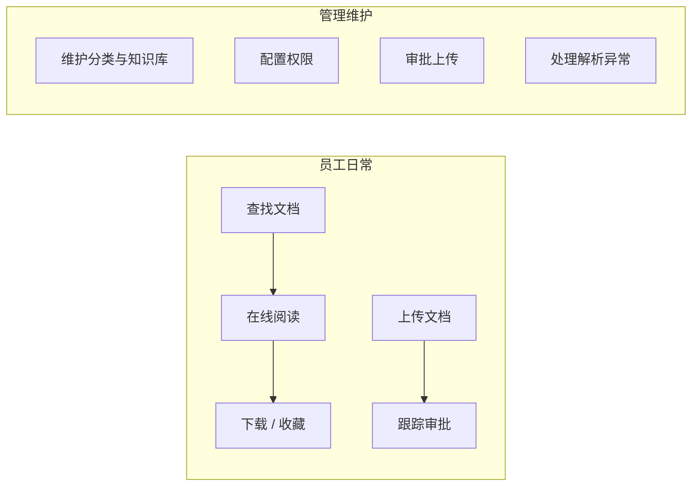
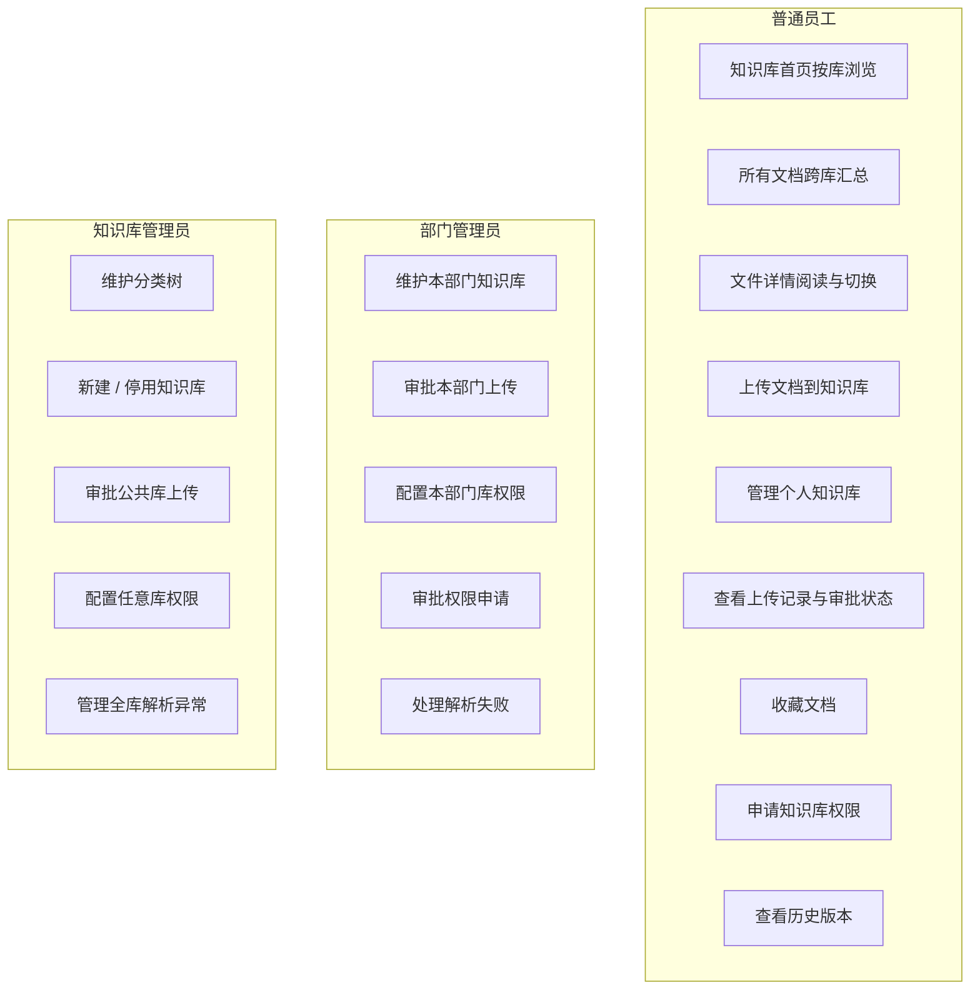

# 知识库模块 · 业务需求说明

> **版本**：v1.1 · 2026-07-06  
> **依据**：[知识库需求沟通纪要-老总沟通](./知识库需求沟通纪要-老总沟通.md) · 原 v0.3 权限体系  
> **范围**：第一期（MVP）  
> **说明**：本文档仅描述**用户要做什么、为什么做**，不涉及界面布局与实现方案。

---

## 一、模块定位

知识库是平台的**文件底座**，用于存放电厂规程、制度、技术标准等文档。后续学习、考试、AI 问答等模块均从此获取资料。

**第一期业务目标**：存得住、找得到、管得住——先把文档的上传、审批、查看、权限等基础能力做全做顺。

---

## 二、用户角色

| 角色 | 典型使用者 | 业务诉求 |
|------|------------|----------|
| **普通员工** | 运行值班员、技术员等 | 快速找到有权查看的文档；上传个人资料；向公共/专业库提交文档并跟踪审批 |
| **部门管理员** | 各部门负责人或指定管理员 | 维护本部门相关知识库；审批员工上传；配置成员权限 |
| **知识库管理员** | 平台指定管理员 / 实施人员 | 维护分类与知识库结构；管理公共库；审批公共库上传；全库权限治理 |

> 同一人可同时具备多个角色（如既是管理员又是普通员工），业务上应能分别完成对应操作。

---

## 三、业务场景概览



---

## 四、业务需求清单（第一期）

### 4.1 知识库浏览（按库查看）

| 编号 | 业务需求 | 用户价值 | 优先级 |
|------|----------|----------|--------|
| BR-01 | 我进入知识库后，有**知识库首页**：左侧看到分类知识库树，选中某个库后右侧展示**该库内的文件** | 按库组织浏览，结构清晰 | P0 |
| BR-02 | 首页左侧有**快速访问**，可置顶常用知识库；**个人知识库**默认出现在快速访问中 | 高频库一键直达 | P0 |
| BR-03 | 首页左侧点击**「我的」**，可跳转到「我的文档」 | 个人事务与按库浏览分离又互通 | P0 |
| BR-04 | 快速访问中点击**个人知识库**，跳转到「我的文档 → 个人知识库」 | 个人库有明确入口，不必在树里找 | P0 |
| BR-05 | 对**无权限的知识库**，我在树中能看到（如灰色）并**申请权限** | 知道有这份资料但还没权限 | P1 |
| BR-06 | 我能对当前库内文件进行**搜索、排序、按标签/专业类型筛选** | 库内文档量大时快速定位 | P0 |

---

### 4.2 跨库文档查找（所有文档）

| 编号 | 业务需求 | 用户价值 | 优先级 |
|------|----------|----------|--------|
| BR-07 | 我能通过**「所有文档」入口**（按钮或菜单），**一次性看到全部有权访问的文件汇总**，不必逐个知识库点进去找 | 解决跨库查找的核心痛点 | P0 |
| BR-08 | 在「所有文档」页，我能按**分类、知识库**筛选，缩小范围 | 汇总视图下的二次过滤 | P0 |
| BR-09 | 我能对汇总列表进行**搜索、排序** | 提升检索效率 | P0 |

---

### 4.3 文档阅读（文件详情）

| 编号 | 业务需求 | 用户价值 | 优先级 |
|------|----------|----------|--------|
| BR-10 | 我点击文件后进入**独立的文件详情页**，可**在线预览**（如 PDF） | 沉浸式阅读 | P0 |
| BR-11 | 详情页**左侧**展示当前库内文件列表，可**快速切换**相邻文件，无需返回列表 | 连续阅读体验 | P0 |
| BR-12 | 详情页**右侧**有 **AI 辅助**（概要、脑图、相关题目等） | 理解文档、衔接学习 | P1 |
| BR-13 | 详情页顶部可**返回知识库首页** | 读完回到浏览上下文 | P0 |
| BR-14 | 我能**下载**有浏览权限的文档 | 离线使用、归档 | P0 |
| BR-15 | 我能查看文档的**历史版本**并预览或下载旧版 | 规程年度修订场景 | P0 |
| BR-16 | 我能**收藏**文档 | 高频文档快速回访 | P1 |
| BR-17 | 我能看到**最近访问**的文档，快速续看 | 减少重复导航 | P1 |

---

### 4.4 个人文档管理（我的文档）

| 编号 | 业务需求 | 用户价值 | 优先级 |
|------|----------|----------|--------|
| BR-18 | 我有**个人知识库**，仅自己可见，用于存放私人工作资料 | 个人笔记、草稿、学习摘录的私密空间 | P0 |
| BR-19 | 我向个人库上传文档**无需审批**，上传后直接进入解析 | 降低个人资料管理成本 | P0 |
| BR-20 | 我能将个人库文档**移动**到有权限的公共/专业知识库 | 个人草稿定稿后正式归档 | P1 |
| BR-21 | 我能在「我的文档」统一查看**收藏列表** | 高频文档快速回访 | P1 |

---

### 4.5 文档上传与审批

| 编号 | 业务需求 | 用户价值 | 优先级 |
|------|----------|----------|--------|
| BR-22 | 我能向有上传权限的知识库**上传文档**（在首页选中库后拖入或选择） | 知识沉淀的基本入口 | P0 |
| BR-23 | 我向公共库 / 非个人库上传时，须经过**管理员审批**后才对外可见 | 保证发布内容质量与合规 | P0 |
| BR-24 | 管理员上传可**免审批**直接发布 | 管理员即内容责任人 | P0 |
| BR-25 | 我能查看**本人上传记录**及每条记录的审批状态（待审批、解析中、已发布、已驳回） | 跟踪自己提交的内容进展 | P0 |
| BR-26 | 审批被驳回时，我能查看**驳回原因**并重新上传 | 闭环处理，避免石沉大海 | P0 |
| BR-27 | 上传同名文件时，我能选择**上传为新版本**或重命名上传 | 规程换版时保留历史 | P0 |
| BR-28 | 审批通过或驳回后，我能收到**消息通知** | 及时知晓结果，无需反复刷新 | P1 |

---

### 4.6 权限申请与授权

| 编号 | 业务需求 | 用户价值 | 优先级 |
|------|----------|----------|--------|
| BR-29 | 我对某知识库无权限或权限不足时，可**申请权限**（浏览 / 上传）并填写理由 | 跨专业协作时获取访问权 | P1 |
| BR-30 | 管理员能**审批**员工的权限申请 | 权限开通有审核 | P1 |
| BR-31 | 管理员能**主动授权**指定员工更高权限 | 无需员工逐一申请 | P1 |
| BR-32 | 本部门成员加入部门后，**自动获得**该部门知识库的默认权限 | 减少逐人配置工作量 | P0 |

---

### 4.7 知识库与分类维护（管理员）

| 编号 | 业务需求 | 用户价值 | 优先级 |
|------|----------|----------|--------|
| BR-33 | 知识库管理员能维护**分类树**（支持多级嵌套） | 按专业/主题组织知识库 | P0 |
| BR-34 | 管理员能在指定分类下**新建、编辑、停用知识库** | 知识库生命周期管理 | P0 |
| BR-35 | 新建知识库时能明确指定**所属上级分类** | 避免建错位置 | P0 |
| BR-36 | 管理员能为单个知识库**配置权限**（默认权限 + 指定成员权限） | 精细化访问控制 | P0 |
| BR-37 | 管理员能**审批**待处理的上传和权限申请 | 管理闭环 | P0 |
| BR-38 | 部门信息从**组织架构**引用，不在知识库模块内新建部门 | 组织数据单一来源，避免重复维护 | P0 |

---

### 4.8 文档元数据与标签

| 编号 | 业务需求 | 用户价值 | 优先级 |
|------|----------|----------|--------|
| BR-39 | 文档有**专业类型**等元数据，我能按此过滤文档 | 按电力专业维度筛选 | P1 |
| BR-40 | 文档有**业务标签**，系统可自动打标，我也可人工修改 | 智能归类 + 人工校正 | P1 |
| BR-41 | 管理员能编辑文档的**基本信息**（名称、版本说明、生效日期、摘要等） | 元数据维护，支撑检索与学习模块 | P1 |

---

### 4.9 解析与发布状态

| 编号 | 业务需求 | 用户价值 | 优先级 |
|------|----------|----------|--------|
| BR-42 | 上传后文档进入**解析**，解析完成后才对有权用户可见、可检索 | 为 AI 问答、学习模块提供结构化内容 | P0 |
| BR-43 | 解析中、待审批的文件，**仅上传者和管理员可见** | 避免未审核/未就绪内容外泄 | P0 |
| BR-44 | 解析失败时，上传者能看到**失败标识**；管理员能统一查看并处理失败文档 | 问题可发现、可处理 | P0 |

---

## 五、用例图（Use Case）



---

## 六、核心业务流程

### 6.1 员工按库浏览文档

```
员工进入知识库 → 知识库首页（默认页）
  → 左侧：快速访问 / 知识库树 选中某个库
  → 右侧：该库内文件列表
  → 点击文件 → 文件详情页（左切换文件 / 中预览 / 右 AI）
  → 顶部返回首页
```

### 6.1b 员工跨库查找文档

```
员工在知识库首页点击「所有文档」按钮（或二级菜单）
  → 所有文档汇总页：全部有权访问的文件
  → 按分类 / 知识库 / 标签筛选、搜索排序
  → 点击文件 → 文件详情页
```

### 6.1c 员工访问个人库

```
方式一：首页左侧「我的」→ 我的文档
方式二：快速访问 → 个人知识库 → 我的文档 · 个人知识库 Tab
方式三：系统二级菜单「我的文档」
```

### 6.2 员工上传文档到公共/专业库

```
员工选择目标知识库（须有上传权限）
  → 上传文件
  → 若同名：选择「新版本」或「重命名」
  → 进入「待审批」队列
  → 管理员审批
      ├─ 通过 → 进入解析 → 解析完成 → 对有权限者可见
      └─ 驳回 → 仅上传者可见，可查看原因并重传
  → 员工在「我的文档」中跟踪状态
  → 收到审批结果通知
```

### 6.3 员工申请知识库权限

```
员工发现某知识库无权限或权限不足
  → 点击「申请权限」
  → 选择权限类型（浏览 / 上传）+ 填写理由
  → 提交申请
  → 对应管理员审批
      ├─ 通过 → 自动获得权限，系统通知
      └─ 驳回 → 收到驳回通知，可重新申请
```

### 6.4 管理员维护知识库

```
知识库管理员登录
  → 进入管理界面（与普通浏览分离）
  → 维护分类树（新增 / 编辑 / 调整层级）
  → 在指定分类下新建知识库
  → 配置该库默认权限与指定成员权限
  → 处理待审批上传与权限申请
  → 查看并处理解析失败文档
```

---

## 七、业务规则摘要

### 7.1 上传审批规则

| 上传者 | 目标库 | 是否审批 |
|--------|--------|----------|
| 任意角色 | 个人库 | 免审批 |
| 知识库管理员 | 任意库 | 免审批 |
| 部门管理员 | 本部门库 | 免审批 |
| 部门管理员 | 其他部门库 / 公共库 | 需审批 |
| 普通员工（有上传权） | 部门库 | 需部门管理员审批 |
| 普通员工（有上传权） | 公共库 | 需知识库管理员审批 |
| 普通员工（无上传权） | 部门库 / 公共库 | 不可上传 |

### 7.2 文件可见性规则

| 文件状态 | 上传者 | 管理员 | 其他有浏览权的用户 |
|----------|:------:|:------:|:------------------:|
| 待审批 | ✅ | ✅ | ❌ |
| 审批驳回 | ✅ | ✅ | ❌ |
| 解析中 | ✅ | ✅ | ❌ |
| 解析失败 | ✅ | ✅ | ❌ |
| 已发布 | ✅ | ✅ | ✅ |

### 7.3 版本管理规则

- 同库同名文件默认推荐「上传为新版本」，保留历史版本
- 列表默认展示当前版
- 历史版本可检索、可预览、可下载
- 历史版本不参与 AI 问答默认召回（当前版为准）

---

## 八、第一期明确不做（Backlog）

以下需求已记录，**不纳入第一期业务范围**：

| 需求 | 原因 | 建议阶段 |
|------|------|----------|
| 知识库内目录树（文件夹式管理） | 与智能打标签方向冲突；多库目录难复用 | 二期及以后 |
| 文件版本差异对比 | 有价值但非基础能力 | 二期第二～四阶段 |
| 文件权威条文解读 | 实现方案未定，需领域知识注入 | 更往后 |
| 移动端 | 第一期聚焦 PC 端基本功能 | 后续 |
| 智能问答原文定位 | 视是否与一期问答联动 | 二期或预留 |
| 在知识库模块内新建部门 | 部门走组织架构 | 不做 |

---

## 九、业务需求与后续文档关系

```
本文档（业务需求）
    ↓ 归类、模块划分
02-知识库系统需求说明.md
    ↓ 性能、安全、权限模型等
03-知识库非功能性需求说明.md
    ↓ 功能闭环确认后
UI 设计说明（待编写）
```

---

## 十、需求闭环检查表

| 检查项 | 状态 |
|--------|------|
| 有上传 → 有审批人、审批流程、状态跟踪 | ✅ |
| 有审批 → 有通过/驳回通知 | ✅ |
| 有查看 → 有权限控制与申请机制 | ✅ |
| 有解析 → 有失败处理角色与流程 | ✅ |
| 有版本 → 有新旧版规则与检索规则 | ✅ |
| 有管理 → 有角色边界（管理员 vs 普通用户） | ✅ |
| 有分类 → 有维护角色与归属关系 | ✅ |

---

*下一步：参见 [02-知识库系统需求说明](./02-知识库系统需求说明.md)*
