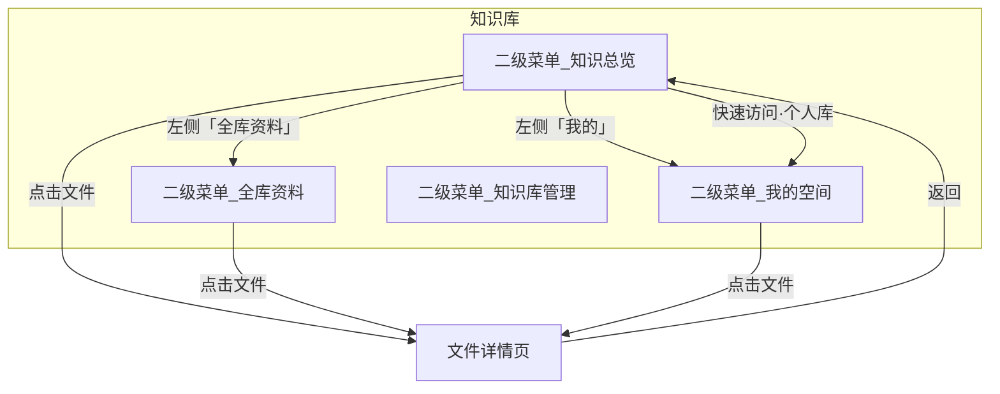
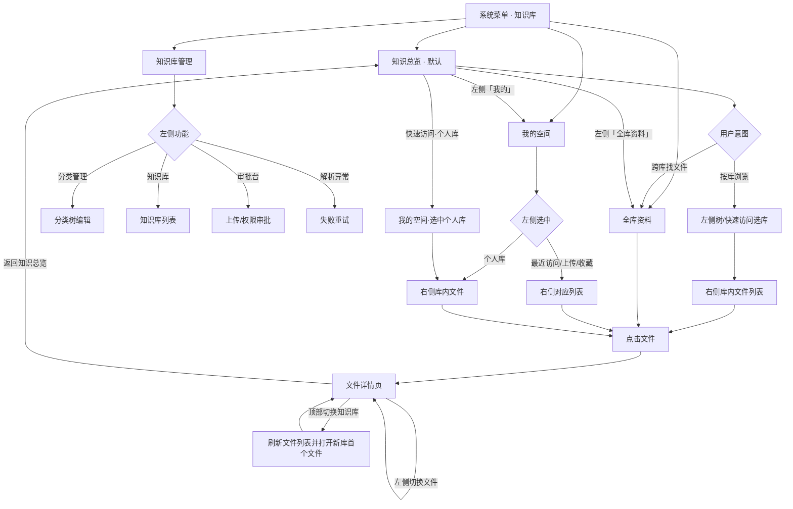

# 知识库模块 · 系统需求说明

> **版本**：v2.0 · 2026-07-07  
> **依据**：[01-知识库业务需求说明](./01-知识库业务需求说明.md) · [知识库需求沟通纪要-老总沟通](./知识库需求沟通纪要-老总沟通.md)  
> **范围**：第一期（MVP）  
> **说明**：本文档将业务需求按**系统实现角度**归类为功能模块，定义页面结构、模块边界、菜单与核心流程。系统菜单采用**方案 2**（一级分组 + 二级页面，默认落地「知识总览」）。不涉及具体 UI 视觉稿。

---

## 一、页面模型总览

知识库模块由 **3 个核心页面** + **2 个独立功能模块** 组成：




| 页面 / 模块   | 系统菜单名 | 定位                                  | 默认落地        |
| --------- | ----- | ----------------------------------- | ----------- |
| **知识总览页** | 知识总览  | 按知识库浏览：左侧导航 + 右侧库内文件                | ✅ 模块默认页     |
| **全库资料页** | 全库资料  | 跨库文件汇总                              | 二级菜单 + 左侧快捷 |
| **文件详情页** | —     | 单文件阅读：顶部库切换 + 左文件列表 + 中预览 + 右 AI    | 从任意列表进入     |
| **我的空间页** | 我的空间  | 左右分栏：左个人导航树 + 右列表（最近访问/上传/收藏/个人库文件） | 二级菜单独立页     |
| **知识库管理** | 知识库管理 | 左右分栏：左功能导航 + 右管理内容（分类/知识库/审批/解析异常）  | 二级菜单，仅管理员   |


---


## 二、系统菜单结构


### 2.1 主导航（系统级）

```
知识库（一级 · 分组，点击仅展开二级）
├── 知识总览（二级）    ← 默认落地页 / 模块入口 redirect 目标
├── 全库资料（二级）
├── 我的空间（二级）
└── 知识库管理（二级）    ← 仅管理员可见
```


| 菜单    | 可见角色         | 说明                          |
| ----- | ------------ | --------------------------- |
| 知识总览  | 全员           | 按知识库树浏览，右侧展示选中库的文件          |
| 全库资料  | 全员           | 有权访问的全部文件汇总列表               |
| 我的空间  | 全员           | 个人目录知识库树；最近访问、我的上传、收藏；个人库管理 |
| 知识库管理 | 知识库管理员、部门管理员 | 后台维护；部门管理员无「分类管理」入口         |


### 2.2 页面间跳转关系


| 起点     | 操作             | 目标                         |
| ------ | -------------- | -------------------------- |
| 知识总览页  | 点击右侧文件         | 文件详情页                      |
| 知识总览页  | 点击左侧顶部「我的」     | 我的空间页（默认右侧「最近访问」）          |
| 知识总览页  | 点击左侧顶部「全库资料」   | 全库资料页                      |
| 知识总览页  | 快速访问 → 个人知识库   | 我的空间页，左侧树选中个人知识库，右侧展示该库文件  |
| 知识总览页  | 快速访问 → 某知识库    | 本页右侧切换为该库文件列表              |
| 全库资料页  | 点击文件           | 文件详情页                      |
| 我的空间页  | 点击左侧顶部入口 / 个人库 | 同页右侧切换列表，不跳转               |
| 我的空间页  | 点击右侧文件         | 文件详情页                      |
| 文件详情页  | 顶部「返回知识总览」     | 知识总览页（保持上次选中的库，或恢复默认）      |
| 文件详情页  | 顶部库名下拉切换知识库    | 同页：左侧列表刷新为新库文件，默认预览新库第一个文件 |
| 文件详情页  | 左侧切换文件         | 同页切换预览内容，不刷新整页             |
| 知识库管理页 | 点击左侧功能项        | 同页右侧切换管理内容                 |


---


## 三、知识总览页

> 系统菜单名：**知识总览**。下文亦称「浏览页」。


### 3.1 页面结构

```
┌──────────────────────────────────────────────────────────────────────┐
│  知识总览                                                             │
├──────────────┬───────────────────────────────────────────────────────┤
│  我的        │  库 E                                    （无浏览权）   │
│  全库资料    │ ─────────────────────────────────────────────────── │
│ ──────────── │                                                       │
│  快速访问    │              [ 缺省插图 ]                              │
│   📁 个人库  │           暂无浏览权限                                 │
│   📁 AGC库   │            [ 去申请权限 ]                              │
│ ──────────── │                                                       │
│  知识库树    │                                                       │
│  📂 分类一   │                                                       │
│    📁 库 A   │                                                       │
│    📁 库 B   │                                                       │
│  📂 分类二   │                                                       │
│    📁 库 E ◀ │                                                       │  ← 与有权限库同样可点击
└──────────────┴───────────────────────────────────────────────────────┘
```

> 无权限库在树中**不置灰**，与有权限库同样可点击；选中后右侧展示**无权访问缺省图** +「去申请权限」按钮，点击打开申请权限 Modal。不展示文件列表、搜索、上传等库内能力。


### 3.2 左侧栏组成


| 区域       | 内容                      | 交互                                                |
| -------- | ----------------------- | ------------------------------------------------- |
| **顶部快捷** | **「我的」「全库资料」**          | 点击「我的」→ 我的空间；点击「全库资料」→ 全库资料页                      |
| **快速访问** | 用户置顶的知识库；**默认含「个人知识库」** | 点击个人库 → 跳转「我的空间 → 个人知识库」；点击其他库 → 右侧展示该库文件，树同步高亮   |
| **知识库树** | 分类（可嵌套）+ 其下知识库节点        | 所有知识库均可点击；有权限 → 右侧文件列表；无权限 → 右侧缺省图 + 申请权限（见 §3.3） |


### 3.3 右侧内容区


| 状态         | 右侧展示                                                      |
| ---------- | --------------------------------------------------------- |
| 首次进入 / 未选库 | 默认选中快速访问第一项或树中第一个有权限的库；或展示空态引导「请从左侧选择知识库」                 |
| 选中有权限知识库   | 右侧标题展示库名与文件数；工具栏含搜索、筛选；**有上传权时并列展示「上传」**；文件区支持列表/卡片与拖入上传  |
| 选中无权限知识库   | 右侧展示库名；**无权访问缺省图** +「去申请权限」按钮 → 申请权限 Modal；不展示文件、搜索、筛选、上传 |


### 3.4 知识总览系统需求


| 编号     | 功能描述                                                          | 来源                     |
| ------ | ------------------------------------------------------------- | ---------------------- |
| SR-01  | 进入知识库模块默认重定向至「知识总览」                                           | BR-01                  |
| SR-02  | 系统菜单方案 ：一级「知识库」仅展开二级；二级含知识总览 / 全库资料 / 我的空间 / 知识库管理；默认重定向至知识总览 | §2.1、BR-01、BR-03、BR-07 |
| SR-03  | 左侧「快速访问」：用户可置顶知识库；默认包含个人知识库                                   | BR-02                  |
| SR-03a | 左侧顶部固定「我的」「全库资料」快捷入口，分别跳转我的空间、全库资料页                           | BR-03、BR-07            |
| SR-04  | 快速访问点击个人库 → 跳转我的空间，**左侧树选中该个人库**，右侧展示文件列表                     | BR-03、BR-04            |
| SR-05  | 快速访问点击其他库 → 右侧展示该库文件，树节点同步选中                                  | BR-01                  |
| SR-06  | 左侧知识库树：分类嵌套 + 知识库节点                                           | BR-33                  |
| SR-07  | 点击树中知识库 → 右侧切换为该库内容（有权限：文件列表；无权限：缺省态，见 SR-08）                 | BR-01、BR-05            |
| SR-08  | 无权限库在树中**不置灰**，可正常点击选中；右侧展示无权访问缺省图 +「去申请权限」→ 申请权限 Modal       | BR-05、BR-29            |
| SR-08a | **已停用**知识库对普通员工在浏览树、全库资料、检索、详情页库切换中**均不展示**                   | BR-34                  |
| SR-08b | 已停用知识库仅管理员在「知识库管理」中可见，可查看（只读）及重新启用                            | BR-34                  |
| SR-09  | 右侧支持列表/卡片视图切换（一期至少一种，建议卡片）                                    | —                      |
| SR-10  | 右侧支持库内搜索、排序、标签/专业类型筛选                                         | BR-06                  |
| SR-11  | 左侧顶部「全库资料」跳转全库资料页（与系统二级菜单同路由）                                 | BR-07                  |
| SR-12  | 点击文件 → 进入文件详情页（新页面/新路由）                                       | BR-10                  |
| SR-13  | 有上传权时，库内工具栏展示「上传」（与搜索、筛选并列），文件区支持拖入/选择上传                      | BR-22                  |
| SR-14  | 持久化：树展开状态、快速访问列表、上次选中的库                                       | —                      |


---


## 四、全库资料页


### 4.1 页面定位

**跨知识库的文件汇总视图**——用户无需逐个进入知识库，即可浏览全部有权访问的文件。

入口方式（二选一均可，建议都保留）：

1. 知识总览页左侧顶部「全库资料」**快捷入口**
2. 系统二级菜单「全库资料」


### 4.2 页面结构

```
┌──────────────────────────────────────────────────────────────────────┐
│  全库资料 · 共 68 篇                    [返回知识总览]  [搜索…]    │
├──────────────────────────────────────────────────────────────────────┤
│  筛选： [全部分类 ▼]  [全部知识库 ▼]  [专业类型 ▼]  [排序 ▼]        │
├──────────────────────────────────────────────────────────────────────┤
│  文件名              所属知识库        更新时间        操作           │
│  ─────────────────────────────────────────────────────────────────  │
│  AGC 运行规程.pdf    运行规程库        今天            预览 下载      │
│  两细则解读.docx     公共制度库        昨天            预览 下载      │
│  …                                                                   │
└──────────────────────────────────────────────────────────────────────┘
```

> 本页**不需要**左侧知识库树；通过顶部筛选器按分类/知识库缩小范围即可。


### 4.3 全库资料系统需求


| 编号    | 功能描述                                      | 来源          |
| ----- | ----------------------------------------- | ----------- |
| SR-20 | 展示当前用户有浏览权的全部已发布文档（跨库汇总）；**排除已停用知识库**中的文档 | BR-07、BR-34 |
| SR-21 | 列表项含：文件名、所属知识库、更新时间、版本标识                  | BR-15       |
| SR-22 | 支持按分类、知识库、专业类型、标签筛选                       | BR-08、BR-39 |
| SR-23 | 支持关键词搜索、排序                                | BR-09       |
| SR-24 | 点击文件 → 进入文件详情页                            | BR-10       |
| SR-25 | 支持下载（有浏览权即可）                              | BR-14       |
| SR-26 | 提供「返回知识总览」                                | —           |


---


## 五、文件详情页


### 5.1 页面定位

独立的**文件阅读页**，从知识总览、全库资料、我的空间等任意列表点击文件后进入。

### 5.2 页面结构

```
┌────────────────────────────────────────────────────────────────────────────┐
│  ← 返回知识总览    [运行规程库 ˅]  /  AGC 运行规程.pdf   [v3▼][下载][收藏] │
├──────────────┬─────────────────────────────────┬─────────────────────────┤
│  当前库文件   │                                 │  AI 辅助                │
│  ──────────  │        PDF 预览区               │  文档概要               │
│  · 文件 A ◀  │                                 │  思维脑图  │
│  · 文件 B    │                                 │  相关题目  │
│  · 文件 C 🕘 │                                 │  推荐问题               │
│  · 文件 D    │                                 │                         │
└──────────────┴─────────────────────────────────┴─────────────────────────┘

顶部「运行规程库 ˅」下拉（仅有浏览权及以上的知识库）：
┌────────────────────────────────┐
│ 运行规程库  ˅                   │
│ 运行专业 · 12 个知识库          │
│────────────────────────────────│
│ ✓ 运行规程库 · 12 个文件        │
│   AGC 细则库 · 46 个文件        │
│   运行记录库 · 28 个文件        │
└────────────────────────────────┘

切换库后：左侧文件列表刷新；预览区加载**新库第一个文件**（按列表默认排序）。
```


### 5.3 文件详情系统需求


| 编号    | 功能描述                                         | 来源           |
| ----- | -------------------------------------------- | ------------ |
| SR-40 | 三栏布局：左文件列表 + 中预览 + 右 AI 辅助                   | BR-10        |
| SR-41 | 顶部「返回知识总览」→ 回到知识总览页                          | BR-13        |
| SR-42 | 顶部展示当前知识库名；库名可点击展开下拉                         | BR-11a       |
| SR-43 | 库名下拉仅展示当前用户**有浏览权及以上**且**未停用**的知识库           | BR-11a、BR-34 |
| SR-44 | 切换知识库后，左侧文件列表刷新为新库文件列表                       | BR-11a       |
| SR-45 | 切换知识库后，**默认选中并预览新库第一个文件**（按列表默认排序）；若无文件则展示空态 | BR-11a       |
| SR-46 | 左侧展示当前库内全部文件，当前预览文件高亮                        | BR-11        |
| SR-47 | 点击左侧其他文件 → 同页切换预览，不离开详情页                     | BR-11        |
| SR-48 | 中间支持 PDF 等格式在线预览                             | BR-10        |
| SR-49 | 顶部版本切换器；历史版本只读预览 + 下载                        | BR-15        |
| SR-50 | 顶部提供下载、收藏按钮                                  | BR-14、BR-16  |
| SR-51 | 右侧 AI 辅助：文档概要（一期必做）；脑图/题目可占位                 | BR-12        |
| SR-52 | 管理员可见编辑入口，进入元数据编辑                            | BR-41        |
| SR-53 | 进入详情页时记录「最近访问」                               | BR-17        |


---


## 六、我的空间页

> 系统菜单名：**我的空间**。与知识总览**分离的独立二级页**；采用与知识总览一致的**左右分栏**模式，左侧导航、右侧内容，**不跳转子页面**。


### 6.1 页面定位

个人事务专属工作台：管理个人目录与个人知识库、续看最近文件、跟踪上传审批、查看收藏。布局延续知识总览——**左侧选中什么，右侧展示什么**。

### 6.2 页面结构

```
┌──────────────────────────────────────────────────────────────────────┐
│  我的空间                                                             │
├──────────────┬───────────────────────────────────────────────────────┤
│  我的上传    │  最近访问                              [搜索]          │
│  我的收藏    │ ─────────────────────────────────────────────────── │
│  最近访问 ◀  │  📄 AGC 运行规程.pdf    运行规程库 · 今天 09:30      │
│ ──────────── │  📄 两细则解读.docx     公共制度库 · 昨天            │
│  [＋ 新建目录]│                                                       │
│  [＋ 新建知识库]                                                      │
│  📂 工作笔记  │                                                       │
│    📁 草稿库  │                                                       │
│    📁 学习摘录│                                                       │
│  📁 默认个人库│                                                       │
└──────────────┴───────────────────────────────────────────────────────┘
```

> 左侧顶部三项与下方个人树**同页切换**：点击后页面不跳转，仅右侧内容区切换。首次进入默认选中 **「最近访问」**，右侧展示最近打开文件列表。

**选中个人知识库时**（右侧示意）：

```
├──────────────┬───────────────────────────────────────────────────────┤
│  …           │  草稿库 · 5 个文件           [搜索] [筛选] [上传]     │
│    📁 草稿库◀│ ─────────────────────────────────────────────────── │
│  …           │  ┌──────────┐ ┌──────────┐                            │
│              │  │ 文件卡片  │ │ 文件卡片  │  …                         │
│              │  [拖入文件到此区域上传]                                 │
└──────────────┴───────────────────────────────────────────────────────┘
```


### 6.3 左侧栏组成


| 区域        | 内容                                  | 交互                                    |
| --------- | ----------------------------------- | ------------------------------------- |
| **顶部入口**  | **我的上传**、**我的收藏**、**最近访问**（自上而下）    | 点击任一项 → **右侧切换为对应列表**，不离开本页           |
| **个人空间树** | 用户个人的**目录**（可嵌套）+ **个人知识库**节点；仅本人可见 | 点击知识库 → 右侧展示该库文件列表；支持上传（免审批）          |
| **新建操作**  | 「＋ 新建目录」「＋ 新建知识库」                   | 在左侧树区域创建个人目录或个人知识库；新建知识库须指定上级目录（可为根级） |


### 6.4 右侧内容区


| 左侧选中          | 右侧展示                                                 |
| ------------- | ---------------------------------------------------- |
| **最近访问**（默认）  | 最近打开的文件列表，含所属知识库、打开时间                                |
| **我的上传**      | 向非个人库提交的上传记录；支持按状态筛选（待审批/解析中/已发布/已驳回）；驳回展示原因、可重传     |
| **我的收藏**      | 收藏文件列表，支持取消收藏                                        |
| **个人知识库**（树中） | 库名 + 文件数；工具栏含搜索、筛选、**上传**；文件区列表/卡片 + 拖入上传；支持移动到目标公共库 |


### 6.5 我的空间系统需求


| 编号     | 功能描述                                              | 来源                       |
| ------ | ------------------------------------------------- | ------------------------ |
| SR-60  | 我的空间为**独立左右分栏页**（左导航 + 右内容），**不使用顶部 Tab**         | BR-21a                   |
| SR-60a | 左侧顶部固定 **我的上传 / 我的收藏 / 最近访问**；点击后右侧切换列表，**不跳转路由** | BR-17、BR-21、BR-21a、BR-25 |
| SR-60b | 左侧展示**个人空间树**：个人目录（可嵌套）+ 个人知识库，**仅本人可见**          | BR-18                    |
| SR-60c | 支持 **新建个人目录**、**新建个人知识库**（左侧树区域操作）                | BR-18                    |
| SR-61  | 每用户至少拥有一个**默认个人知识库**（可在树中展示）                      | BR-18                    |
| SR-62  | 个人库上传**免审批**，直接进入解析                               | BR-19                    |
| SR-63  | 选中个人库时，右侧文件列表 + 上传（工具栏按钮 + 拖入区域）                  | BR-18、BR-22              |
| SR-64  | 支持将个人库文件**移动**到有权限的目标知识库                          | BR-20                    |
| SR-65  | 「我的上传」列表支持状态筛选；驳回展示原因、支持重传                        | BR-25、BR-26              |
| SR-66  | 「我的收藏」列表，支持取消收藏                                   | BR-21                    |
| SR-67  | 各列表中点击文件 → 进入文件详情页                                | BR-10                    |
| SR-68  | 首次进入我的空间，默认选中 **最近访问**，右侧展示最近访问列表                 | BR-21a                   |


### 6.6 入口


| 入口                  | 跳转目标                     |
| ------------------- | ------------------------ |
| 系统二级菜单「我的空间」        | 我的空间页（默认右侧「最近访问」）        |
| 知识总览 → 左侧顶部「我的」     | 我的空间页（默认右侧「最近访问」）        |
| 知识总览 → 快速访问 → 个人知识库 | 我的空间页，左侧树选中该个人库，右侧展示文件列表 |


---


## 七、知识库管理页

> 系统菜单名：**知识库管理**。管理员专用后台，与知识总览等浏览界面**完全分离**；采用**左侧功能导航 + 右侧管理内容**布局（非浏览侧目录树）。


### 7.1 页面定位

供知识库管理员、部门管理员维护分类与知识库结构、配置权限、处理审批与解析异常。部门管理员**复用同一页面**，左侧比知识库管理员**少「分类管理」入口**，其余功能项一致。

### 7.2 整体布局

```
┌──────────────────────────────────────────────────────────────────────┐
│  知识库管理                                                            │
├──────────────┬───────────────────────────────────────────────────────┤
│  分类管理    │                                                       │
│  知识库 ◀    │              右侧：随左侧功能项切换                     │
│  审批台  🔴3 │                                                       │
│  解析异常 🔴1│                                                       │
└──────────────┴───────────────────────────────────────────────────────┘
```

> **部门管理员**左侧仅见：**知识库 / 审批台 / 解析异常**（无「分类管理」）。


### 7.3 左侧功能导航


| 功能项      | 可见角色         | 角标   | 说明              |
| -------- | ------------ | ---- | --------------- |
| **分类管理** | 知识库管理员       | —    | 维护全部分类树         |
| **知识库**  | 知识库管理员、部门管理员 | —    | 知识库列表与生命周期管理    |
| **审批台**  | 知识库管理员、部门管理员 | 待处理数 | 文件上传审批 + 权限申请审批 |
| **解析异常** | 知识库管理员、部门管理员 | 失败数  | 解析失败文档处理        |


| 规则   | 说明                                      |
| ---- | --------------------------------------- |
| 默认落地 | 首次进入默认选中 **「知识库」**                      |
| 同页切换 | 点击左侧功能项，右侧切换内容，**不跳转子路由**               |
| 数据范围 | 部门管理员在「知识库」「审批台」中默认限定**本部门**；知识库管理员可见全部 |


### 7.4 分类管理（仅知识库管理员）

分类为知识库组织骨架，采用**树形编辑器**（非浏览页左侧树）。

```
┌─────────────────────────────────────────────────────────────────┐
│  分类管理                                      [+ 新建根分类]    │
├─────────────────────────────────────────────────────────────────┤
│  📂 运行专业                           [+ 子分类] [重命名] [删除]│
│  ├─ 📂 规程库                          [+ 子分类] [重命名] [删除]│
│  │  └─ 📂 细则                         [+ 子分类] [重命名] [删除]│
│  └─ 📂 培训资料                        [+ 子分类] [重命名] [删除]│
│  📂 电气专业                           [+ 子分类] [重命名] [删除]│
│  └─ 📂 继保                            [+ 子分类] [重命名] [删除]│
└─────────────────────────────────────────────────────────────────┘
```


| 操作          | 说明                          |
| ----------- | --------------------------- |
| 新建根分类 / 子分类 | 行内或弹窗输入名称                   |
| 重命名         | 行内编辑或弹窗                     |
| 删除          | 下属**仍有知识库**时禁止删除，须先转移或删除知识库 |


### 7.5 知识库列表

知识库以**表格 + 筛选**管理（便于跨分类、跨部门总览），不用浏览页目录树。

```
┌───────────────────────────────────────────────────────────────────────┐
│  知识库            [部门 ▼] [分类 ▼] [状态 ▼] [搜索…]     [+ 新建库]  │
├───────────────────────────────────────────────────────────────────────┤
│  知识库名       所属分类         所属部门   文件数  状态   操作         │
│  ─────────────────────────────────────────────────────────────────    │
│  AGC 运行规程库  运行专业/规程库   运行部    12     启用  编辑 停用 权限 │
│  两细则库       运行专业/细则     运行部     8     启用  编辑 停用 权限 │
│  历史规程库     运行专业/规程库   运行部     3    停用  —  重新启用  —  │
└───────────────────────────────────────────────────────────────────────┘
```


| 操作       | 说明                                    |
| -------- | ------------------------------------- |
| **新建库**  | 右侧 **Drawer**：名称、所属分类（展示完整路径）、所属部门、简介 |
| **编辑**   | 同 Drawer 修改元数据                        |
| **停用**   | 确认弹窗；停用后普通员工不可见，行展示停用态                |
| **重新启用** | 停用行可操作                                |
| **权限**   | 打开该库**权限配置面板**（见 §7.6）                |


| 角色差异   | 说明                                                 |
| ------ | -------------------------------------------------- |
| 知识库管理员 | 可见全部库；可新建公共库与本部门库                                  |
| 部门管理员  | 列表默认筛选**本部门**；可新建本部门关联库；可编辑/停用/配权限本部门库；**不可新建公共库** |


### 7.6 权限配置面板

从知识库列表行「权限」进入（Drawer 或侧栏面板），非独立左侧菜单项。

```
┌──────────────────────────────────────────────┐
│  权限配置 · AGC 运行规程库                    │
├──────────────────────────────────────────────┤
│  默认权限（本部门成员）  [ 可贡献 ▼ ]           │
│  ──────────────────────────────────────────  │
│  指定成员                                     │
│  张三    可管理    [调整] [移除]              │
│  李四    可贡献    [调整] [移除]              │
│  [ + 添加成员 ]                               │
│  ──────────────────────────────────────────  │
│  待审批权限申请（2）                          │
│  王五 申请可贡献  [通过] [驳回]               │
└──────────────────────────────────────────────┘
```


### 7.7 审批台

两类审批，顶部 **Tab** 切换。

```
┌───────────────────────────────────────────────────────────────────────┐
│  审批台                                                                │
├───────────────────────────────────────────────────────────────────────┤
│  [ 文件上传 (3) ]   [ 权限申请 (2) ]                                   │
├───────────────────────────────────────────────────────────────────────┤
│  文件名            知识库         提交人  时间   操作                   │
│  AGC规程v4.pdf     AGC运行规程库   张三    今天  [通过] [驳回]           │
│  两细则.docx       两细则库        李四    昨天  [通过] [驳回]           │
└───────────────────────────────────────────────────────────────────────┘
```


| Tab      | 内容                        |
| -------- | ------------------------- |
| **文件上传** | 待审批上传列表；通过 → 进入解析；驳回须填原因  |
| **权限申请** | 员工权限申请；展示申请人、目标库、申请权限组、理由 |


| 角色差异   | 说明                  |
| ------ | ------------------- |
| 部门管理员  | 本部门各库待审上传 + 本部门权限申请 |
| 知识库管理员 | 全部待审（含公共库），作为兜底审批人  |


### 7.8 解析异常

```
┌───────────────────────────────────────────────────────────────────────┐
│  解析异常                                                  [批量重试]  │
├───────────────────────────────────────────────────────────────────────┤
│  文件名         知识库       上传时间   失败原因       操作             │
│  xx规程.pdf     AGC 规程库   今天       格式不支持     [重试] [删除]    │
│  协议.docx      两细则库     昨天       文件过大       [重试] [删除]    │
└───────────────────────────────────────────────────────────────────────┘
```

部门管理员默认只看本部门库下失败记录；知识库管理员可看全部。

### 7.9 知识库管理系统需求


| 编号     | 功能描述                                               | 来源                      |
| ------ | -------------------------------------------------- | ----------------------- |
| SR-70  | 知识库管理为**独立左右分栏页**（左功能导航 + 右管理内容），与浏览界面分离           | BR-33～38、NFR-U01        |
| SR-71  | 左侧功能导航：**分类管理 / 知识库 / 审批台 / 解析异常**；点击同页切换右侧内容      | §7.3                    |
| SR-72  | **部门管理员**左侧**无「分类管理」**；其余三项与知识库管理员复用               | BR-33、§9.3              |
| SR-73  | 审批台、解析异常入口展示**待处理数量角标**                            | BR-37、BR-44             |
| SR-74  | **分类管理**：树形编辑；新建根/子分类、重命名、删除；**仅知识库管理员**           | BR-33                   |
| SR-75  | 删除分类时，下属仍有知识库则**禁止删除**                             | BR-33                   |
| SR-76  | **知识库列表**：表格 + 筛选（部门、分类、状态、关键词）；部门管理员默认本部门范围       | BR-34、BR-35             |
| SR-77  | 新建/编辑知识库：**Drawer** 表单（名称、所属分类完整路径、所属部门、简介）        | BR-34、BR-35             |
| SR-78  | 停用/重新启用须确认；停用库仅管理员可见（见 SR-08a/b）                   | BR-34                   |
| SR-79  | 列表行「权限」打开权限配置面板：默认权限、指定成员、待审批权限申请                  | BR-36、BR-29、BR-30       |
| SR-79a | 审批台双 Tab：**文件上传** / **权限申请**；通过/驳回（驳回须填原因）；结果通知提交人 | BR-23、BR-26、BR-28、BR-37 |
| SR-79b | 解析异常列表；单条重试、删除；支持批量重试                              | BR-44                   |
| SR-79c | 首次进入默认选中「知识库」列表                                    | —                       |


---


## 八、信息架构（数据层次）

```
分类（可嵌套）
  └── 知识库
        └── 文件（含多版本）
              └── 元数据（专业类型、标签、摘要等）
```


| 调整（相对 v0.3） | 说明                                     |
| ----------- | -------------------------------------- |
| 去掉库内目录层     | 文件用标签/专业类型过滤                           |
| 弱化「空间」菜单    | 公共/专业/个人为知识库类型属性                       |
| 部门走组织架构     | 不在知识库内新建部门                             |
| 个人库         | 归入「我的空间」；用户可自建个人目录与个人知识库树；知识总览快速访问露出入口 |


---


## 九、权限模型


### 9.1 三层模型

```
层次 1：知识库可见性 — 用户能否在树中看到该知识库
层次 2：知识库管理权 — 谁能新建/编辑/停用该库
层次 3：文件操作权 — 浏览 / 上传 / 管理
```

文件操作权限**绑定在单个知识库**上。

### 9.2 文件操作权限组


| 权限组     | 包含操作        | 可配置    |
| ------- | ----------- | ------ |
| **浏览组** | 在线预览、下载     | ✅      |
| **上传组** | 上传文件到该库     | ✅      |
| **管理组** | 编辑元数据、删除、移动 | ❌ 仅管理员 |


### 9.3 角色权限矩阵

**知识库管理权限**：


| 操作       | 知识库管理员 | 部门管理员  | 普通员工 |
| -------- | ------ | ------ | ---- |
| 维护分类树    | ✅      | ❌      | ❌    |
| 新建公共库    | ✅      | ❌      | ❌    |
| 新建本部门关联库 | ✅      | ✅      | ❌    |
| 编辑/停用知识库 | ✅ 全部   | ✅ 本部门  | ❌    |
| 查看已停用知识库 | ✅      | ✅ 本部门  | ❌    |
| 配置知识库权限  | ✅ 全部   | ✅ 本部门库 | ❌    |


**文件操作（普通员工）**：


| 知识库类型   | 浏览  | 上传          | 管理  |
| ------- | --- | ----------- | --- |
| 个人库     | ✅   | ✅ 免审批       | ✅   |
| 本部门默认库  | ✅   | ✅ 需审批       | ❌   |
| 其他库（授权） | 按授权 | 按授权         | ❌   |
| 公共库     | ✅   | ✅ 需知识库管理员审批 | ❌   |


**文件操作（管理员）**：


| 角色          | 浏览  | 上传    | 管理  | 审批他人上传 |
| ----------- | --- | ----- | --- | ------ |
| 知识库管理员      | ✅   | ✅ 免审批 | ✅   | ✅      |
| 部门管理员（本部门库） | ✅   | ✅ 免审批 | ✅   | ✅ 本部门  |
| 部门管理员（其他库）  | ✅   | ❌     | ❌   | ❌      |


### 9.4 权限获取与申请

> 权限配置面板 UI 见 **§7.6**；申请权限 Modal 见 **§3 / SR-08、SR-82**。


| 编号    | 功能描述                               | 来源    |
| ----- | ---------------------------------- | ----- |
| SR-80 | 部门成员自动获得部门关联库默认权限                  | BR-32 |
| SR-81 | 管理员可手动授权指定成员                       | BR-31 |
| SR-82 | 申请权限 Modal：选择权限组（浏览 / 上传）+ 填写理由后提交 | BR-29 |
| SR-83 | 部门库→部门管理员审；公共库→知识库管理员审             | BR-30 |
| SR-84 | 审批通过写入权限并通知                        | BR-30 |


### 9.5 审批模块

> 审批台界面见 **§7.7**；以下为业务规则补充。


| 编号    | 功能描述                 | 来源          |
| ----- | -------------------- | ----------- |
| SR-90 | 非个人库员工上传进入待审批队列      | BR-23       |
| SR-91 | 管理员审批台：通过/驳回（驳回须填原因） | BR-26、BR-37 |
| SR-92 | 通过后进入解析；驳回仅上传者和管理员可见 | BR-26       |
| SR-93 | 审批结果消息通知             | BR-28       |


---


## 十、文档上传模块


| 编号          | 功能描述                          | 来源             |
| ----------- | ----------------------------- | -------------- |
| SR-30～SR-37 | 同 v1.0：选择/拖入上传、同名处理、审批规则、触发解析 | BR-14～19、BR-34 |


上传入口分布：


| 位置                 | 说明                         |
| ------------------ | -------------------------- |
| 知识总览页右侧（库内工具栏）     | 选中某库后，「上传」与搜索、筛选并列；文件区支持拖入 |
| 我的空间 → 个人知识库（树中选中） | 上传到该个人库；免审批                |
| 文件详情页              | 一期可不提供上传（返回浏览页操作）          |


---


## 十一、阅读动线




---


## 十二、系统模块与业务需求映射


| 系统页面/模块 | 合并的业务需求                              |
| ------- | ------------------------------------ |
| 知识总览    | BR-01～06                             |
| 全库资料    | BR-07～09                             |
| 文件详情页   | BR-10～17、BR-11a                      |
| 我的空间    | BR-18～21、BR-21a、BR-25～26             |
| 知识库管理   | BR-33～38、BR-44（解析异常）                 |
| 权限与审批   | BR-29～32、BR-23～24、BR-28（规则层，UI 见 §7） |


---


## 十三、一期交付边界


### 纳入一期

- 系统菜单方案 2：知识总览 / 全库资料 / 我的空间 / 知识库管理
- 知识总览页（左：顶部快捷/快速访问/树；右：库内文件）
- 左侧「我的」「全库资料」快捷 + 全库资料汇总页
- 文件详情页（三栏；顶部库切换 + 左侧文件列表 / 预览 / AI 辅助）
- 我的空间（左右分栏：顶部入口 + 个人目录树 / 右侧列表）
- 知识库管理页（左：分类/知识库/审批台/解析异常；部门管理员无分类管理）
- 上传、审批、解析、权限、版本管理


### 一期简化

- 详情页右侧脑图/题目可占位
- 浏览页右侧列表/卡片二选一或先做一种


### 一期不做

- 库内目录树、文件 diff、权威解读、移动端

---

*参见 [03-知识库非功能性需求说明](./03-知识库非功能性需求说明.md)*