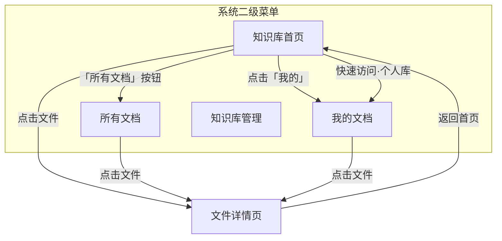
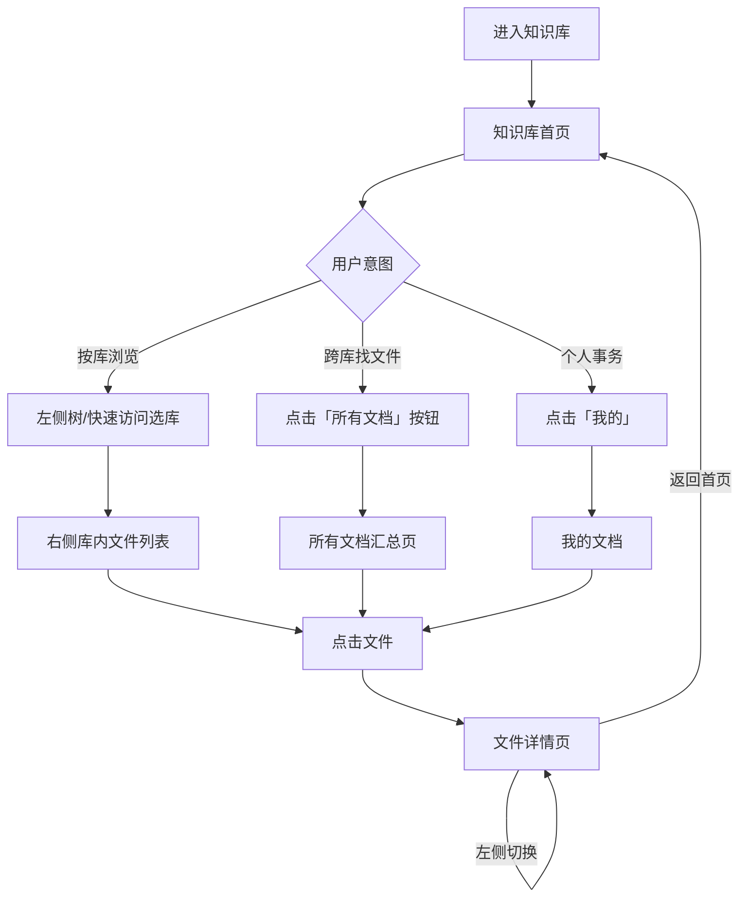

# 知识库模块 · 系统需求说明

> **版本**：v1.1 · 2026-07-06  
> **依据**：[01-知识库业务需求说明](./01-知识库业务需求说明.md) · [知识库需求沟通纪要-老总沟通](./知识库需求沟通纪要-老总沟通.md)  
> **范围**：第一期（MVP）  
> **说明**：本文档将业务需求按**系统实现角度**归类为功能模块，定义页面结构、模块边界、菜单与核心流程。不涉及具体 UI 视觉稿。

---

## 一、页面模型总览

知识库模块由 **3 个核心页面** + **2 个独立功能模块** 组成：



| 页面 / 模块 | 定位 | 默认落地 |
|-------------|------|----------|
| **知识库首页** | 按知识库浏览：左侧导航 + 右侧库内文件 | ✅ 进入知识库模块的默认页 |
| **所有文档** | 跨库文件汇总，无需逐个进库查找 | 首页按钮入口 + 二级菜单直达 |
| **文件详情页** | 单文件阅读：左文件列表 + 中预览 + 右 AI | 从任意列表点击文件进入 |
| **我的文档** | 个人库 / 上传记录 / 收藏 | 二级菜单；首页左侧「我的」跳转 |
| **知识库管理** | 分类维护 / 建库 / 权限 / 审批 | 二级菜单，仅管理员 |

---

## 二、系统菜单结构

### 2.1 主导航（系统级）

```
知识库（一级）
├── 知识库首页（二级）    ← 默认落地页
├── 所有文档（二级）      ← 与首页「所有文档」按钮同目标页
├── 我的文档（二级）
└── 知识库管理（二级）    ← 仅管理员可见
```

| 菜单 | 可见角色 | 说明 |
|------|----------|------|
| 知识库首页 | 全员 | 按知识库树浏览，右侧展示选中库的文件 |
| 所有文档 | 全员 | 有权访问的全部文件汇总列表 |
| 我的文档 | 全员 | 个人库、上传、收藏 |
| 知识库管理 | 管理员 | 后台维护，与浏览界面分离 |

> 系统二/三级菜单不可省略；首页内可提供快捷跳转，但不替代顶层菜单。

### 2.2 页面间跳转关系

| 起点 | 操作 | 目标 |
|------|------|------|
| 知识库首页 | 点击右侧文件 | 文件详情页 |
| 知识库首页 | 点击顶部/工具栏「所有文档」按钮 | 所有文档页 |
| 知识库首页 | 点击左侧「我的」 | 我的文档（二级菜单） |
| 知识库首页 | 快速访问 → 个人知识库 | 我的文档 → 个人知识库 Tab |
| 知识库首页 | 快速访问 → 某知识库 | 首页右侧切换为该库文件列表 |
| 所有文档页 | 点击文件 | 文件详情页 |
| 我的文档 | 点击文件 | 文件详情页 |
| 文件详情页 | 顶部「返回首页」 | 知识库首页（保持上次选中的库，或恢复默认） |
| 文件详情页 | 左侧切换文件 | 同页切换预览内容，不刷新整页 |

---

## 三、知识库首页

### 3.1 页面结构

```
┌──────────────────────────────────────────────────────────────────────┐
│  知识库首页                                    [所有文档]  [上传…]    │  ← 「所有文档」为按钮入口
├──────────────┬───────────────────────────────────────────────────────┤
│  我的        │  运行规程库 · 12 个文件              [搜索] [筛选]    │  ← 右侧标题随选中库变化
│ ──────────── │ ─────────────────────────────────────────────────── │
│  快速访问    │  ┌──────────┐ ┌──────────┐ ┌──────────┐              │
│   📁 个人库  │  │ 文件卡片  │ │ 文件卡片  │ │ 文件卡片  │              │
│   📁 AGC库   │  │          │ │          │ │          │              │
│ ──────────── │  └──────────┘ └──────────┘ └──────────┘              │
│  知识库树    │  ┌──────────┐ ┌──────────┐                             │
│  📂 分类一   │  │ 文件列表  │ │ 文件列表  │  …                        │
│    📁 库 A ◀ │  └──────────┘ └──────────┘                             │
│    📁 库 B   │                                                       │
│  📂 分类二   │  [拖入文件上传]  [申请权限]                             │
│    📁 库 E灰 │                                                       │
└──────────────┴───────────────────────────────────────────────────────┘
```

### 3.2 左侧栏组成

| 区域 | 内容 | 交互 |
|------|------|------|
| **我的** | 固定入口，图标 + 文案 | 点击 → 跳转系统二级菜单「我的文档」 |
| **快速访问** | 用户置顶的知识库；**默认含「个人知识库」** | 点击个人库 → 跳转「我的文档 → 个人知识库」；点击其他库 → 右侧展示该库文件，树同步高亮 |
| **知识库树** | 分类（可嵌套）+ 其下知识库节点 | 点击知识库 → 右侧展示该库内文件列表/卡片 |

### 3.3 右侧内容区

| 状态 | 右侧展示 |
|------|----------|
| 首次进入 / 未选库 | 默认选中快速访问第一项或树中第一个有权限的库；或展示空态引导「请从左侧选择知识库」 |
| 选中某知识库 | 该库内文件列表或卡片；支持搜索、排序、专业类型/标签筛选 |
| 选中无权限库（灰色） | 展示库名 + 「申请权限」按钮，不展示文件 |
| 有上传权 | 展示上传入口（按钮 + 拖入区域） |

### 3.4 首页系统需求

| 编号 | 功能描述 | 来源 |
|------|----------|------|
| SR-01 | 进入知识库模块默认落地知识库首页 | — |
| SR-02 | 左侧固定「我的」入口，跳转二级菜单「我的文档」 | BR-10 |
| SR-03 | 左侧「快速访问」区：用户可置顶知识库；默认包含个人知识库 | BR-08 |
| SR-04 | 快速访问点击个人库 → 跳转「我的文档 → 个人知识库」 | BR-10 |
| SR-05 | 快速访问点击其他库 → 右侧展示该库文件，树节点同步选中 | BR-03 |
| SR-06 | 左侧知识库树：分类嵌套 + 知识库节点 | BR-25 |
| SR-07 | 点击树中知识库 → 右侧展示该库内文件列表/卡片 | BR-03 |
| SR-08 | 无权限知识库在树中灰色展示，右侧显示申请权限 | BR-09 |
| SR-09 | 右侧支持列表/卡片视图切换（一期至少一种，建议卡片） | — |
| SR-10 | 右侧支持库内搜索、排序、标签/专业类型筛选 | BR-04、BR-31 |
| SR-11 | 顶部或工具栏提供「**所有文档**」按钮，跳转所有文档页 | BR-01 |
| SR-12 | 点击文件 → 进入文件详情页（新页面/新路由） | BR-05 |
| SR-13 | 有上传权时，右侧支持拖入/选择上传 | BR-14 |
| SR-14 | 持久化：树展开状态、快速访问列表、上次选中的库 | — |

---

## 四、所有文档页

### 4.1 页面定位

**跨知识库的文件汇总视图**——用户无需逐个进入知识库，即可浏览全部有权访问的文件。

入口方式（二选一均可，建议都保留）：

1. 知识库首页顶部「所有文档」**按钮**
2. 系统二级菜单「所有文档」

### 4.2 页面结构

```
┌──────────────────────────────────────────────────────────────────────┐
│  所有文档 · 共 68 篇                          [返回首页]  [搜索…]    │
├──────────────────────────────────────────────────────────────────────┤
│  筛选： [全部分类 ▼]  [全部知识库 ▼]  [专业类型 ▼]  [排序 ▼]        │
├──────────────────────────────────────────────────────────────────────┤
│  文件名              所属知识库        更新时间        操作           │
│  ─────────────────────────────────────────────────────────────────  │
│  AGC 运行规程.pdf    运行规程库        今天            预览 下载      │
│  两细则解读.docx     公共制度库        昨天            预览 下载      │
│  …                                                                   │
└──────────────────────────────────────────────────────────────────────┘
```

> 本页**不需要**左侧知识库树；通过顶部筛选器按分类/知识库缩小范围即可。

### 4.3 所有文档系统需求

| 编号 | 功能描述 | 来源 |
|------|----------|------|
| SR-20 | 展示当前用户有浏览权的全部已发布文档（跨库汇总） | BR-01 |
| SR-21 | 列表项含：文件名、所属知识库、更新时间、版本标识 | BR-07 |
| SR-22 | 支持按分类、知识库、专业类型、标签筛选 | BR-02、BR-03、BR-31 |
| SR-23 | 支持关键词搜索、排序 | BR-04 |
| SR-24 | 点击文件 → 进入文件详情页 | BR-05 |
| SR-25 | 支持下载（有浏览权即可） | BR-06 |
| SR-26 | 提供「返回首页」回到知识库首页 | — |

---

## 五、文件详情页

### 5.1 页面定位

独立的**文件阅读页**，从首页、所有文档、我的文档等任意列表点击文件后进入。

### 5.2 页面结构

```
┌────────────────────────────────────────────────────────────────────────────┐
│  ← 返回首页    运行规程库 / AGC 运行规程.pdf    [v3 ▼] [下载] [收藏] [编辑] │
├──────────────┬─────────────────────────────────┬─────────────────────────┤
│  当前库文件   │                                 │  AI 辅助                │
│  ──────────  │                                 │  ─────────────────────  │
│  · 文件 A ◀  │        PDF 预览区               │  文档概要               │
│  · 文件 B    │                                 │  思维脑图（一期可占位）  │
│  · 文件 C 🕘 │                                 │  相关题目（一期可占位）  │
│  · 文件 D    │                                 │  推荐问题               │
│              │                                 │                         │
└──────────────┴─────────────────────────────────┴─────────────────────────┘
```

### 5.3 文件详情系统需求

| 编号 | 功能描述 | 来源 |
|------|----------|------|
| SR-40 | 三栏布局：左文件列表 + 中预览 + 右 AI 辅助 | BR-05 |
| SR-41 | 顶部「返回首页」→ 回到知识库首页 | — |
| SR-42 | 顶部展示：当前知识库名、当前文件名 | — |
| SR-43 | 左侧展示**当前知识库内**全部文件，当前文件高亮 | — |
| SR-44 | 点击左侧其他文件 → 同页切换预览，不离开详情页 | — |
| SR-45 | 中间支持 PDF 等格式在线预览 | BR-05 |
| SR-46 | 顶部版本切换器；历史版本只读预览 + 下载 | BR-07 |
| SR-47 | 顶部提供下载、收藏按钮 | BR-06、BR-13 |
| SR-48 | 右侧 AI 辅助：文档概要（一期必做）；脑图/题目可占位 | — |
| SR-49 | 管理员可见编辑入口，进入元数据编辑 | BR-33 |
| SR-50 | 进入详情页时记录「最近访问」 | BR-08 |

> 一期不在详情页左侧做「切换其他知识库」下拉；换库须返回首页或通过「所有文档」筛选。二期可评估顶部库切换器。

---

## 六、我的文档模块

### 6.1 入口

| 入口 | 跳转目标 |
|------|----------|
| 系统二级菜单「我的文档」 | 我的文档页 |
| 知识库首页左侧「我的」 | 同上 |
| 快速访问 → 个人知识库 | 我的文档 → **个人知识库** Tab |

### 6.2 内部 Tab

| Tab | 内容 | 来源 |
|-----|------|------|
| **个人知识库** | 私人文档空间；上传免审批 | BR-10、BR-11 |
| **我的上传** | 向非个人库提交的记录；按状态筛选 | BR-17、BR-18 |
| **我的收藏** | 收藏列表 | BR-13 |
| **最近访问** | 最近打开的文件（可选独立 Tab 或置顶区） | BR-08 |

### 6.3 我的文档系统需求

| 编号 | 功能描述 | 来源 |
|------|----------|------|
| SR-60 | 每用户自动拥有个人知识库 | BR-10 |
| SR-61 | 个人库上传免审批，直接进入解析 | BR-11 |
| SR-62 | 个人库文件列表 + 上传（拖入/选择） | BR-10、BR-14 |
| SR-63 | 支持将个人库文件移动到目标知识库 | BR-12 |
| SR-64 | 「我的上传」按状态筛选：待审批/解析中/已发布/已驳回 | BR-17 |
| SR-65 | 驳回展示原因，支持重传 | BR-18 |
| SR-66 | 「我的收藏」列表，支持取消收藏 | BR-13 |
| SR-67 | 点击文件 → 进入文件详情页 | BR-05 |

---

## 七、知识库管理模块

管理员专用，与浏览界面分离（详见 v1.0，无结构性变更）：

| 子功能 | 操作 | 角色 |
|--------|------|------|
| 分类维护 | 新增/编辑/删除/调整层级 | 知识库管理员 |
| 知识库维护 | 新建/编辑/停用；指定上级分类 | 知识库管理员；部门管理员（本部门） |
| 权限配置 | 默认权限、指定成员、待审批申请 | 对应管理员 |
| 审批台 | 待审批上传、权限申请 | 对应管理员 |
| 解析异常 | 失败列表、批量重试 | 管理员 |

| 编号 | 功能描述 | 来源 |
|------|----------|------|
| SR-70～SR-76 | 同 v1.0 知识库管理需求 | BR-25～29、BR-36 |

---

## 八、信息架构（数据层次）

```
分类（可嵌套）
  └── 知识库
        └── 文件（含多版本）
              └── 元数据（专业类型、标签、摘要等）
```

| 调整（相对 v0.3） | 说明 |
|-------------------|------|
| 去掉库内目录层 | 文件用标签/专业类型过滤 |
| 弱化「空间」菜单 | 公共/专业/个人为知识库类型属性 |
| 部门走组织架构 | 不在知识库内新建部门 |
| 个人库 | 归入「我的文档」，在快速访问中露出入口 |

---

## 九、权限模型

### 9.1 三层模型

```
层次 1：知识库可见性 — 用户能否在树中看到该知识库
层次 2：知识库管理权 — 谁能新建/编辑/停用该库
层次 3：文件操作权 — 浏览 / 上传 / 管理
```

文件操作权限**绑定在单个知识库**上。

### 9.2 文件操作权限组

| 权限组 | 包含操作 | 可配置 |
|--------|----------|--------|
| **浏览组** | 在线预览、下载 | ✅ |
| **上传组** | 上传文件到该库 | ✅ |
| **管理组** | 编辑元数据、删除、移动 | ❌ 仅管理员 |

### 9.3 角色权限矩阵

**知识库管理权限**：

| 操作 | 知识库管理员 | 部门管理员 | 普通员工 |
|------|:-----------:|:---------:|:-------:|
| 维护分类树 | ✅ | ❌ | ❌ |
| 新建公共库 | ✅ | ❌ | ❌ |
| 新建本部门关联库 | ✅ | ✅ | ❌ |
| 编辑/停用知识库 | ✅ 全部 | ✅ 本部门 | ❌ |
| 配置知识库权限 | ✅ 全部 | ✅ 本部门库 | ❌ |

**文件操作（普通员工）**：

| 知识库类型 | 浏览 | 上传 | 管理 |
|------------|:----:|:----:|:----:|
| 个人库 | ✅ | ✅ 免审批 | ✅ |
| 本部门默认库 | ✅ | ✅ 需审批 | ❌ |
| 其他库（授权） | 按授权 | 按授权 | ❌ |
| 公共库 | ✅ | ✅ 需知识库管理员审批 | ❌ |

**文件操作（管理员）**：

| 角色 | 浏览 | 上传 | 管理 | 审批他人上传 |
|------|:----:|:----:|:----:|:------------:|
| 知识库管理员 | ✅ | ✅ 免审批 | ✅ | ✅ |
| 部门管理员（本部门库） | ✅ | ✅ 免审批 | ✅ | ✅ 本部门 |
| 部门管理员（其他库） | ✅ | ❌ | ❌ | ❌ |

### 9.4 权限获取与申请

| 编号 | 功能描述 | 来源 |
|------|----------|------|
| SR-80 | 部门成员自动获得部门关联库默认权限 | BR-32 |
| SR-81 | 管理员可手动授权指定成员 | BR-31 |
| SR-82 | 员工可在首页灰色库节点发起权限申请 | BR-29 |
| SR-83 | 申请须选权限组 + 填写理由 | BR-29 |
| SR-84 | 部门库→部门管理员审；公共库→知识库管理员审 | BR-30 |
| SR-85 | 审批通过写入权限并通知 | BR-30 |

### 9.5 审批模块

| 编号 | 功能描述 | 来源 |
|------|----------|------|
| SR-90 | 非个人库员工上传进入待审批队列 | BR-23 |
| SR-91 | 管理员审批台：通过/驳回（驳回须填原因） | BR-26、BR-37 |
| SR-92 | 通过后进入解析；驳回仅上传者和管理员可见 | BR-26 |
| SR-93 | 审批结果消息通知 | BR-28 |

---

## 十、文档上传模块

| 编号 | 功能描述 | 来源 |
|------|----------|------|
| SR-30～SR-37 | 同 v1.0：选择/拖入上传、同名处理、审批规则、触发解析 | BR-14～19、BR-34 |

上传入口分布：

| 位置 | 说明 |
|------|------|
| 知识库首页右侧 | 选中某库后，上传到该库 |
| 我的文档 → 个人知识库 | 上传到个人库 |
| 文件详情页 | 一期可不提供上传（返回首页操作） |

---

## 十一、阅读动线



---

## 十二、系统模块与业务需求映射

| 系统页面/模块 | 合并的业务需求 |
|---------------|----------------|
| 知识库首页 | BR-02～04、BR-03、BR-08、BR-09、BR-14 |
| 所有文档 | BR-01、BR-02～07 |
| 文件详情页 | BR-05～08、BR-13、BR-33 |
| 我的文档 | BR-10～13、BR-17～18 |
| 知识库管理 | BR-25～29、BR-36 |
| 权限中心 | BR-21～24、BR-09 |
| 审批 | BR-15～16、BR-18、BR-20 |

---

## 十三、一期交付边界

### 纳入一期

- 知识库首页（左：我的/快速访问/树；右：库内文件）
- 「所有文档」按钮 + 所有文档汇总页
- 文件详情页（三栏：文件列表 / 预览 / AI 辅助）
- 我的文档（含个人库、上传、收藏）
- 知识库管理（管理员）
- 上传、审批、解析、权限、版本管理

### 一期简化

- 详情页右侧脑图/题目可占位
- 首页右侧列表/卡片二选一或先做一种
- 详情页不做「切换其他知识库」下拉

### 一期不做

- 库内目录树、文件 diff、权威解读、移动端

---

*参见 [03-知识库非功能性需求说明](./03-知识库非功能性需求说明.md)*
