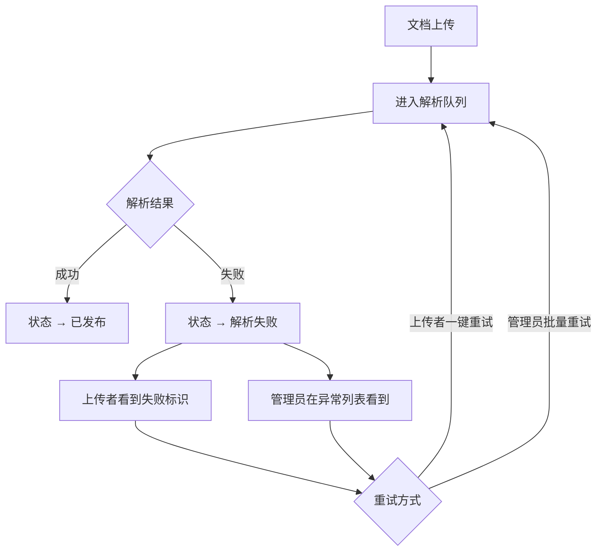

# 知识库模块 · 非功能性需求说明

> **版本**：v1.1 · 2026-07-06  
> **依据**：[02-知识库系统需求说明](./02-知识库系统需求说明.md) · [知识库需求沟通纪要-老总沟通](./知识库需求沟通纪要-老总沟通.md)  
> **范围**：第一期（MVP）  
> **说明**：本文档描述权限安全、性能、可靠性、可维护性等**不直接体现在界面上**但对系统质量至关重要的要求。

---

## 一、非功能性需求总览

| 类别 | 一期要求级别 | 说明 |
|------|--------------|------|
| 安全性 / 权限 | **必须实现** | 三层权限模型、数据隔离 |
| 性能 | **必须达标** | 页面响应、列表加载 |
| 可靠性 | **必须实现** | 解析失败处理、状态一致性 |
| 可用性 | **基本保障** | 管理员/用户界面分离 |
| 可维护性 | **设计预留** | 模块化、为多厂部署做准备 |
| 兼容性 | **一期范围** | PC 端主流浏览器，1920×1080 为主 |

---

## 二、安全性需求

### 2.1 身份认证与授权

| 编号 | 需求描述 | 验收标准 |
|------|----------|----------|
| NFR-S01 | 所有知识库接口须校验用户登录态 | 未登录用户无法访问任何文档 |
| NFR-S02 | 每个文档操作（浏览/下载/上传/管理）须校验该用户对目标知识库的对应权限组 | 越权访问返回 403 |
| NFR-S03 | 个人知识库文档仅本人和管理员可访问 | 其他用户无法通过任何途径访问 |
| NFR-S04 | 待审批、已驳回、解析中、解析失败的文档，除上传者和管理员外，其他用户不可见、不可检索 | 列表与搜索均过滤 |
| NFR-S05 | 管理操作（分类维护、建库、权限配置、审批）须校验管理员角色 | 普通员工无法调用管理接口 |
| NFR-S06 | 部门管理员的操作范围限制在本部门关联知识库 | 无法管理其他部门库 |

### 2.2 权限模型约束

| 编号 | 需求描述 | 说明 |
|------|----------|------|
| NFR-S10 | 文件操作权限**绑定在单个知识库**，不按部门统一分配 | 防止权限扩散 |
| NFR-S11 | 管理组权限（编辑/删除/移动）不对外开放配置，固定为管理员 | 防止权限滥用 |
| NFR-S12 | 有浏览权即可下载，浏览与下载不拆分授权 | 简化权限配置 |
| NFR-S13 | 有上传权不等于免审批；审批是内容质量关卡，非操作入口限制 | 业务规则强制 |
| NFR-S14 | 权限变更即时生效；已打开的页面下次请求时应用新权限 | 无缓存导致的越权 |

### 2.3 数据安全

| 编号 | 需求描述 | 验收标准 |
|------|----------|----------|
| NFR-S20 | 文件存储与传输使用安全协议（HTTPS） | 传输加密 |
| NFR-S21 | 文件下载链接须带权限校验，不可通过猜测 URL 直接访问 | 临时签名或鉴权 |
| NFR-S22 | 删除文件为软删除或进入回收机制（一期可简化为软删除标记） | 误删可恢复或审计 |
| NFR-S23 | 关键操作（权限变更、审批、删除）记录操作日志 | 可追溯 |

---

## 三、性能需求

### 3.1 响应时间

| 编号 | 场景 | 指标 | 说明 |
|------|------|------|------|
| NFR-P01 | 知识库首页首次加载 | ≤ 2 秒 | 默认落地页 |
| NFR-P01b | 所有文档汇总页首次加载 | ≤ 2 秒 | 跨库列表 |
| NFR-P01c | 文件详情页打开（含预览） | ≤ 3 秒 | 含 PDF 渲染 |
| NFR-P02 | 首页分类树展开/切换节点 | ≤ 1 秒 | 用户频繁操作 |
| NFR-P03 | 文档列表搜索（关键词） | ≤ 2 秒 | 首页库内 / 所有文档页 |
| NFR-P04 | 详情页左侧切换同库文件 | ≤ 1 秒 | 不整页刷新 |
| NFR-P05 | 文件上传提交响应 | ≤ 2 秒 | 仅指提交成功响应，解析异步 |
| NFR-P06 | 权限配置页加载 | ≤ 2 秒 | 管理员操作 |

### 3.2 容量与并发

| 编号 | 需求描述 | 一期预期 |
|------|----------|----------|
| NFR-P10 | 单知识库文档数量 | 支持 500+ 篇 |
| NFR-P11 | 用户可见文档总数（「所有」列表） | 支持 1000+ 篇 |
| NFR-P12 | 分类树层级 | 支持 5 级以上嵌套 |
| NFR-P13 | 并发上传 | 支持 10 用户同时上传 |
| NFR-P14 | 单文件大小上限 | 建议 50MB（可配置） |
| NFR-P15 | 批量上传单次上限 | 建议 20 个文件 |

### 3.3 列表与树优化策略

| 编号 | 需求描述 | 说明 |
|------|----------|------|
| NFR-P20 | 文档列表分页加载，默认每页 20～50 条 | 避免一次加载全部 |
| NFR-P21 | 分类树懒加载子节点 | 分类量大时按需展开 |
| NFR-P22 | 列表状态（展开/排序）本地持久化 | 减少重复操作 |

---

## 四、可靠性需求

### 4.1 文档解析

| 编号 | 需求描述 | 一期实现 | 后续增强 |
|------|----------|----------|----------|
| NFR-R01 | 上传后触发异步解析，不阻塞上传响应 | ✅ 必须 | — |
| NFR-R02 | 解析过程有明确状态：解析中 → 已发布 / 解析失败 | ✅ 必须 | — |
| NFR-R03 | 解析失败时，上传者看到失败标识 | ✅ 必须 | — |
| NFR-R04 | 管理员可在管理界面查看全部解析失败文档 | ✅ 必须 | — |
| NFR-R05 | 管理员可手动触发单条/批量重试解析 | ✅ 必须 | — |
| NFR-R06 | 上传者可一键重试（简化操作） | ✅ 建议 | — |
| NFR-R07 | 定时任务自动扫描失败文档并重试 | ⏳ 设计预留 | 二期 |
| NFR-R08 | 解析失败超过 N 次后通知管理员 | ⏳ 设计预留 | 二期 |

**解析失败处理流程（一期）**：



> 老总意见：多数用户不懂技术，不能仅依赖上传者处理；管理员须有统一处理入口，但上传者也可自助重试。

### 4.2 审批流程可靠性

| 编号 | 需求描述 | 验收标准 |
|------|----------|----------|
| NFR-R10 | 审批操作原子性：通过/驳回与文档状态变更同一事务 | 不会出现审批通过但状态未变 |
| NFR-R11 | 审批结果通过消息模块推送，推送失败不影响状态变更 | 状态优先，通知尽力 |
| NFR-R12 | 同一文档不会同时存在多条有效审批记录 | 幂等处理 |
| NFR-R13 | 驳回须填写原因，原因对上传者可见 | 业务闭环 |

### 4.3 版本管理可靠性

| 编号 | 需求描述 | 验收标准 |
|------|----------|----------|
| NFR-R20 | 上传新版本时，旧版本完整保留，不覆盖 | 历史版本可访问 |
| NFR-R21 | 任意时刻有且仅有一个「当前版」标记 | 列表与 AI 召回一致 |
| NFR-R22 | 新版本解析完成前，当前版仍为旧版 | 避免未就绪内容成为当前版 |
| NFR-R23 | 历史版本不参与 AI 问答默认召回 | 检索规则一致 |

### 4.4 数据一致性

| 编号 | 需求描述 | 说明 |
|------|----------|------|
| NFR-R30 | 分类删除时，须处理下属知识库（禁止删除有库的分类 / 或强制迁移） | 防止孤儿数据 |
| NFR-R31 | 知识库停用时，已有文档保持只读可访问 | 历史数据不丢失 |
| NFR-R32 | 员工离职或调岗后，个人库按平台统一规则处理 | 依赖组织架构模块 |
| NFR-R33 | 部门变更后，默认权限按新部门关系重新计算 | 权限即时同步 |

---

## 五、可用性需求

### 5.1 角色界面分离

| 编号 | 需求描述 | 说明 |
|------|----------|------|
| NFR-U01 | 普通用户浏览界面与管理员维护界面分离 | 老总明确要求 |
| NFR-U02 | 兼岗用户（管理员+员工）登录后同时可见两类入口 | 不混在同一操作流 |
| NFR-U03 | 新建知识库、维护分类在管理模块完成，不在浏览界面暴露 | 减少普通用户困惑 |
| NFR-U04 | 新建知识库表单展示上级分类完整路径 | 防止建错位置 |

### 5.2 操作效率

| 编号 | 需求描述 | 说明 |
|------|----------|------|
| NFR-U10 | 进入知识库默认落地**知识库首页**（非所有文档页） | 按库浏览为主路径 |
| NFR-U11 | 「所有文档」作为按钮/菜单快捷入口，一键查看跨库汇总 | 核心痛点场景 |
| NFR-U12 | 系统二/三级菜单提供直达（首页、所有文档、我的文档） | 避免多次跳转 |
| NFR-U13 | 文件详情页左侧可快速切换同库文件 | 阅读连续性 |
| NFR-U14 | 详情页顶部「返回首页」回到知识库首页 | 导航闭环 |
| NFR-U16 | 上传支持拖入到首页右侧库内区域 | 一期支持 |
| NFR-U17 | 分类树、快速访问展开状态保持 | 见 NFR-P22 |

### 5.3 错误提示

| 编号 | 场景 | 提示要求 |
|------|------|----------|
| NFR-U20 | 无上传权限 | 明确提示「无上传权限」+ 申请入口 |
| NFR-U21 | 无浏览权限 | 灰色展示 + 「申请权限」 |
| NFR-U22 | 上传格式不支持 | 列出支持格式 |
| NFR-U23 | 文件超大 | 提示大小限制 |
| NFR-U24 | 解析失败 | 上传者看到「解析失败，点击重试」 |
| NFR-U25 | 审批驳回 | 展示驳回原因 |

---

## 六、可维护性与扩展性

### 6.1 模块化

| 编号 | 需求描述 | 说明 |
|------|----------|------|
| NFR-M01 | 知识库模块与考试、学习、AI 问答模块低耦合 | 通过文档 API 交互 |
| NFR-M02 | 权限模型封装为独立服务或模块，供其他模块复用 | 便于多厂部署 |
| NFR-M03 | 分类、知识库、文档、版本、权限分表/分实体 | 便于扩展 |
| NFR-M04 | 解析服务独立部署，通过消息队列解耦 | 解析可独立扩容 |

### 6.2 多厂部署预留

| 编号 | 需求描述 | 说明 |
|------|----------|------|
| NFR-M10 | 公共模块与电厂定制逻辑分离 | 老总沟通：多分支管理 |
| NFR-M11 | 需求层面优先标准化，避免单厂硬编码 | 产品化方向 |
| NFR-M12 | 配置项（文件大小限制、审批开关等）可后台配置 | 减少改代码 |

### 6.3 后续功能预留

| 功能 | 预留方式 | 阶段 |
|------|----------|------|
| 文件版本 diff 对比 | 版本实体已存在，对比为独立功能模块 | 二期 |
| 文件权威解读 | 文档元数据可扩展「解读」字段 | 更往后 |
| 库内目录树 | 不预留表结构，避免过度设计 | 二期评估 |
| 原文定位 / 解析标记 | 解析产出可扩展段落偏移量 | 视 AI 联动 |
| 定时重试解析 | 解析任务表支持重试次数、下次重试时间字段 | 二期 |

---

## 七、兼容性需求

| 编号 | 需求描述 | 一期范围 |
|------|----------|----------|
| NFR-C01 | 浏览器：Chrome、Edge 最新两个大版本 | ✅ |
| NFR-C02 | 分辨率：以 1920×1080 为主设计基准 | ✅ |
| NFR-C03 | 低分辨率适配 | ❌ 一期不做（老总：用户量有限，不做复杂适配） |
| NFR-C04 | 移动端 | ❌ 一期不做 |
| NFR-C05 | 文件格式：PDF 必须支持预览；Word/Excel 一期可仅支持上传下载 | 预览格式分期 |

---

## 八、消息通知需求

| 编号 | 触发事件 | 通知对象 | 一期 |
|------|----------|----------|------|
| NFR-N01 | 上传审批通过 | 上传者 | ✅ |
| NFR-N02 | 上传审批驳回（含原因） | 上传者 | ✅ |
| NFR-N03 | 权限申请通过 | 申请人 | ✅ |
| NFR-N04 | 权限申请驳回 | 申请人 | ✅ |
| NFR-N05 | 有新的待审批上传 | 对应管理员 | ✅ 建议 |
| NFR-N06 | 有新的权限申请 | 对应管理员 | ✅ 建议 |
| NFR-N07 | 解析失败（多次重试仍失败） | 管理员 | ⏳ 二期 |

通知渠道：复用平台消息通知模块（站内信 / 待办，具体渠道依平台统一能力）。

---

## 九、日志与审计

| 编号 | 记录内容 | 保留期限 |
|------|----------|----------|
| NFR-L01 | 文档上传（谁、何时、哪个库、文件名） | ≥ 1 年 |
| NFR-L02 | 审批操作（谁、通过/驳回、原因） | ≥ 1 年 |
| NFR-L03 | 权限变更（谁、目标库、变更内容） | ≥ 1 年 |
| NFR-L04 | 文档删除 / 停用 | ≥ 1 年 |
| NFR-L05 | 解析失败与重试记录 | ≥ 6 个月 |
| NFR-L06 | 文件下载记录（可选，一期可不做） | — |

---

## 十、非功能性需求验收清单

| 类别 | 关键指标 | 一期必验 |
|------|----------|----------|
| 安全 | 越权访问拦截、待发布文档不可见 | ✅ |
| 性能 | 页面 ≤ 2s、列表分页 | ✅ |
| 可靠 | 解析失败可发现可重试、审批原子性 | ✅ |
| 可用 | 管理员/用户界面分离、默认知识库首页 | ✅ |
| 通知 | 审批结果推送 | ✅ |
| 兼容 | PC Chrome/Edge 1920×1080 | ✅ |

---

## 十一、与非功能相关的待决策项

| 事项 | 选项 | 建议 |
|------|------|------|
| 解析失败自动重试 | 一期不做 / 做简单版（最多 3 次） | 一期手动重试为主，表结构预留重试字段 |
| 文件下载审计 | 一期记录 / 不记录 | 一期不记录，减轻存储 |
| 软删除 vs 硬删除 | 软删除 / 硬删除 | 软删除，管理员可恢复 |
| 单文件大小上限 | 20MB / 50MB / 100MB | 50MB，可配置 |

---

*三份需求文档关系：*

```
01-知识库业务需求说明.md   → 用户做什么
02-知识库系统需求说明.md   → 系统怎么拆模块
03-知识库非功能性需求说明.md → 质量属性与约束
         ↓ 三者确认后
    UI 设计说明（待编写）
```
