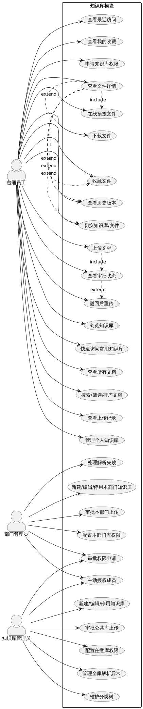
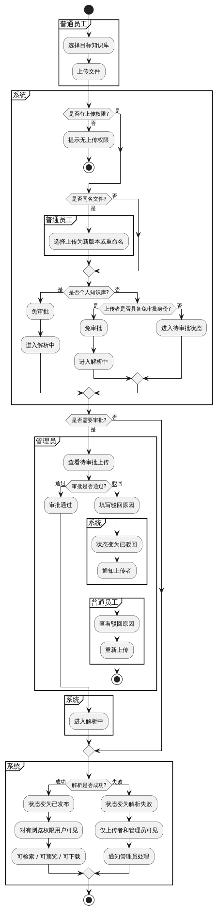
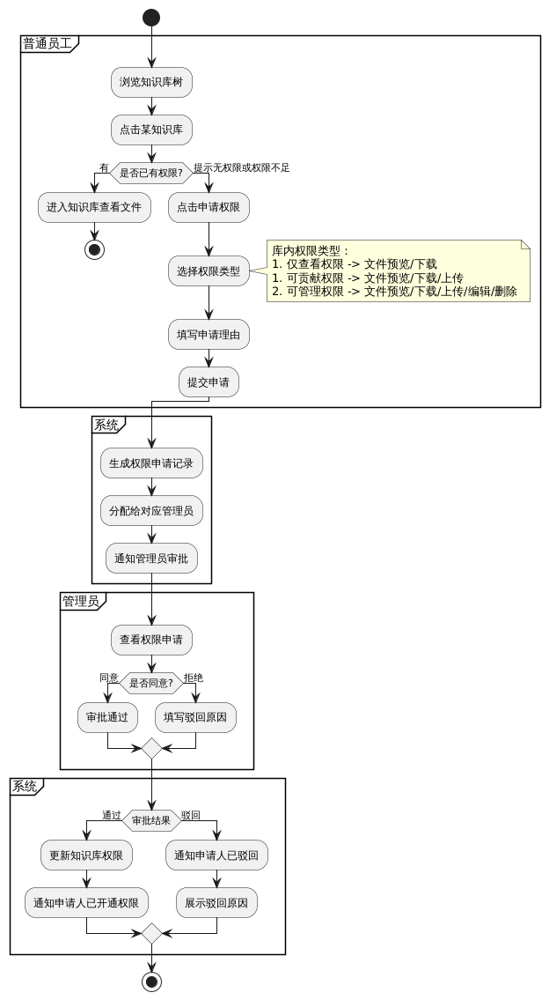

# Ⅰ.知识库模块 · 业务需求说明


# 一.模块定位

> 知识库是平台的文件底座，用于存放电厂规程制度，国标/厂标/技标等文档. 
> 服务于后续的智能问答，知识学习，考试等模块


# 二.用户角色

| 角色     | 使用者          | 职责                                                    |
| ------ | ------------ | ----------------------------------------------------- |
| 普通员工   | 值班员/技术员等     | 1.快速找到有权查看的文档.&#xA;2.上传个人资料&#xA;3.向公共/专业库提交文档可跟踪审批记录  |
| 部门管理员  | 各个部门负责人      | 1.维护本部门相关的知识库&#xA;2.审批员工上传的文件&#xA;3.配置本部门下各个知识库的权限    |
| 知识库管理员 | 平台指定管理员/培训老师 | 1.维护知识库分类&#xA;2.管理公共库&#xA;3.审批公共库上传的文件&#xA;4.全部门知识库治理 |


# 三. 业务需求清单 （一期）

### 概览

| 业务入口  | 业务场景                    |
| ----- | ----------------------- |
| 知识总览  | 日常查阅某专业库, 往指定库传文件       |
| 所有文档  | 不记得在哪个库, 要一次性搜全部有权浏览的文件 |
| 我的空间  | 管个人库, 查上传审批进度           |
| 知识库管理 | 管理原后台，维护分类/知识库/审批/解析异常  |

## 3.1  知识总览

| 业务编号                                                                                               | 业务需求                                          |
| -------------------------------------------------------------------------------------------------- | --------------------------------------------- |
| [BR-01  知识库首页](assets://./workspace/1a8fad11-533b-4aed-8217-b428024cdc95/l2UgNiu1gM80qhuKTxFcs)    | 点击知识库菜单，展示知识库首页；左侧有分类知识库树，右侧展示选中库下的文件         |
| [BR-02 快速访问常用知识库](assets://./workspace/1a8fad11-533b-4aed-8217-b428024cdc95/s_u5OsEkCqBaQOeUkzA-w) | 知识库后也左侧有快速访问，可置顶常用知识库；&#xA;个人知识库默在快速访问中       |
| [BR-03 我的入口](assets://./workspace/1a8fad11-533b-4aed-8217-b428024cdc95/rz6Znk0Iy1IqmMCQ3Rs2I)      | 首页左侧点击 我的，进入\[我的文档]页面（展示最近访问，上传记录，个人知识库）      |
| [BR-04 快速进入个人知识库](assets://./workspace/1a8fad11-533b-4aed-8217-b428024cdc95/Sj-yrnAODT9as2QiD4rWn) | 快速访问中，点击个人知识库跳转之知识库二级菜单\[我的文档]                |
| [BR-05 无权限库申请访问](assets://./workspace/1a8fad11-533b-4aed-8217-b428024cdc95/b4bM6U1YabBOdS2RM2W8_)  | 对无权限的知识库，在树中置灰可见，点击提示无权并提供申请权限入口              |
| [BR-06 库内检索与筛选](assets://./workspace/1a8fad11-533b-4aed-8217-b428024cdc95/ReMsdhjv-hRCsDyLdCJjc)   | 对文件进行搜索，排序，按标签/专业类型筛选；&#xA;支持多视图切换(文件列表/文件卡片） |


## 3.2 所有文档（有权库文档汇总）

| 业务编号                                                                                              | 业务需求                                          |
| ------------------------------------------------------------------------------------------------- | --------------------------------------------- |
| [BR-07 跨库汇总](assets://./workspace/1a8fad11-533b-4aed-8217-b428024cdc95/CyxF6CaF-Bujv6rcnNrE9)     | 一次性展示全部有权访问库 的 文件汇总，不必逐个翻库查阅                  |
| [BR-08 汇总页检索与筛选](assets://./workspace/1a8fad11-533b-4aed-8217-b428024cdc95/PyzwKl4c_rL-WtxGxdhOk) | 对文件进行搜索，排序，按标签/专业类型筛选；&#xA;支持多视图切换(文件列表/文件卡片） |

## 3.3 文档详情

| 业务编号                                                                                                 | 业务需求                                                            |
| ---------------------------------------------------------------------------------------------------- | --------------------------------------------------------------- |
| [BR-09 文档在线预览](assets://./workspace/1a8fad11-533b-4aed-8217-b428024cdc95/Miv2rI0iHUaaWnyyA4Ln-)      | 点击文件后进入独立的文件详情页，剧中显示文件原文，沉浸式阅读                                  |
| [BR-10 详情页内快速切换文件](assets://./workspace/1a8fad11-533b-4aed-8217-b428024cdc95/dPT1_7B4aId0gkY_ltQsc)  | 详情页左侧展示当前库内文件列表，可快速切换文件，无需返回列表                                  |
| [BR-11 详情页内快速切换知识库](assets://./workspace/1a8fad11-533b-4aed-8217-b428024cdc95/yhCGzhZ3WOcq7wfNJZYr0) | 详情页顶部展示当前知识库名，可通过下拉切换至有权访问的其他知识库；切换后左侧文件列表更新，并默认打开库内的第一个文件      |
| [BR-12详情页AI辅助](assets://./workspace/1a8fad11-533b-4aed-8217-b428024cdc95/GpbFkIS9hgtFpvr6WnSmH)      | 详情页右侧有Ai辅助内容：概要，知识点，脑图，练习题，与快捷提问入口                              |
| [BR-13 返回前页留存库状态](assets://./workspace/1a8fad11-533b-4aed-8217-b428024cdc95/BPrgLDZZ7ZqmTEvpl_zA0)   | 详情页顶部可返回前页；(总览/全库资料/最近访问/收藏);&#xA;若前页为知识库，需要记录上次选中的库（保存上次访问库状态） |
| [BR-14 文档下载](assets://./workspace/1a8fad11-533b-4aed-8217-b428024cdc95/gb1yfzvbDHAAIDfenkzF_)        | 具有某知识库的下载权限的员工, 可对某知识库内文件进行下载                                   |
| [BR-15 文档收藏](assets://./workspace/1a8fad11-533b-4aed-8217-b428024cdc95/4S9hP-PZu7JnZKTHEH-ci)        | 在列表页/详情页提供收藏入口，纳入至个人沉淀(我的收藏)与我的空间(个人收藏）                         |
| [BR-16 最近访问](assets://./workspace/1a8fad11-533b-4aed-8217-b428024cdc95/XBtisO2cxUm3ogw2BO67O)        | 详情页左侧展示当前库下最近访问的文档，最多显示5条。方便快速续看，减少重复导航                         |
| [BR-17 历史版本查看](assets://./workspace/1a8fad11-533b-4aed-8217-b428024cdc95/v3xkU7AxBoheZHRyZT4lf)      | 预览文件时，顶部可切换预览当前文档历史版本                                           |

## 3.4 我的空间

| 业务编号                                                                                                | 业务需求                                                                   |
| --------------------------------------------------------------------------------------------------- | ---------------------------------------------------------------------- |
| [BR-18 个人知识库](assets://./workspace/1a8fad11-533b-4aed-8217-b428024cdc95/QPeg3rEm5a1fBSH2VE02k)      | 有个人知识库，仅自己可见，用于存放私人资料                                                  |
| [BR-19 个人库免审批上传](assets://./workspace/1a8fad11-533b-4aed-8217-b428024cdc95/j9inedt7SMvpJW1VPhWB3)   | 向个人库上传文档无需审批，上传后直接进入解析                                                 |
| [BR-20 个人库文件归档其他库](assets://./workspace/1a8fad11-533b-4aed-8217-b428024cdc95/1RnMDOuNDhjsAORXx-v5s) | 员工可将个人库内的文件移动至有权上传的知识库中（移动的文件需被目标库管理员审批）                               |
| [bR-21 我的收藏列表](assets://./workspace/1a8fad11-533b-4aed-8217-b428024cdc95/7HZlylW2YnQv7gsqjnzxA)     | 在我的空间内统一查看文件的收藏列表；与个人沉淀(我的收藏）不同，是对多维度的资料进行收藏汇总(如问答，题目，错题等)；&#xA;支持取消收藏 |
| [BR-22 最近访问](assets://./workspace/1a8fad11-533b-4aed-8217-b428024cdc95/xiH5yfg2OYtjKiZyhiuhH)       | 展示最近访问的知识库与文件                                                          |
| [BR-23 我的上传](assets://./workspace/1a8fad11-533b-4aed-8217-b428024cdc95/eZGFRk4DDNlcrj7_zMiZb)       | 展示员工所有历史上传记录                                                           |

## 3.5 文档上传与审批

| 业务编号                                                                                               | 业务需求                                                 |
| -------------------------------------------------------------------------------------------------- | ---------------------------------------------------- |
| [BR-24 向知识库上传文档](assets://./workspace/1a8fad11-533b-4aed-8217-b428024cdc95/bx9ephMdTh95sFL0-EKMv)  | 向有上传权限的知识库上传文档，支持拖入文件或点击上传按钮                         |
| [BR-25 非个人库须审批](assets://./workspace/1a8fad11-533b-4aed-8217-b428024cdc95/9Qi6CRnlGaCG3jR1FyEqq)   | 向公共库/非个人知识库上传时，必须结果管理员审批后才可解析并对外可见                   |
| [BR-26 上传记录与状态跟踪](assets://./workspace/1a8fad11-533b-4aed-8217-b428024cdc95/KrxlGqhIvFDZl_6Lz_B78) | 在我的空间\[我的上传]中能看到员工本人上传的记录及每条记录的审批状态（待审批，解析中，已通过，已驳回） |
| [BR-27 驳回原因与重新上传](assets://./workspace/1a8fad11-533b-4aed-8217-b428024cdc95/yXEyYOxgF68qzWZ2OtMAC) | 文件审批被驳回时，员工可以查看驳回原因并重新上传                             |
| [BR-28 审批结果推送](assets://./workspace/1a8fad11-533b-4aed-8217-b428024cdc95/hql7P2nIH8hTalRPaeZ-9)    | 审批通过或驳回后，能收到消息通知                                     |

## 3.6 权限申请与授权

| 业务编号                                                                                              | 业务需求                                 |
| ------------------------------------------------------------------------------------------------- | ------------------------------------ |
| [BR-29 申请知识库权限](assets://./workspace/1a8fad11-533b-4aed-8217-b428024cdc95/WfASaOOLdsUp9eDQ7Fdx8)  | 员工对某知识库无权限或者权限不足时，可申请权限并填写理由         |
| [BR-30 审批权限申请](assets://./workspace/1a8fad11-533b-4aed-8217-b428024cdc95/g8Ct8CPZmULVQRwl2Muzm)   | 管理员能审批员工的权限申请                        |
| [BR-31 授权指定成员](assets://./workspace/1a8fad11-533b-4aed-8217-b428024cdc95/6yOPnl448y68QmUqDBjkI)   | 管理员能自主指定知识库授权指定员工更高/更低的权限            |
| [BR-32 部门成员默认权限](assets://./workspace/1a8fad11-533b-4aed-8217-b428024cdc95/zjW_mkcKdv3lLA0K4fEVx) | 本部门成员加入部门后，自动获得该部门的知识库的默认权限，减少逐人配置工作 |

## 3.7 知识库与分类维护

| 业务编号                                                                                               | 业务需求                                                                         |
| -------------------------------------------------------------------------------------------------- | ---------------------------------------------------------------------------- |
| [BR-33 维护分类树](assets://./workspace/1a8fad11-533b-4aed-8217-b428024cdc95/MTFGAW2WH5fzaJCH1JKjw)     | 知识库管理员可以维护分类树，支持多级嵌套，按主题组织知识库                                                |
| [BR-34 知识库管理](assets://./workspace/1a8fad11-533b-4aed-8217-b428024cdc95/5pQZtRARUa15cpS4xwFUh)     | 管理员对知识库的新建，编辑，停用；停用的知识库仅管理员可见）普通员工在浏览知识库树是不可见，且在所有文档中也不可见停用知识库下的文档，同时无法被检索出； |
| [BR-35 知识库所属分类](assets://./workspace/1a8fad11-533b-4aed-8217-b428024cdc95/LnmzVSF-nbldezC6kj0bP)   | 新建知识库时能明确指定所属上级分类                                                            |
| [BR-36 配置知识库权限](assets://./workspace/1a8fad11-533b-4aed-8217-b428024cdc95/5orU34Yo7Ip-JySxaoZ9H)   | 管理员能为单个知识库配置权限，指定成员权限                                                        |
| [BR-37 审批上传与权限申请](assets://./workspace/1a8fad11-533b-4aed-8217-b428024cdc95/i2kfVBNGTLr3pU7OWqR06) | 管理员能审批待处理的上传与 权限申请                                                           |
| [BR-38  部门引用组织架构](assets://./workspace/1a8fad11-533b-4aed-8217-b428024cdc95/RIxBR2pu1JoIj00GnXOKI) | 部门信息从组织架构中 引用，不在知识库模块内新建部门                                                   |


# 四.UseCase

## &#x20;   4.1 知识库模块



&#x20;   

## &#x20;   4.2 上传文档审批



## &#x20;   4.3 知识库权限申请与授权




# 五.核心业务流程

## 5.1 员工按库浏览文档

```
员工点击系统菜单： 知识库 -> 浏览器知识库（默认页）
  ->左侧：快速访问 / 知识库树 选中某个库
  ->右侧：该库内文件列表
  ->点击文件 进入文件详情页面（左侧展示该库的文件列表 / 中间预览文件 / 右侧AI辅助内容
  ->文件详情页顶部可切换选择其他有权限的知识库，切换后，左侧文件列表更新， 默认打开新库的第一个文件
  ->文件详情页顶部左侧 提供 [返回知识库浏览页]，回到知识库首页
```


## 5.2 员工跨库查找所有文档

```
员工点击系统菜单： 知识库 -> 所有文档 / 或 知识库 -> 浏览知识库页 -> [所有文档]按钮
  -> 进入所有文档页，展示全部有权访问知识库的文件汇总
  -> 按分类,知识库, 标签筛选 
  -> 点击文件进入文件详情页
```


## 5.3 员工访问个人空间

```
方式一：点击系统菜单： 知识库 -> 我的空间 -> 个人知识库
方式二：点击系统菜单： 浏览知识库 -> 快速访问 -> 点击已置顶的【个人知识库】
```


## 5.4 员工申请知识库权限

```
员工发现某知识库无权限访问或权限不足
  -> 在无权提示面板中，点击 [申请权限]
  -> 选择权限类型(仅查看 / 可贡献 / 可管理) + 填写申请理由
  -> 提交申请
  -> 等待管理员审批
      ├─ 通过 → 自动获得权限,系统通知
      └─ 驳回 → 收到驳回通知, 可重新申请
```

##

## 5.5 管理员维护知识库

```
维护分类树（新增目录/编辑目录/调整层级)
入口：
  方式一： 点击菜单: 知识库 -> 知识库管理 (二级菜单) ，选择指定目录进行维护
  方式二： 在知识库首页目录上 [...] 悬浮编辑/编辑目录

维护知识库
入口：
  方式一： 点击菜单: 知识库 -> 知识库管理 (二级菜单) 在指定节点下编辑/停用/启用/新增知识库 
  方式二： 在知识库首页左侧目录上 [...] 悬浮显示新增知识库
  方式三： 在知识库首页左侧知识库上 [...] 悬浮显示 编辑知识库（编辑时可进行启停）
```


# 六. 业务规则

## 6.1 上传审批规则

| 上传人        | 目标库  | 是否审批 |
| ---------- | ---- | ---- |
| 任意角色       | 个人库  | 免审批  |
| 知识库管理员     | 任意库  | 免审批  |
| 部门管理员      | 本部门库 | 免审批  |
| 部门管理员      | 公共库  | 需审批  |
| 普通员工（有上传权) | 部门库  | 需审批  |
| 普通员工       | 公共库  | 徐审批  |

## 6.2 文件可见性规则

| 文件状态 | 上传者 | 管理员 | 其他有查看权用户 |
| ---- | --- | --- | -------- |
| 待审批  | ✅   | ✅   | ❌        |
| 审批驳回 | ✅   | ✅   | ❌        |
| 解析中  | ✅   | ✅   | ❌        |
| 解析失败 | ✅   | ✅   | ❌        |
| 审批通过 | ✅   | ✅   | ✅        |
|      |     |     |          |


# 七. 知识库本期不做

以下需求记录，不纳入第一期业务范围

| 需求              | 原因                 | 安排    |
| --------------- | ------------------ | ----- |
| 知识库内目录树（文件夹式管理） | 与智能打标签方向冲突；多库目录难复用 | 二期及以后 |
| 文件版本差异对比        | 有价值但非基础能力          | 二期    |
| 文件条文解读          | 需领域知识注入            | 更往后   |
| 移动端             | 第一期聚焦 PC 端基本功能     | 后续    |

***

