# 知识库模块需求设计说明

> **版本**：v0.4 · 2026-07-06 · 权限与上传审批规则完善  
> **变更重点**：累积级别模型（仅查看 / 可贡献 / 可管理）；「可管理」含本库上传审批权；文件上传采用**或审**（任一有权人通过即可）及状态机防重  
> **历史版本**：v0.3 归档见同目录 `知识库需求设计说明-v0.3.md`

---

## 一、建设内容

1. **导航简化**：「我的（含个人知识库）+ 公共空间 + 部门空间（平铺列表）」
2. **层级清晰**：空间（公共 / 部门 / 个人）→ 知识库 → 库内目录 → 文件 → 预览
3. **文件快速切换**：阅读文件时，左侧展示当前库内目录与文件，可快速切换相邻文档
4. **知识库快速切换**：阅读文件时，左侧顶部可切换当前部门下其他知识库
5. **状态可见**：解析中 / 待审批文件对上传者、有权审批人及管理员可见，普通用户只看已发布内容
6. **我的**：个人知识库、我的上传
7. **拖入即上传**：支持将文件直接拖入某个知识库或库内目录，无需先点「上传」按钮，交互贴近 Windows 资源管理器的拖放习惯
8. **多版本留存**：同一文件可保留多个历史版本（如 2023 版 / 2024 版规程），列表只展示当前版，可查看与下载历史版本

---

## 二、用户角色与权限体系


### 2.1 角色定义

系统共有三种角色，权限从高到低依次为：


| 角色         | 说明                     | 管理范围          |
| ---------- | ---------------------- | ------------- |
| **知识库管理员** | 系统最高权限，由平台超管指定         | 公共空间 + 全部部门空间 |
| **部门管理员**  | 由知识库管理员创建部门时指定，可同时指定多人 | 仅限本部门         |
| **普通员工**   | 全体员工的默认角色              | 个人库 + 有权限的知识库 |


---


### 2.2 权限体系：三层模型

知识库的权限分为三个层次，从外到内依次控制：

```
层次 1：【空间可见性】谁能看到哪个部门/空间的入口
层次 2：【知识库权限】对某个知识库本身（新建、编辑、停用等管理操作）
层次 3：【文件操作权限】进入知识库后，对文件的具体操作
```

> 📌 **核心原则**：文件操作权限**绑定在单个知识库上**，不是按部门统一分配。
> 同一名员工，可能对 A 知识库有「可管理」维护权，对 B 知识库只有「仅查看」权限。

---


### 2.3 文件操作权限：累积级别模型

为降低配置复杂度、避免「单独勾选上传」带来的歧义，文件操作权限采用 **3 个累积级别**（由低到高）。高级别自动包含低级别能力，配置时**单选一级**，不做独立开关叠加。


| 系统权限组（对内）     | 界面展示名   | 界面副说明（Tooltip）                | 包含操作                               | 可配置给普通员工 |
| ------------- | ------- | ----------------------------- | ---------------------------------- | -------- |
| **查看组**       | **仅查看** | 可预览、下载已发布文件                   | 在线预览、下载                            | ✅        |
| **贡献组**（原上传组） | **可贡献** | 在「仅查看」基础上，可上传文件；上传须审批后发布      | 查看 + 上传文件、上传新版本                    | ✅        |
| **管理组**       | **可管理** | 维护本库目录与文件；上传免审批；可审批他人向本库提交的上传 | 编辑元数据、删除、移动、建目录、上传免审批、**审批本库待审上传** | ✅        |


#### 「可管理」的边界：文件操作 ≠ 知识库管理

「可管理」描述的是**进入某个知识库之后**对库内内容的维护能力，可授权给普通员工（如指定某人为某库的「资料维护人」）。它与**系统管理员角色**管辖的知识库级操作相互独立：


| 能力                | 普通员工（被授予「可管理」） | 部门管理员 / 知识库管理员        |
| ----------------- | -------------- | --------------------- |
| 预览、下载             | ✅              | ✅                     |
| 上传文件（本库）          | ✅ 免审批          | ✅ 免审批                 |
| 编辑文件元数据、删除、移动、建目录 | ✅ 仅限本库         | ✅                     |
| **审批他人向本库提交的上传**  | ✅ **仅限本库**     | ✅ 部门库：本部门；知识库管理员：全厂兜底 |
| 编辑 / 停用知识库本身      | ❌              | ✅                     |
| 配置本库成员权限          | ❌              | ✅                     |
| 审批他人「权限申请」        | ❌              | ✅                     |


> 📌 **角色与权限级别可叠加**：部门管理员在本部门库内自动拥有「可管理」文件操作权，无需单独授权；普通员工须经管理员授权或申请审批后方可获得「可管理」。


#### 为什么不用「上传」作界面展示名？


| 问题                | 说明                                           |
| ----------------- | -------------------------------------------- |
| 上传是**动作**不是**身份** | 管理员配权限时想的是「这人在这个库里能干什么」，而非「能不能点上传按钮」         |
| 单独「上传」易误解         | 用户可能以为「只上传、不能看」，实际上上传权限**必然包含**查看权           |
| 与「管理」不对称          | 「查看」「管理」描述的是能力层级，「上传」夹在中间显得突兀；「可贡献」与两侧形成递进关系 |


> 📌 **命名约定**：文档与接口层使用「查看组 / 贡献组 / 管理组」；**所有面向用户的界面**统一使用「仅查看 / 可贡献 / 可管理」，不在 UI 中单独出现「上传组」字样。上传、审批等动作能力由「可贡献」隐含表达。


#### 界面展示规范（权限配置场景）

管理员在「知识库权限管理」页配置时，遵循以下展示规则：

**① 默认权限（本部门成员）—— 单选，互斥**

```
○ 无访问        成员须单独申请或授权
● 仅查看        可预览、下载已发布文件          ← 推荐默认
○ 可贡献        可上传文件，须审批后发布
```

> 默认权限**不设「可管理」**——该级别权限面较大，仅通过「指定成员」单独授权或员工申请后审批授予。

**② 指定成员列表 —— 「权限级别」列**


| 列名   | 展示值                   | 说明                      |
| ---- | --------------------- | ----------------------- |
| 成员   | 姓名                    | —                       |
| 权限级别 | `仅查看` / `可贡献` / `可管理` | 三档均可配置；高于本部门默认级别的成员在此列出 |
| 操作   | 调整 / 移除               | 「调整」弹出三档单选（无访问不在成员行出现）  |


**③ 员工「申请权限」—— 目标级别单选**

```
申请权限级别 *
○ 仅查看 — 我需要查阅本库资料
○ 可贡献 — 我需要向本库提交文件
○ 可管理 — 我需要维护本库目录与文件
```

**④ 待审批申请 —— 展示申请目标**

```
王五 申请「可贡献」· 理由：参与该库资料维护
```

**⑤ 无权限时的操作提示**


| 场景      | 提示文案                        |
| ------- | --------------------------- |
| 无查看权    | 「暂无访问权限，可向管理员申请」            |
| 有查看、无贡献 | 隐藏拖入上传区与上传按钮；底部保留「申请更高权限」   |
| 有贡献权    | 显示拖入上传区；上传后进入审批队列           |
| 有可管理权   | 显示完整维护能力；上传免审批；可处理本库「待审批上传」 |


---


### 2.4 各角色权限矩阵


#### ▌ 空间层与知识库管理权限


| 操作         | 知识库管理员 | 部门管理员           | 普通员工    |
| ---------- | ------ | --------------- | ------- |
| 新建部门空间     | ✅      | ❌               | ❌       |
| 在公共空间新建知识库 | ✅      | ❌               | ❌       |
| 在本部门新建知识库  | ✅      | ✅               | ❌       |
| 编辑/停用任意知识库 | ✅      | 仅限本部门           | ❌       |
| 查看全部部门入口   | ✅      | ✅（全部可见，但只能管本部门） | ✅（全部可见） |


> 📌 **说明**：部门入口对全员可见，所有人都能看到有哪些部门。但进入某个知识库后能做什么操作，由该知识库的文件权限控制。


#### ▌ 文件操作权限：普通员工

普通员工在不同库的文件操作权限如下（权限来源见 2.5）。界面统一用「仅查看 / 可贡献 / 可管理」展示：


| 知识库类型            | 仅查看      | 可贡献   | 可管理       |
| ---------------- | -------- | ----- | --------- |
| **个人库**（我的资料）    | ✅        | ✅ 免审批 | ✅         |
| **所属部门库**（默认）    | ✅        | ✅ 需审批 | 按授权（默认 ❌） |
| **其他部门库**（申请/授权） | 按授权级别    | 按授权级别 | 按授权级别     |
| **公共空间库**        | ✅（公开可查看） | ✅ 需审批 | 按授权（默认 ❌） |


#### ▌ 文件操作权限：管理员角色

部门管理员 / 知识库管理员在其管辖范围内**自动拥有**对应库的「可管理」文件操作权，同时额外拥有知识库级管理能力（建库、权限配置、权限申请审批等）：


| 知识库类型           | 仅查看 | 可贡献    | 可管理（文件） | 知识库级管理 | 审批本库上传  | 审批权限申请 |
| --------------- | --- | ------ | ------- | ------ | ------- | ------ |
| **知识库管理员**（任意库） | ✅   | ✅ 免审批  | ✅ 自动    | ✅      | ✅ 全厂兜底  | ✅      |
| **部门管理员**（本部门库） | ✅   | ✅ 免审批  | ✅ 自动    | ✅ 本部门  | ✅ 本部门各库 | ✅ 本部门  |
| **部门管理员**（其他库）  | ✅   | ❌ 或按申请 | 按授权     | ❌      | ❌       | ❌      |


---


### 2.5 普通员工如何获得知识库权限

员工对某知识库的权限，通过以下三种方式获取：

```
方式 1：自动获得（所属部门库的默认权限）
  └─ 部门管理员在创建知识库时，可为「本部门成员」设置默认权限级别
     如：默认给所有成员「仅查看」
     部门成员无需申请，加入部门即自动拥有

方式 2：管理员主动授权
  └─ 部门管理员或知识库管理员可以手动为指定员工调整权限级别
     如：将某员工从「仅查看」升级为「可贡献」，或指定为某库「可管理」维护人

方式 3：员工主动申请
  └─ 员工可在任意知识库详情页点击「申请权限」
     选择目标级别（仅查看 / 可贡献 / 可管理）并填写申请理由
     由该库所属的管理员审批**权限申请**（部门库→部门管理员，公共库→知识库管理员）
     「可管理」申请建议重点审核；通过后授予库内文件维护权及本库上传审批权
```

---


### 2.6 上传是否需要审批（上传者视角）

上传文件的审批规则，由**上传者权限级别 × 目标知识库**共同决定：


| 上传者             | 上传到个人库 | 上传到部门库           | 上传到公共库       |
| --------------- | ------ | ---------------- | ------------ |
| 知识库管理员          | 免审批    | 免审批              | 免审批          |
| 部门管理员           | 免审批    | 本部门库免审批；其他部门库需审批 | 需审批          |
| 普通员工（可管理）       | 免审批    | 免审批（限已授权的本库）     | 免审批（限已授权的本库） |
| 普通员工（可贡献）       | 免审批    | 需审批              | 需审批          |
| 普通员工（仅查看 / 无访问） | 免审批    | ❌ 无权限            | ❌ 无权限        |


> 📌 **可贡献 ≠ 免审批**：「可贡献」只决定能否提交；提交后进入待审批队列，由有权审批人处理（规则见 2.7）。

---


### 2.7 文件上传审批规则（审批人视角）

「可贡献」员工向部门库 / 公共库提交文件后，系统生成**一条**待审批记录。审批采用**或审**模式：**多个审批人均有权处理，任意一人通过或驳回即结案**，不需要会签，也不要求多方共同审批。

#### 谁可以审批？


| 目标库类型   | 有权审批的人（满足任一即可操作）                                        |
| ------- | ------------------------------------------------------- |
| **部门库** | ① 该库被授予「可管理」的员工（库维护人） ② 该库所属部门的「部门管理员」 ③ 「知识库管理员」（全厂兜底） |
| **公共库** | ① 该库被授予「可管理」的员工（若有指定） ② 「知识库管理员」                        |


> 📌 **审批权融入「可管理」**：不单独增设第四权限档或「审批组」。库维护人因「可管理」而自然获得本库上传审批权；部门管理员 / 知识库管理员作为角色级兜底审批人，无需额外授权。


#### 或审与防重规则


| 规则       | 说明                                      |
| -------- | --------------------------------------- |
| **或审**   | 多人待办指向**同一条**待审批记录；**先操作的有效，后操作的无效**    |
| **一人通过** | 状态变为「已通过」→ 进入解析；所有审批人待办同步消失             |
| **一人驳回** | 状态变为「已驳回」→ 仅上传者可见；所有人待办同步关闭             |
| **重复点击** | 已结案记录按钮置灰；提示「该文件已由 {姓名} 于 {时间} {通过/驳回}」 |
| **并发冲突** | 两人几乎同时点击时，以**先写入**为准；后者提示「状态已变更，请刷新」    |
| **重传**   | 驳回后上传者修改重传 → 生成**新的**待审批记录，与旧单独立        |


#### 待办入口（同一单据，多入口可见）


| 入口              | 谁看到       | 范围             |
| --------------- | --------- | -------------- |
| **我维护的库 · 待审批** | 本库「可管理」员工 | 仅自己维护的知识库      |
| **本部门 · 待审批**   | 部门管理员     | 本部门所有库的待审上传    |
| **全厂 · 待审批**    | 知识库管理员    | 公共库 + 各部门库（兜底） |


库详情页内，有权审批的用户可在文件列表看到待审批条目，并提供「通过 / 驳回」操作（驳回须填写原因）。

---


### 2.8 文件移动与跨库分享

员工将个人库的内容分享到部门/公共库时，操作方式为：

- 支持将个人库文件**移动**到有「可贡献」及以上权限的部门库或公共库
- 若目标库权限为「可贡献」，移动后进入**审批队列**；若目标库权限为「可管理」，移动后**直接解析发布**
- **移动**：文件从个人库消失，出现在目标库（适合正式归档）
- **复制**（本期视技术可行性）：个人库保留一份，目标库也有一份

---


### 2.9 架构概览

```
知识库模块
│
├── 【一级】入口菜单
│   ├── 我的
│   │   ├── 最近访问（最近库 / 最近文件）
│   │   ├── 我的资料 → 个人知识库
│   │   └── 我的上传 → 公共/部门库的上传及审批记录
│   ├── 快速访问（将指定知识库置顶，直达库详情）
│   ├── 公共空间 → 知识库卡片列表（扁平，不套深层目录）
│   └── 部门空间（平铺列表，全员可见各部门入口）
│       ├── 运行处
│       ├── 技术处
│       ├── 调度处
│       ├── …
│       └── ＋ 新建部门（仅知识库管理员可见）
│
├── 【二级】空间知识库主页
│   ├── 公共空间 / 部门空间 → 该空间下知识库卡片
│   └── 我的（最近访问的库和文件 / 个人知识库 / 我的上传记录）
│
└── 【三级】知识库详情
    └── 库内目录 + 文件列表 + 预览 + 待审批处理（有权人）
```

---


## 三、功能模块说明


### 3.1 我的

「我的」是员工个人在知识库中的聚合入口，左侧菜单固定可见，包含三个 Tab：

**最近访问**

- 展示最近打开过的知识库与文件，便于从上次阅读位置快速续看
- 点击库名进入库详情，点击文件名直达预览

**我的资料（个人知识库）**

- 仅本人可见的私人资料空间，结构与部门库一致：库内目录 + 文件列表
- 上传**无需审批**，拖入或选择文件后直接进入解析
- 支持新建目录、拖入上传、文件增删改
- 可将文件移动到有权限的部门/公共库（移动后进入审批流）

**我的上传**

- 汇总本人向**公共空间 / 部门空间**提交的上传记录
- 按状态筛选：待审批、解析中、已发布、已驳回
- 驳回文件支持查看原因并**重传**（重传生成新的待审批单）

**待我审批（有权审批人可见）**

- 库「可管理」维护人：「我维护的库 · 待审批」
- 部门管理员：「本部门 · 待审批上传」
- 知识库管理员：「全厂 · 待审批上传」
- 多人有权时**或审**，规则见 §2.7；界面见 §4.9

---


### 3.2 快速访问

- 员工可将常用知识库**置顶**到左侧「快速访问」区
- 点击后直达该库详情，跳过空间主页的卡片列表
- 适合高频查阅的库

---


### 3.3 公共空间

- 存放全厂级、跨部门共享的知识库，以**知识库卡片**形式扁平展示
- 卡片展示库名、文件数量、最近更新时间等摘要信息
- 知识库管理员可在公共库进行文件上传 / 删除 / 更新（免审批）
- 普通员工可浏览已发布内容；向公共库上传须审批（审批人见 §2.7）

---


### 3.4 部门空间

- 按部门平铺展示（如运行处、技术处、调度处），**全员可见所有部门入口**
- 进入某部门后，展示该部门下全部知识库卡片
- 各知识库有独立的权限配置，控制员工对该库可做的操作
- **知识库管理员**可在左侧点击「＋ 新建部门」，填写部门名称、指定部门管理员
- **部门管理员**负责本部门知识库与文件的日常维护，并作为本部门各库上传审批的兜底人
- 部门成员以「可贡献」身份上传须审批；本库「可管理」维护人、部门管理员、知识库管理员均可处理（或审，见 §2.7）

---


### 3.5 知识库详情

知识库详情是「库内目录 + 文件列表」的管理与浏览页，是进入单文件预览前的核心页面

主要能力：

- 左侧**库内目录树**，右侧**文件列表 / 卡片**；选中目录后列表联动过滤
- **拖入即上传**：文件可直接拖入目录节点或列表区，无需先点上传按钮
- 文件卡片展示名称、类型、更新时间；有多版本时显示**版本角标**
- 列表支持搜索、排序；管理员可新建目录、移动 / 删除文件
- 解析中、待审批文件对上传者、有权审批人及管理员可见，普通用户只看已发布内容
- 员工可点击「**申请权限**」按钮，选择目标级别（仅查看 / 可贡献 / 可管理）并提交申请
- 拥有「可管理」级别的员工可在库内进行目录维护、文件编辑 / 删除 / 移动，可审批本库待审上传，但**看不到**「权限管理」入口

---


### 3.6 文件预览

文件预览是知识库的核心阅读场景，采用「左目录 + 中预览 + 右辅助」三栏布局

**左侧：目录与切换**

- 展示当前库内目录与文件，点击可快速切换相邻文档
- 顶部支持**切换当前部门下其他知识库**，无需返回空间主页
- 列表项旁版本图标表示该文件存在历史版本

**中间：预览区**

- 支持 PDF 等格式的在线预览
- 顶部**版本下拉**：查看当前版与历史版本，历史版可只读预览 / 下载
- 管理员可从此处进入文件编辑

**右侧：辅助面板**

- 知识点 / 文档概要、思维脑图
- 相关题目、推荐问题（与能力提升学习模块衔接）
- 解析完成后内容可被学习模块引用为「知识资料」

---


### 3.7 文件上传与版本管理

**上传方式**

- 拖入知识库详情页的目录或列表区
- 点击上传按钮选择本地文件；支持**批量选择**（多文件或多文件拖入）
- 个人库上传免审批；公共 / 部门库按权限级别走审批或直接解析（规则见 §2.6、§2.7）

**上传审批（有权审批人）**

- 待审批文件在库详情文件列表中标注状态；有权人可直接「通过 / 驳回」
- 驳回须填写原因；上传者在「我的上传」中查看并支持重传
- 多人有权审批时**或审**：一人结案后，其他人待办自动同步

---

**同名文件处理**

- 同库 + 同目录 + 同名时，上传前弹窗确认
- 默认推荐「**上传为新版本**」，保留历史版本，新版解析后成为当前版
- 也可选择重命名上传或取消；批量拖入时对冲突项逐项处理

**多版本留存**

- 同一逻辑文件可保留多个历史版本（如 2023 版 / 2024 版规程）
- 列表默认展示当前版；历史版不参与**智能问答（RAG）默认召回**
- 历史版本**可被文件检索命中**（文件名或内容均可检索），以满足「精确查找旧版本」场景
- 用户可在预览页顶部版本下拉中切换到历史版，进行只读预览或下载

---


### 3.8 文件编辑

入口：① 预览页编辑按钮；② 文件列表模式的 `⋯` 编辑菜单；③ 文件卡片模式右键编辑按钮

维护字段：

- 基本信息：文件名称、版本说明、生效日期、文档年份
- 分类与标签：文件分类、文件性质、适用岗位等（RAG 预填 + 人工修改）
- 文档摘要：供检索与学习模块展示

> 📌 文件编辑（修改元数据）属于「可管理」级别能力；管理员角色自动拥有，普通员工须被授权「可管理」后方可操作。

---


## 四、页面示意


### 4.1 知识库主页

```
┌────────────┬─────────────────────────────────────────┐
│            │  运行处 · 部门主页                       |
|  我的      |                [搜索本部门知识库…] 新建  │
│  快速访问  │  ┌─────────┐ ┌─────────┐ ┌─────────┐    │
│ ─────────  │  │ xxxx库  │ │  xxxx库 │ │＋新建库 │    │
│ 公共空间   │  │最近更新… │ │12 个文件│ │         │    │
│ ─────────  │  └─────────┘ └─────────┘ └─────────┘    │
│ 部门空间   │                                         │
│  运行处 ◀  │                                         │
│  技术处    │                                         │
│  调度处    │                                         │
│  ＋ 新建   │  ← 仅知识库管理员可见                   │
└────────────┴─────────────────────────────────────────┘
```

---


### 4.2 库详情页 - 目录预览

```
┌────────────┬─────────────────────────────────────┐
│ 部门名/库名 |                                    │
|  目录/文件  │            文件列表预览区           │
│             │   ┌ ─ ─ ─ ─ ─ ─ ─ ─ ─ ─ ─ ─ ─ ┐   │
│ 📁 目录A ◀ │   │  拖放文件到此处即可上传      │   │
│  · xx文件   │   └ ─ ─ ─ ─ ─ ─ ─ ─ ─ ─ ─ ─ ─ ┘   │
│  · xx文件   │           文件卡片/文件列表         │
│  · xx文件 🕘│  ← 有历史版本时显示版本角标          │
│ 📁 目录B    │                                    │
│  · xx文件   │                    [申请权限]      │
└─────────────┴─────────────────────────────────────┘
```

---


### 4.3 库详情页 - 文件预览

```
┌──────────────┬─────────────────────────┬─────────────┐
│ 部门名/库名 ˅|  [当前 v3 ▼]  [编辑]   |             |
|  目录/文件   │        PDF 预览区       │ 知识点/概要  │
│             │                         │  [思维脑图]  │
│ 📁 目录A    │                         │              │
│  · xx文件 ◀ │  ← 列表项旁 🕘 表示有多版本             │
│  · xx文件 🕘│                         │  [相关题目]  │
│ 📁 目录B    │                         │  [推荐问题]  │
│  · xx文件   │                         │              │
└─────────────┴─────────────────────────┴──────────────┘

预览区顶部「当前 v3 ▼」展开历史版本：
┌────────────────────────────────┐
│ 历史版本                        │
│ ✓ v3 · 2024-06 版  今天  张三  │  ← 当前版（参与 AI 问答）
│   v2 · 2023-12 版  2024-01 李四│  ← 可检索/预览/下载
│   v1 · 2023-06 版  2023-07 王五│  ← 可检索/预览/下载
└────────────────────────────────┘

---- 库名下拉：快速切换当前部门下其他知识库 ----
┌────────────────────────────────┐
│ 部门名/库名A  ˅                 │
│ 电气运行部 · 3 个知识库         │
│────────────────────────────────│
│ ✓ 库名A                        │
│   12 个文件 · 最近更新 今天     │
│                                │
│   库名B                        │
│   46 个文件 · 最近更新 昨天     │
│                                │
│   库名C                        │
│   28 个文件 · 最近更新 3 天前   │
└────────────────────────────────┘
```

---


### 4.4 新建部门弹窗

> 说明：部门入口对全员可见，**无需设置可见范围**（能否访问某库内内容由知识库权限控制，与部门节点无关）

```
┌──────────────────────────────────────┐
│  新建部门空间                         │
├──────────────────────────────────────┤
│  部门名称 *                           │
│  [ 运行处                          ] │
│                                      │
│  部门简介                             │
│  [ 本部门运行规程、技术标准…         ] │
│                                      │
│  部门管理员 *                         │
│  [ 搜索并选择人员…                 ▼] │
│  已选：张三、李四                     │
│                                      │
│              [取消]  [创建部门]       │
└──────────────────────────────────────┘
```

---


### 4.5 知识库权限配置（管理员视角）

部门管理员可对本部门下的单个知识库配置权限。界面采用 **累积级别单选**，不使用「浏览 + 上传」组合文案：

```
┌──────────────────────────────────────────────────┐
│  权限管理 · 运行处 > AGC 规程库                   │
├──────────────────────────────────────────────────┤
│  默认权限（本部门成员自动获得）                   │
│  ○ 无访问 — 成员须单独申请或授权                  │
│  ● 仅查看 — 可预览、下载已发布文件    ← 推荐      │
│  ○ 可贡献 — 可上传文件，须审批后发布              │
│                                                  │
│  指定成员权限                                    │
│  ┌─────────┬──────────┬──────────────┐           │
│  │ 成员    │ 权限级别 │ 操作         │           │
│  ├─────────┼──────────┼──────────────┤           │
│  │ 张三    │ 可管理   │ [调整][移除] │  ← 库维护人│
│  │ 李四    │ 可贡献   │ [调整][移除] │           │
│  │ 王五    │ 仅查看   │ [调整][移除] │           │
│  └─────────┴──────────┴──────────────┘           │
│  [ + 添加成员 ]  添加时选择：仅查看 / 可贡献 / 可管理 │
│                                                  │
│  待审批申请（2 条）  ← 权限申请，与上传审批分开              │
│  📋 赵六 申请「可管理」· 理由：负责本库规程维护   │
│  📋 钱七 申请「可贡献」· 理由：需提交运行记录       │
│  [通过]  [驳回]                                   │
└──────────────────────────────────────────────────┘
```

> **说明**：此处「待审批申请」指员工**权限级别**的申请。员工**文件上传**的待审批在库详情文件列表或「待审批上传」专页处理（见 §4.9）。

**调整权限弹窗（成员行点击「调整」）**

```
┌──────────────────────────────────────┐
│  调整权限 · 张三                      │
├──────────────────────────────────────┤
│  权限级别 *                           │
│  ○ 仅查看                             │
│  ○ 可贡献                             │
│  ● 可管理                             │
│                                      │
│  ⓘ 可管理：可维护本库目录与文件，上传免审批，可审批他人向本库提交的上传；不含权限配置 │
│                                      │
│              [取消]  [保存]           │
└──────────────────────────────────────┘
```

---


### 4.5.1 员工申请权限弹窗

无访问或仅有「仅查看」的员工，在库详情页点击「申请权限」：

```
┌──────────────────────────────────────┐
│  申请权限 · AGC 规程库                │
├──────────────────────────────────────┤
│  当前权限：无访问                     │
│                                      │
│  申请权限级别 *                       │
│  ● 仅查看 — 我需要查阅本库资料        │
│  ○ 可贡献 — 我需要向本库提交文件      │
│  ○ 可管理 — 我需要维护本库目录与文件  │
│                                      │
│  申请理由 *                           │
│  [ 参与 AGC 规程学习，需查阅…     ]  │
│                                      │
│              [取消]  [提交申请]       │
└──────────────────────────────────────┘
```

> 若当前已有「仅查看」，弹窗默认选中「可贡献」；若已有「可贡献」，默认选中「可管理」。按钮文案随当前级别显示为「申请更高权限」。

---


### 4.6 我的（最近访问 + 个人知识库 + 我的上传）

```
┌────────────┬────────────────────────────────────────────┐
│  我的 ◀    │  [ 最近访问 ]  [ 我的资料 ]  [ 我的上传 ]  │
│            │──────────────────────────────────────────  │
│  我的      │  Tab · 我的资料（默认个人知识库）            │
│  快速访问  │  ┌──────────┬──────────────────────────┐   │
│  公共空间  │  │ 库内目录  │  文件列表                 │   │
│  部门空间  │  │ 📁 工作笔记│  📄 学习摘录.pdf         │   │
│            │  │ 📁 待整理  │  📄 规程草稿.docx        │   │
│            │  │ ＋新建目录 │  [拖入文件上传]  [移动到…]│  │
│            │  └──────────┴──────────────────────────┘   │
│            │────────────────────────────────────────────│
│            │  Tab · 我的上传（上传到公共/部门库的记录）  │
│            │  [ 待审批 2 ][ 解析中 1 ][ 已发布 8 ][ 已驳回 ] │
│            │  📄 xxxx.pdf   xxx库 · 待审批              │
│            │  📄 xxxx.xlsx  xxx库 · 已驳回  [查看原因][重传]│
└────────────┴────────────────────────────────────────────┘
```

---


### 4.7 重复文件上传确认

拖入或选择文件时，若**同库 + 同目录 + 同名**已存在，上传前先弹窗确认：

```
┌──────────────────────────────────────────┐
│  检测到同名文件                           │
├──────────────────────────────────────────┤
│  当前目录已存在：AGC 运行规程.pdf          │
│  当前版本：v2 · 2023-12 版 · 上传于昨天   │
│                                          │
│  请选择处理方式：                         │
│  ● 上传为新版本（推荐）                   │
│    保留历史版本，新版本解析后成为当前版    │
│  ○ 重命名后上传                           │
│    [ AGC 运行规程(1).pdf            ]    │
│  ○ 取消                                   │
│                                          │
│              [取消]  [确认上传]           │
└──────────────────────────────────────────┘
```


| 场景        | 交互方式                          |
| --------- | ----------------------------- |
| 拖入单个同名文件  | 立即弹窗，默认选中「上传为新版本」             |
| 批量拖入含多个同名 | 列表展示冲突项，可逐项选择「新版本 / 重命名 / 跳过」 |
| 无冲突       | 直接上传，不弹窗                      |


---


### 4.8 文件编辑

入口：① 文件预览页面编辑按钮；② 文件列表 `⋯` 悬浮编辑菜单；③ 文件卡片模式右键编辑按钮

```
┌──────────────────────────────────────────────────────┐
│  ← 返回预览    编辑文件信息 · AGC 运行规程.pdf        │
├──────────────────────────────────────────────────────┤
│  基本信息                                             │
│  文件名称    [ AGC 运行规程.pdf                    ]  │
│  版本说明    [ 2024 年修订版，替代 2023 版          ]  │
│  生效日期    [ 2024-06-01 ]   文档年份 [ 2024 ]       │
│                                                      │
│  分类与标签（AI 可预填，支持人工修改）                │
│  知识分类    [ 调频调压                          ▼]  │
│  业务标签    [ AGC ] [ 两细则 ] [ +添加 ]             │
│  适用岗位    [ 值班员 ] [ 值班长 ]                    │
│  文档摘要    [ 本规程规定 AGC 投运前检查…          ]   │
│                                                      │
│              [取消]  [保存]                           │
└──────────────────────────────────────────────────────┘
```

---


### 4.9 上传审批待办（有权审批人视角）

库维护人、部门管理员、知识库管理员均可能看到同一条待审上传，**任一有权人操作即结案**。

**库详情内 — 待审批文件行**

```
┌────────────┬─────────────────────────────────────────────────┐
│  目录/文件  │  文件列表                                        │
│            │  📄 AGC 补充说明.pdf   待审批 · 钱七 · 今天 10:20 │
│            │     [通过]  [驳回]                               │
│            │  📄 运行记录.xlsx    已发布 · 昨天               │
└────────────┴─────────────────────────────────────────────────┘
```

**驳回弹窗**

```
┌──────────────────────────────────────┐
│  驳回上传 · AGC 补充说明.pdf          │
├──────────────────────────────────────┤
│  驳回原因 *                           │
│  [ 文件版本不对，请上传正式版…     ]  │
│                                      │
│              [取消]  [确认驳回]       │
└──────────────────────────────────────┘
```

**聚合待办（部门管理员示例）**

```
┌──────────────────────────────────────────────────┐
│  本部门 · 待审批上传（3）                         │
├──────────────────────────────────────────────────┤
│  📄 AGC 补充说明.pdf                              │
│     运行处 > AGC 规程库 · 钱七 · 今天 10:20       │
│     [通过]  [驳回]                                │
│                                                  │
│  📄 检修记录.docx                                 │
│     运行处 > 设备台账库 · 孙八 · 昨天 16:05       │
│     已由张三于 昨天 16:30 通过  ← 或审后自动同步   │
└──────────────────────────────────────────────────┘
```


| 场景          | 交互                        |
| ----------- | ------------------------- |
| 多人同时打开同一待审单 | 先操作者生效；后操作者提示「已由 {姓名} 处理」 |
| 库维护人已通过     | 部门管理员待办中该条显示「已处理」，按钮置灰    |
| 驳回后         | 上传者「我的上传」显示驳回原因，可重传生成新单   |


---


## 五、流程展示


### 5.1 知识库整体使用流程

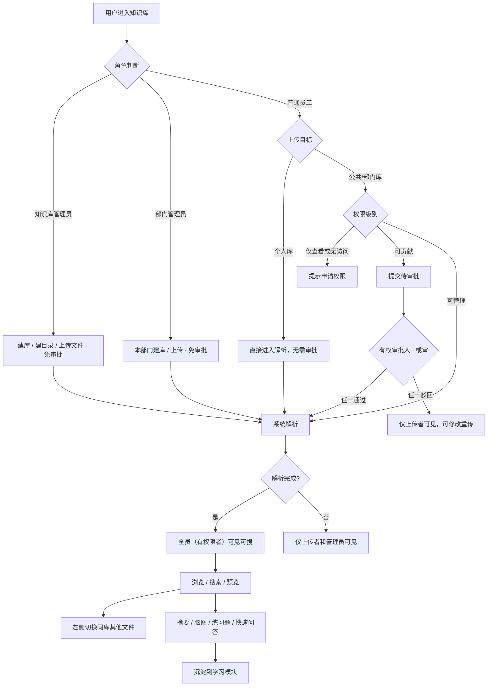


---


### 5.2 阅读动线

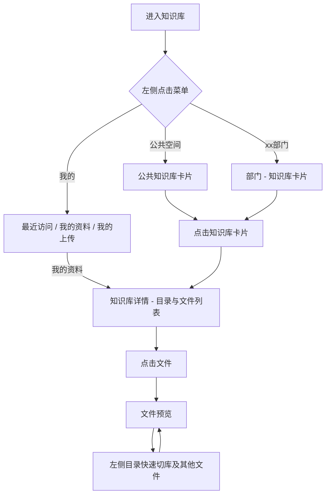


---


### 5.3 文件上传与审批流程

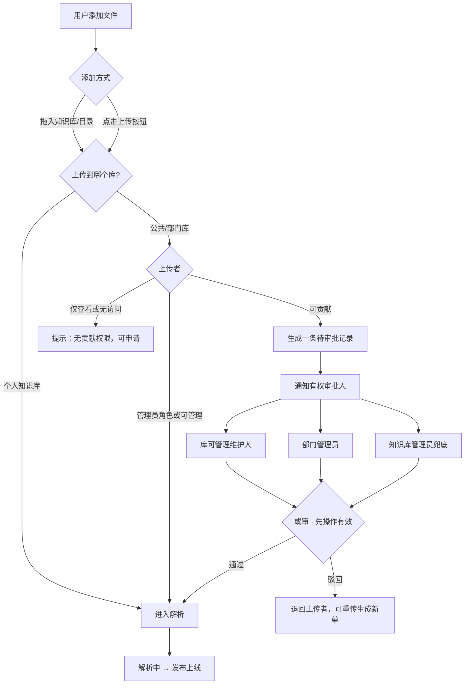


---


### 5.3.1 上传审批或审

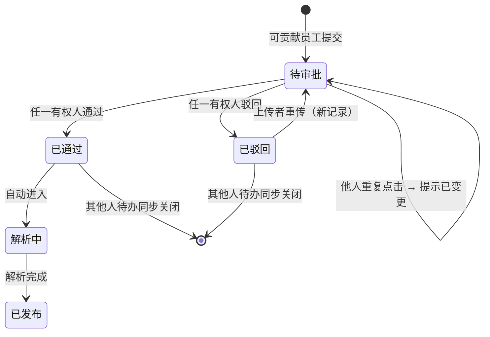


---


### 5.4 文件可见性规则

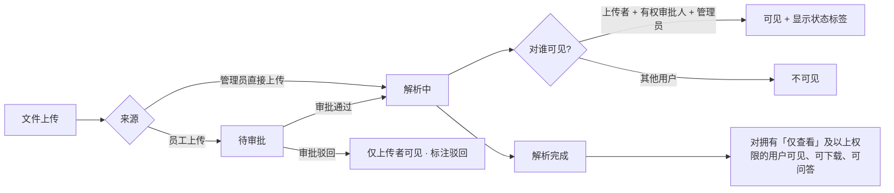


---


### 5.5 普通员工申请知识库权限（权限级别审批）

> 本节为**权限级别**申请审批，与**文件上传**审批（§2.7、§5.3）相互独立。

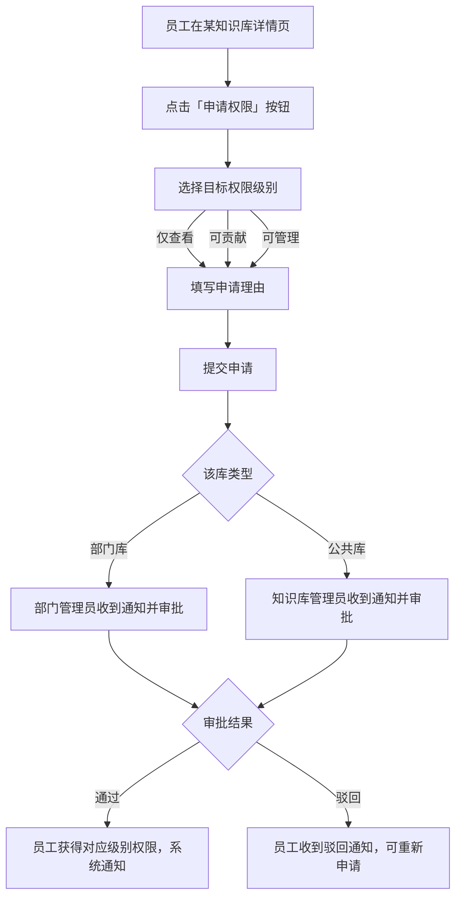


---


### 5.6 创建部门空间

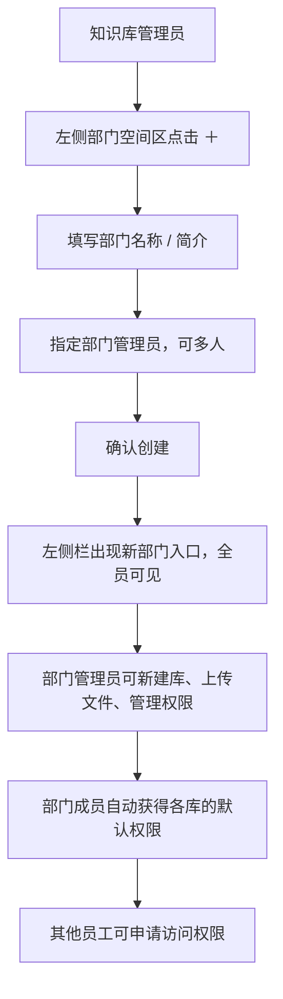


---


### 5.7 同名文件上传（新版本处理）

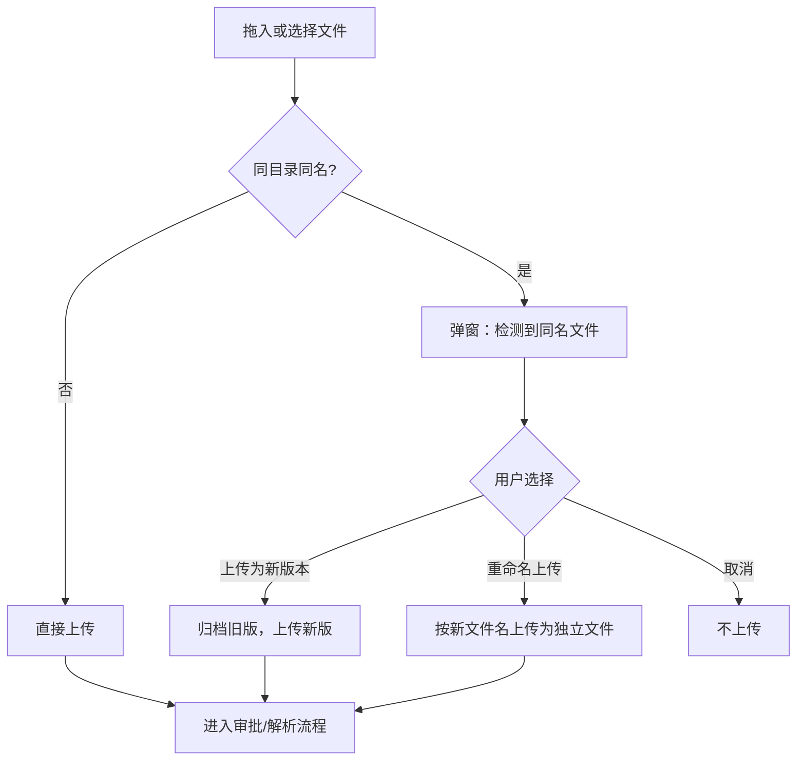


---


### 5.8 查看历史版本与检索规则

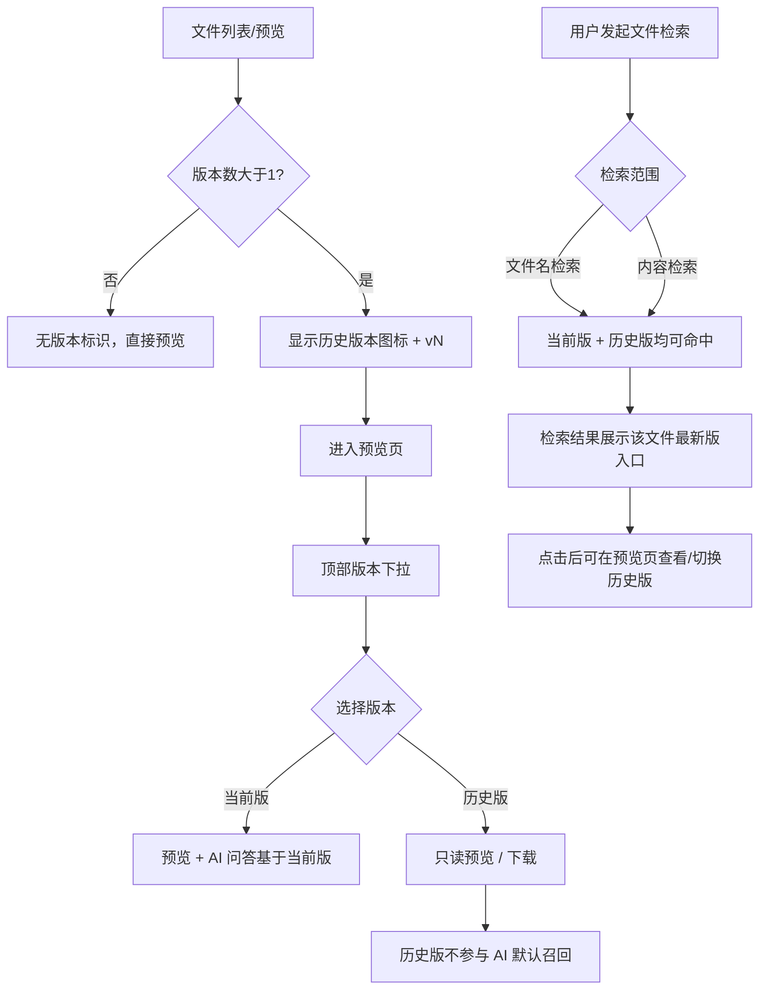


---


### 5.9 审批全流程总览（详细）

> 知识库模块存在两类相互独立的审批，本节以流程图完整串联。实现时共用「待办 + 状态机 + 或审」机制，但业务对象与审批人范围不同。


| 审批类型       | 触发动作                   | 审批对象     | 有权审批人                     | 或审  |
| ---------- | ---------------------- | -------- | ------------------------- | --- |
| **文件上传审批** | 「可贡献」员工向部门库/公共库上传或移动文件 | 待发布的文件   | 库可管理维护人、部门管理员、知识库管理员（见下图） | ✅   |
| **权限级别审批** | 员工在库详情点击「申请权限」         | 权限级别变更申请 | 部门库→部门管理员；公共库→知识库管理员      | ✅   |


#### 5.9.1 文件上传审批全流程

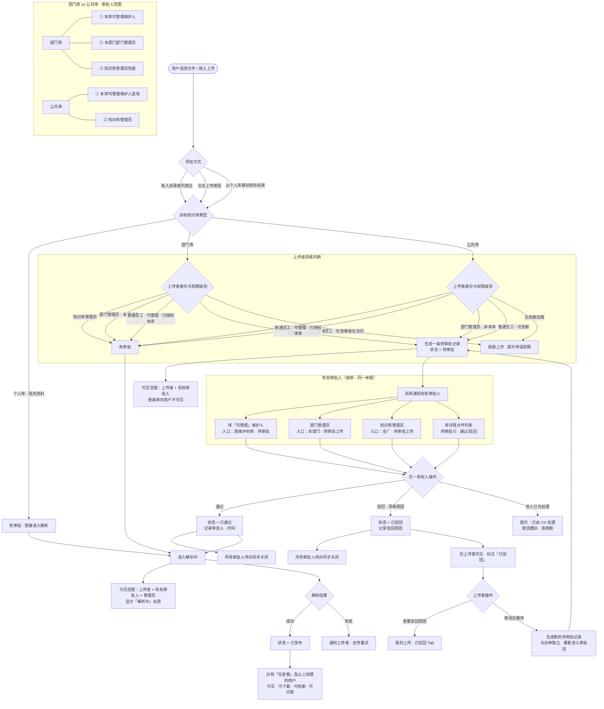


#### 5.9.2 权限级别申请审批流程

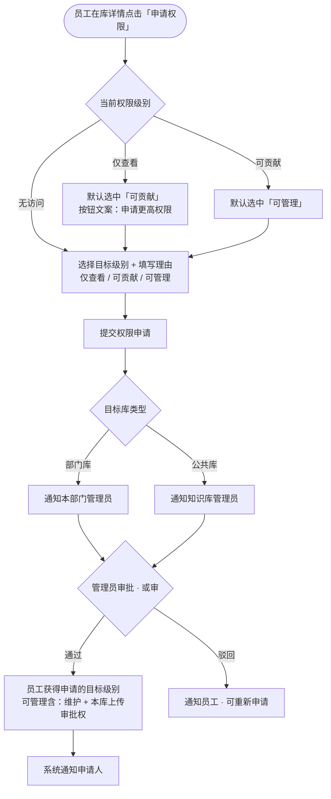


#### 5.9.4 审批场景速查


| 场景                    | 是否审批 | 审批人                   | 结案规则 |
| --------------------- | ---- | --------------------- | ---- |
| 个人库上传                 | ❌    | —                     | 直接解析 |
| 部门管理员上传本部门库           | ❌    | —                     | 直接解析 |
| 可管理员工上传已授权本库          | ❌    | —                     | 直接解析 |
| 可贡献员工上传部门库            | ✅    | 库维护人 / 部门管理员 / 知识库管理员 | 或审   |
| 可贡献员工上传公共库            | ✅    | 库维护人（若有）/ 知识库管理员      | 或审   |
| 个人库文件移动到目标库（上传者有可贡献权） | ✅    | 同上                    | 或审   |
| 个人库文件移动到目标库（上传者有可管理权） | ❌    | —                     | 直接解析 |
| 员工申请「可贡献」权限           | ✅    | 部门库→部门管理员；公共库→知识库管理员  | 或审   |
| 员工申请「可管理」权限           | ✅    | 同上（建议重点审核）            | 或审   |


---

