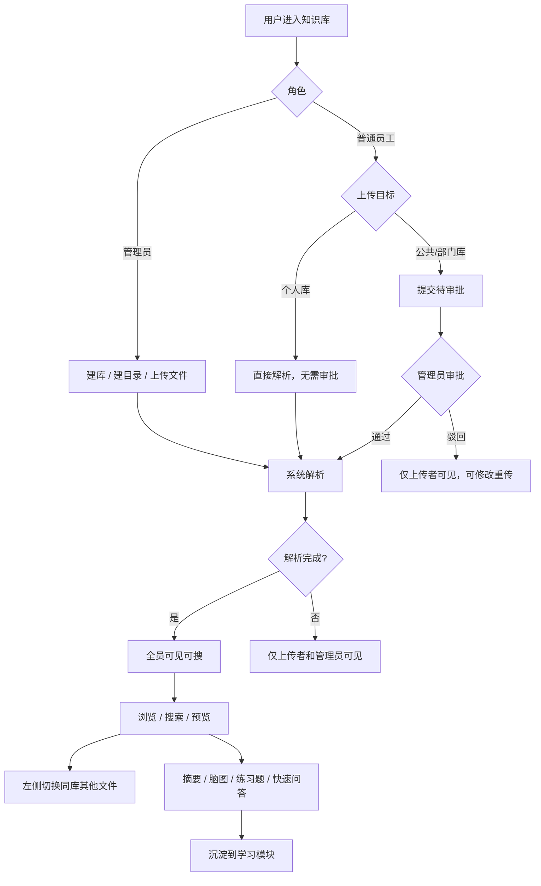
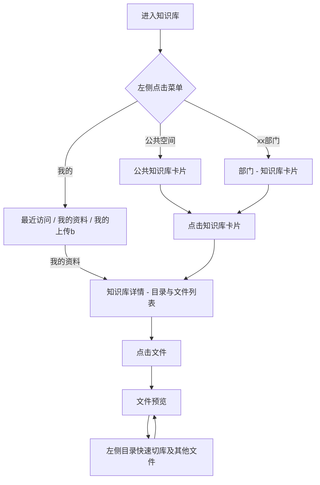
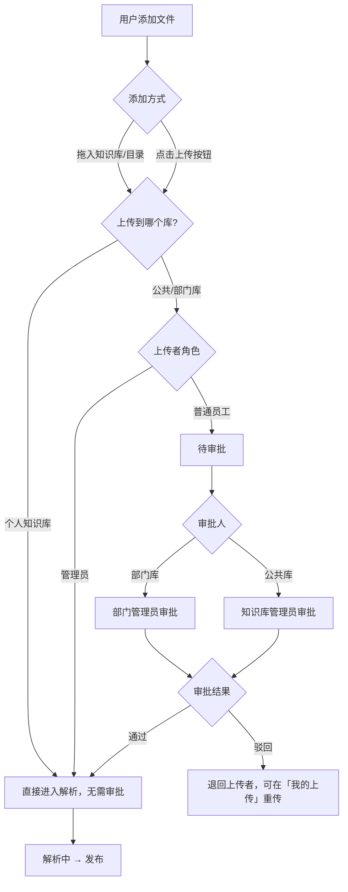
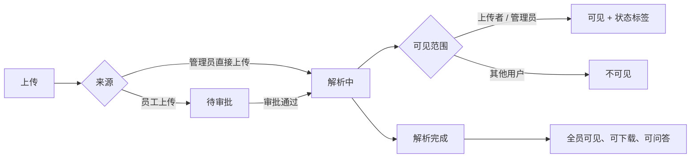
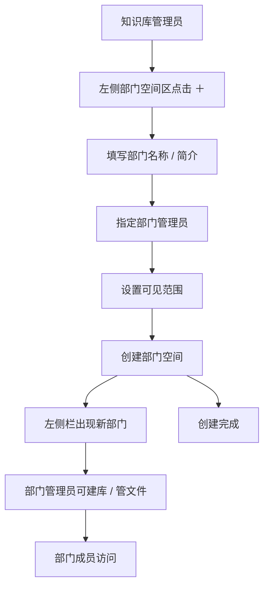
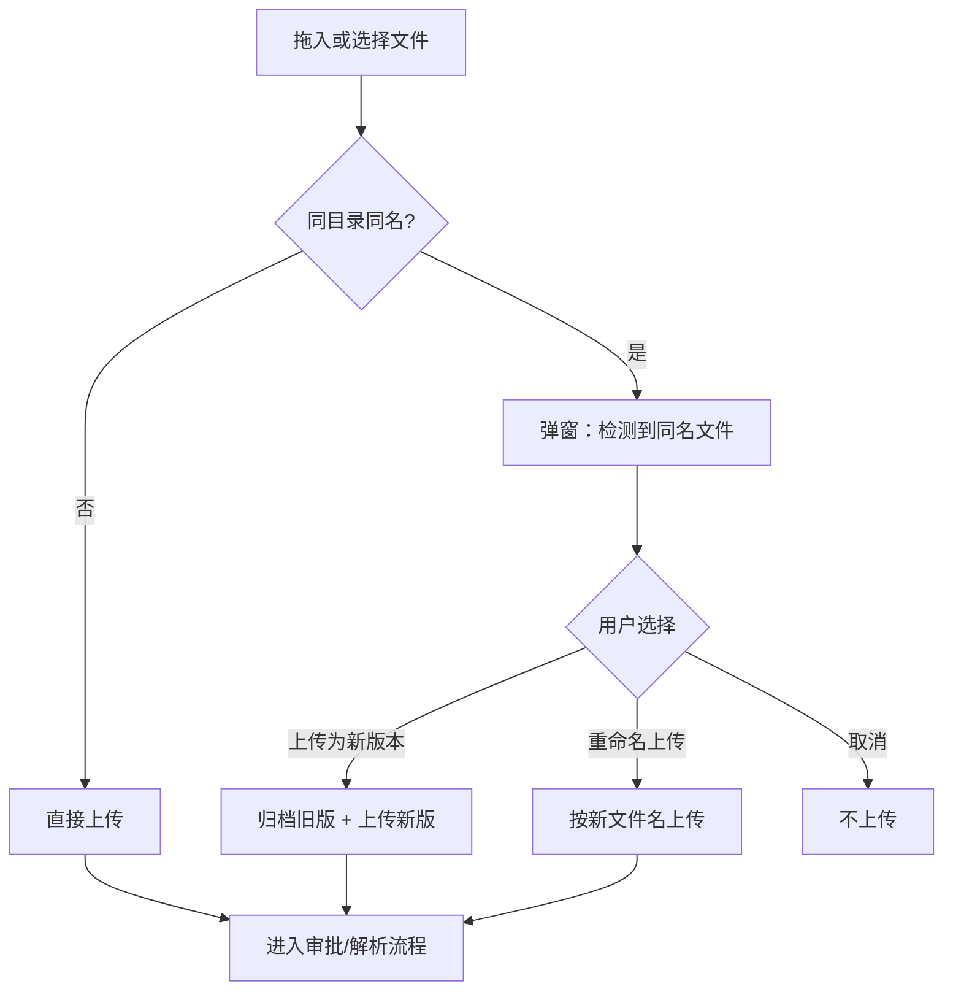
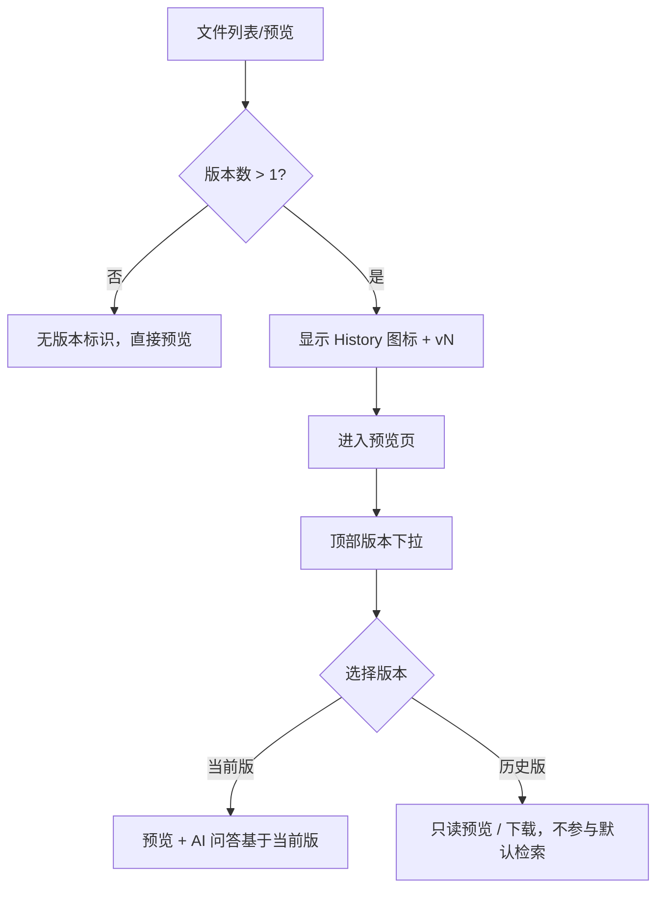

---

> **日期**：2026-07-02

---

## 一、建设内容

1. **导航简化**：「我的（含个人知识库）+ 公共空间 + 部门空间(平铺列表)」
2. **层级清晰**：空间（公共 / 部门 / 个人）→ 知识库 → 库内目录 → 文件 → 预览
3. **预览可切换**：阅读文件时，左侧展示当前库内目录与文件，可快速切换相邻文档
4. **知识库可切换**：阅读文件时，左侧顶部可切换当前部门下其他知识库
5. **状态可见**：解析中 / 待审批文件仅上传者和管理员可见，普通用户只看已发布内容
6. **权限分层**：知识库管理员、部门管理员、普通员工三类角色
7. **部门可建**：知识库管理员可创建部门空间，指定部门管理员
8. **我的**：个人知识库、我的上传均归入「我的」，左侧不再单独设「个人空间」
9. **拖入即上传**：支持将文件直接拖入某个知识库或库内目录，无需先点「上传」按钮，交互贴近 Windows 资源管理器的拖放习惯
10. **多版本留存**：同一文件可保留多个历史版本（如 2023 版 / 2024 版规程），列表只展示当前版，可查看与下载历史版本

---

## 二、整体信息架构

```
知识库模块
│
├── 【一级】入口菜单
│   ├── 我的
│   │   ├── 最近访问（最近库 / 最近文件）
│   │   ├── 我的资料 → 个人知识库
│   │   └── 我的上传 → 公共/部门库的上传审批记录
│   ├── 快速访问（将指定知识库置顶，直达库详情）
│   ├── 公共空间 → 知识库卡片列表（扁平，不套深层目录）
│   └── 部门空间（平铺列表）
│       ├── 运行处
│       ├── 技术处
│       ├── …
│       └── ＋ 新建部门（知识库管理员）
│
├── 【二级】空间主页
│   ├── 公共空间 / 部门空间 → 该空间下知识库
│   └── 我的 （最近访问的库和文件 / 个人知识库 / 我的上传）
│
├── 【三级】知识库详情
│   └── 库内目录 + 文件列表 + 预览
│
├── 【四级】单文件
│   ├── 文件预览（含版本切换）
│   ├── 文件编辑（元数据、标签、分类、版本说明）
│   └── 历史版本列表（查看 / 下载旧版）
│
```

---

## 三、功能模块说明

在页面原型之前，先对各子模块的定位与主要能力做简要说明，便于理解后续示意与流程。

### 3.1 我的

「我的」是员工个人在知识库中的聚合入口，左侧菜单固定可见，包含三个 Tab：

**最近访问**

- 展示最近打开过的知识库与文件，便于从上次阅读位置快速续看
- 点击库名进入库详情，点击文件名直达预览

**我的资料（个人知识库）**

- 仅本人可见的私人资料空间，结构与部门库一致：库内目录 + 文件列表
- 上传**无需审批**，拖入或选择文件后直接进入解析
- 支持新建目录、拖入上传、文件增删改

**我的上传**

- 汇总本人向**公共空间 / 部门空间**提交的上传记录
- 按状态筛选：待审批、解析中、已发布、已驳回
- 驳回文件支持查看原因并**重传**

### 3.2 快速访问

- 员工可将常用知识库**置顶**到左侧「快速访问」区
- 点击后直达该库详情，跳过空间主页的卡片列表
- 适合高频查阅的运行规程库、标准库等

### 3.3 公共空间

- 存放全厂级、跨部门共享的知识库，以**知识库卡片**形式扁平展示
- 卡片展示库名、文件数量、最近更新时间等摘要信息
- 知识库管理员可在公共库进行文件上传/删除/更新
- 普通员工可浏览已发布内容；向公共库上传须**知识库管理员审批**

### 3.4 部门空间

- 按部门平铺展示（如运行处、技术处、调度处），不再套多层目录
- 进入某部门后，展示该部门下全部知识库卡片
- **知识库管理员**可在左侧点击「＋ 新建部门」，填写部门名称、简介、指定部门管理员、设置可见范围
- **部门管理员**负责本部门知识库与文件的日常维护、审批本部门上传
- 部门成员上传文件须**部门管理员审批**（管理员本人上传免审批）

### 3.5 知识库详情

知识库详情是「库内目录 + 文件列表」的管理与浏览页，是进入单文件预览前的核心页面

主要能力：

- 左侧**库内目录树**，右侧**文件列表 / 卡片**；选中目录后列表联动过滤
- **拖入即上传**：文件可直接拖入目录节点或列表区，无需先点上传按钮
- 文件卡片展示名称、类型、更新时间；有多版本时显示**版本角标**
- 列表支持搜索、排序；管理员可新建目录、移动 / 删除文件
- 解析中、待审批文件仅上传者和管理员可见，普通用户只看已发布内容

### 3.6 文件预览

文件预览是知识库的核心阅读场景，采用「左目录 + 中预览 + 右辅助」三栏布局

**左侧：目录与切换**

- 展示当前库内目录与文件，点击可快速切换相邻文档
- 顶部支持**切换当前部门下其他知识库**，无需返回空间主页
- 列表项旁版本图标表示该文件存在历史版本

**中间：预览区**

- 支持 PDF 等格式的在线预览
- 顶部**版本下拉**：查看当前版与历史版本，历史版可只读预览 / 下载
- 管理员可从此处进入文件编辑

**右侧：辅助面板**

- 知识点 / 文档概要、思维脑图
- 相关题目、推荐问题（与能力提升学习模块衔接）
- 解析完成后内容可被学习模块引用为「知识资料」

### 3.7 文件上传与版本管理

**上传方式**

- 拖入知识库详情页的目录或列表区
- 点击上传按钮选择本地文件
- 个人库上传免审批；公共 / 部门库按角色走审批或直接解析

**同名文件处理**

- 同库 + 同目录 + 同名时，上传前弹窗确认
- 默认推荐「**上传为新版本**」，保留历史版本，新版解析后成为当前版
- 也可选择重命名上传或取消；批量拖入时对冲突项逐项处理

**多版本留存**

- 同一逻辑文件可保留多个历史版本（如 2023 版 / 2024 版规程）
- 列表默认展示当前版；历史版不参与默认检索与 AI 问答，但可查看、下载

### 3.8 文件编辑

入口：1.预览页编辑按钮； 2.文件列表的 `⋯` 编辑菜单； 3.文件卡片右键编辑按钮

维护字段：

- 基本信息：文件名称、版本说明、生效日期、文档年份
- 分类与标签：文件分类、文件性质、适用岗位等（RAG 预填 + 人工修改）
- 文档摘要：供检索与学习模块展示

---

## 四、页面示意


### 4.1 知识库主页

```
┌────────────┬─────────────────────────────────────────┐
│            │  运行处 · 部门主页                       |
|  我的      |                [搜索本部门知识库…] 新建  │
│  快速访问  │  ┌─────────┐ ┌─────────┐ ┌─────────┐    │
│ ─────────  │  │ xxxx库  │ │  xxxx库 │ │＋新建库 │    │
│ 公共空间   │  │最近更新… │ │12 个文件│ │         │   │
│ ─────────  │  └─────────┘ └─────────┘ └─────────┘    │
| 部门空间   │                                         │
|  运行处 ◀ │                                         │
│  技术处    │                                         │
│  调度处    │                                         │
│  ＋ 新建   │  ← 仅知识库管理员可见                   │
└────────────┴─────────────────────────────────────────┘
```


### 4.2 库详情页 - 目录预览

```
┌────────────┬─────────────────────────────────────┐
│ 部门名/库名 |                                    │
|  目录/文件  │            文件列表预览区           │
│             │   ┌ ─ ─ ─ ─ ─ ─ ─ ─ ─ ─ ─ ─ ─ ┐   │
│ 📁 目录A ◀ │   │  拖放文件到此处即可上传      │   │
│  · xx文件   │   └ ─ ─ ─ ─ ─ ─ ─ ─ ─ ─ ─ ─ ─ ┘   │
│  · xx文件   │           文件卡片/文件列表         │
│  · xx文件 🕘│  ← 有历史版本时显示版本角标          │
│ 📁 目录B    │                                    │
│  · xx文件   │                                    │
└─────────────┴─────────────────────────────────────┘
```

---


### 4.3 库详情页-文件预览

```
┌──────────────┬─────────────────────────┬─────────────┐
│ 部门名/库名 ˅|  [当前 v3 ▼]  [编辑]   |             |
|  目录/文件   │        PDF 预览区       │ 知识点 /概要  │
│             │                          │  [思维脑图]  │
│ 📁 目录A    │                         │               | 
│  · xx文件 ◀│  ← 列表项旁 🕘 表示有多版本 │              │
│  · xx文件 🕘│                          │  [相关题目]  │
│ 📁 目录B   │                          │  [推荐问题]   │
│  · xx文件  │                           │              │
└────────────┴───────────────────────────┴──────────────┘

预览区顶部「当前 v3 ▼」展开历史版本：
┌────────────────────────────────┐
│ 历史版本                        │
│ ✓ v3 · 2024-06 版  今天  张三   │  ← 当前版
│   v2 · 2023-12 版  2024-01 李四  │  ← 可预览 / 下载
│   v1 · 2023-06 版  2023-07 王五  │
└────────────────────────────────┘

---- ---- ---- ---- 库内快速切换当前部门下其他知识库 ---- ---- ---- ---- 
┌────────────────────────────────┐
│部门名/库名A  ˅                  │
│电气运行部 · 3 个知识库          │
│--------------------------------│
│✓ 库名A                         │
│  12 个文件 · 最近更新 今天      │
│                                │
│ 库名B                          │
│  46 个文件 · 最近更新 昨天      │
│                                │
│ 库名C                          │
│  28 个文件 · 最近更新 3 天前    │
│                                │
│________________________________│

```


### 4.4 新建部门弹窗

```

┌──────────────────────────────────────┐
│  新建部门空间                         │
├──────────────────────────────────────┤
│  部门名称 *                           │
│  [ 运行处                          ] │
│                                      │
│  部门简介                             │
│  [ 本部门运行规程、技术标准…         ] │
│                                      │
│  部门管理员 *                         │
│  [ 搜索并选择人员…                 ▼] │
│  已选：张三、李四                     │
│                                      │
│  可见范围                             │
│  ○ 全员可见                           │
│  ○ 部门内成员可见                      │
│                                      │
│              [取消]  [创建部门]       │
└──────────────────────────────────────┘

```


### 4.5 我的（最近访问 + 个人知识库 + 我的上传）

点击左侧「**我的**」进入

```

┌────────────┬─────────────────────────────────────────┐
│  我的 ◀    │  [ 最近访问 ]  [ 我的资料 ]  [ 我的上传 ] │
│            │─────────────────────────────────────────│
│  我的      │  Tab · 我的资料（默认个人知识库）          │
│  快速访问  │  ┌──────────┬──────────────────────────┐ │
│  公共空间  │  │ 库内目录  │  文件列表                 │ │
│  部门空间  │  │ 📁 工作笔记│  📄 学习摘录.pdf        │ │
│            │  │ 📁 待整理  │  📄 规程草稿.docx      │ │
│            │  │ ＋新建目录 │  [拖入文件上传]         │ │
│            │  └──────────┴──────────────────────────┘ │
│            │──────────────────────────────────────────│
│            │  Tab · 我的上传（上传到公共/部门库的记录）  │
│            │  ┌─────────┬─────────┬─────────┬──────┐  │
│            │  │ 待审批 2│ 解析中 1│ 已发布 8│已驳回│ │  |
│            │  └─────────┴─────────┴─────────┴──────┘  │
│            │  📄 xxxx.pdf   xxx库 · 待审批       │
│            │  📄 xxxx.xlsx  xxx库 · 已驳回 [重传]│
└────────────┴──────────────────────────────────────────┘

```

**个人知识库：**

| 上传至个人库 | 仅本人可见，**无需审批**，上传后直接进入解析；支持拖入目录或文件列表区直接上传 |

---

### 4.6 重复文件上传确认

拖入或选择文件时，若**同库 + 同目录 + 同名**已存在，上传前先弹窗确认：

```

┌──────────────────────────────────────────┐
│  检测到同名文件                           │
├──────────────────────────────────────────┤
│  当前目录已存在：AGC 运行规程.pdf          │
│  当前版本：v2 · 2023-12 版 · 上传于昨天   │
│                                          │
│  请选择处理方式：                         │
│  ● 上传为新版本（推荐）                   │
│    保留历史版本，新版本解析后成为当前版    │
│  ○ 重命名后上传                           │
│    [ AGC 运行规程(1).pdf            ]    │
│  ○ 取消                                   │
│                                          │
│              [取消]  [确认上传]           │
└──────────────────────────────────────────┘

```

| 场景 | 交互 |
| ---- | ---- |
| 拖入单个同名文件 | 立即弹窗，默认选中「上传为新版本」 |
| 批量拖入含多个同名 | 列表展示冲突项，可逐项选择「新版本 / 重命名 / 跳过」 |
| 无冲突 | 直接上传，不弹窗 |


---

### 4.7 文件编辑

入口：1.文件预览页面，编辑按钮； 2.文件列表`⋯`悬浮编辑按钮； 3.文件卡片模式邮件编辑按钮

```

┌──────────────────────────────────────────────────────┐
│  ← 返回预览    编辑文件信息 · AGC 运行规程.pdf        │
├──────────────────────────────────────────────────────┤
│  基本信息                                             │
│  文件名称    [ AGC 运行规程.pdf                    ] │
│  版本说明    [ 2024 年修订版，替代 2023 版          ] │
│  生效日期    [ 2024-06-01 ]   文档年份 [ 2024 ]      │
│                                                      │
│  分类与标签（RAG 可预填，支持人工修改）               │
│  知识分类    [ 调频调压                          ▼] │
│  业务标签    [ AGC ] [ 两细则 ] [ +添加 ]            │
│  适用岗位    [ 值班员 ] [ 值班长 ]                    │
│  文档摘要    [ 本规程规定 AGC 投运前检查…          ]  │
│                                                      │
│              [取消]  [保存]                           │
└──────────────────────────────────────────────────────┘

```


## 五、流程展示


### 5.1 知识库整体使用



### 5.2 阅读动线




### 5.3 文件上传与审批




**拖入上传说明：**

- 可将本地文件直接拖入**知识库详情页**的目录树节点或右侧文件列表区，松手即开始上传
- 拖入目录节点时，文件落入该目录；拖入列表空白区时，落入当前选中目录
- 不强制用户先点「上传」再选文件，降低操作步骤， 贴合windows桌面文件管理习惯

### 5.4 文件可见性




### 5.5 创建部门空间




---

### 5.6 同名文件上传（新版本）




---

---

### 5.7 查看历史版本




---

## 六、权限体系

### 6.1 角色定义


| 角色         | 管理范围              | 部门空间     | 知识库      | 文件                     | 审批          |
| ---------- | ----------------- | -------- | -------- | ---------------------- | ----------- |
| **知识库管理员** | 公共空间 + 全部部门       | 新建、编辑、停用 | 新建、编辑、删除 | 上传、编辑、删除、移动、**版本管理**   | 审批公共库及各部门文件 |
| **部门管理员**  | 本部门               | —        | 新建、编辑、删除 | 上传、编辑、删除、移动、**版本管理**   | 审批本部门文件     |
| **普通员工**   | 有访问权限的库 + **个人库** | —        | —        | 部门空间上传、查看；**个人库可增删改**； | —           |


> - **知识库管理员**  管理公共空间和各部门知识库，可创建部门空间
> - **部门管理员**     由知识库管理员在创建/编辑部门时指定；仅限本部门，不能操作其他部门或公共空间
> - **普通员工**       不能建部门、建库；可向公共/部门库上传，须审批 ； 个人库可对文件增删改,免审批
> - 管理员向公共/部门库上传的文件**无需审批**，直接进入解析队列

### 6.2 可见范围


| 角色     | 可见内容                               |
| ------ | ---------------------------------- |
| 知识库管理员 | 全部文件（含待审批、解析中、解析失败）                |
| 部门管理员  | 本部门全部文件（含待审批、解析中、解析失败）             |
| 普通员工   | 已发布文件 + 本人上传中的文件（待审批 / 解析中 / 解析失败） |


---

