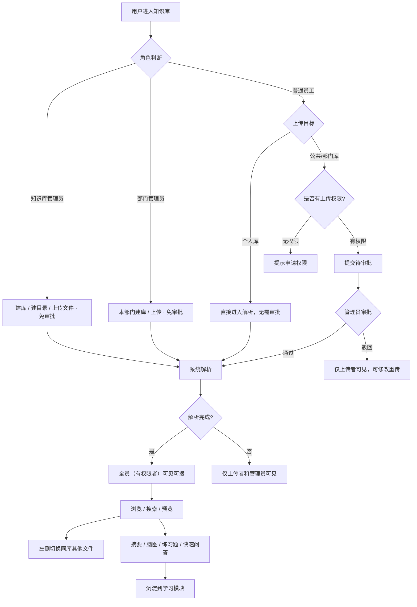
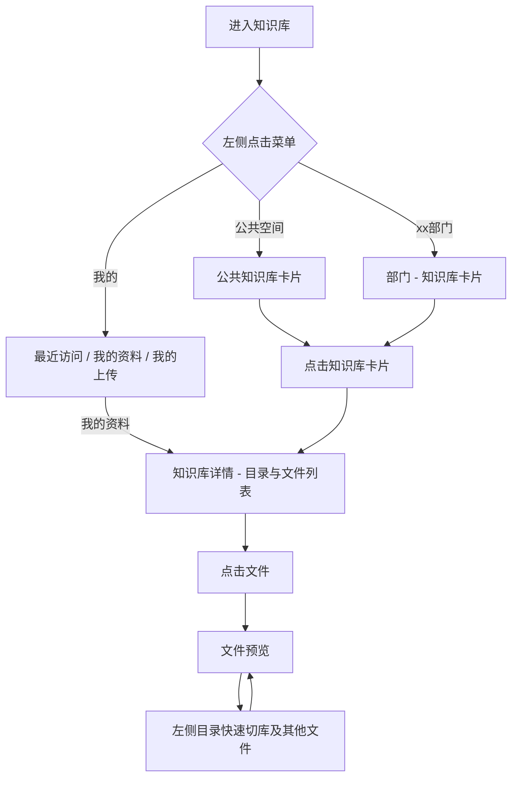
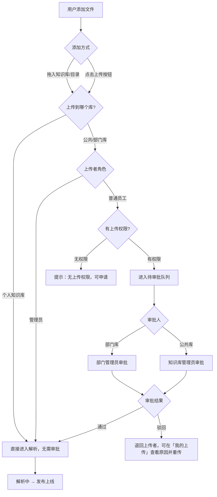
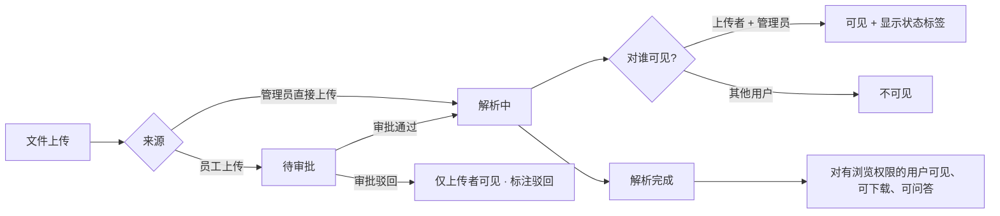
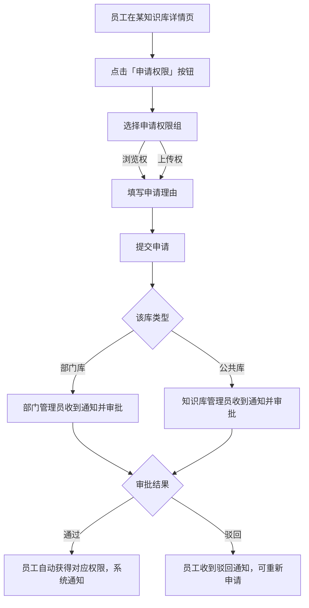
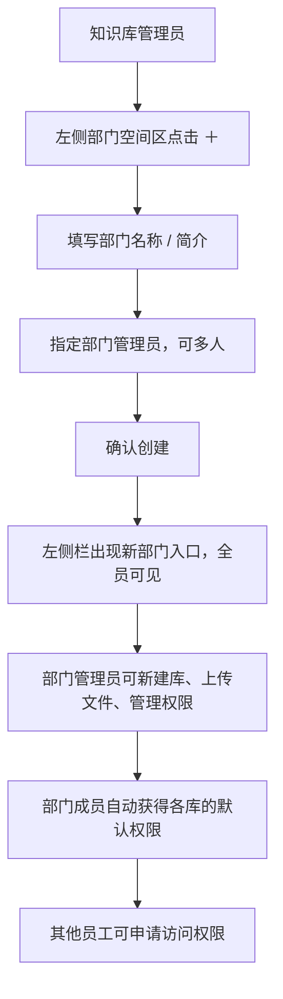
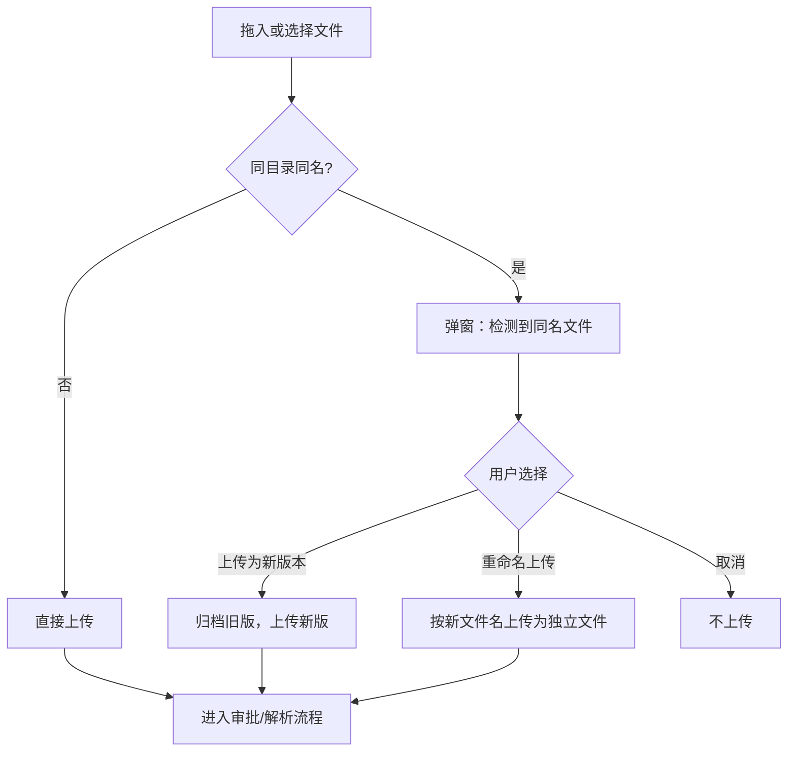
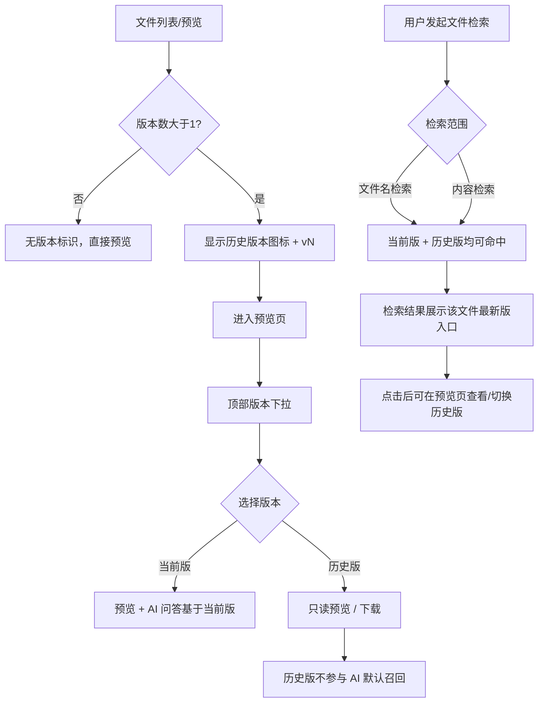

# 知识库模块需求设计说明

> **版本**：v0.3 · 2025-07-03 · 根据 0703 内部 UI 评审会议更新  
> **变更重点**：权限体系重新梳理（三层权限模型 + 权限矩阵）、新建部门去除「可见范围」、历史版本检索规则补充

---

## 一、建设内容

1. **导航简化**：「我的（含个人知识库）+ 公共空间 + 部门空间（平铺列表）」
2. **层级清晰**：空间（公共 / 部门 / 个人）→ 知识库 → 库内目录 → 文件 → 预览
3. **文件快速切换**：阅读文件时，左侧展示当前库内目录与文件，可快速切换相邻文档
4. **知识库快速切换**：阅读文件时，左侧顶部可切换当前部门下其他知识库
5. **状态可见**：解析中 / 待审批文件仅上传者和管理员可见，普通用户只看已发布内容
6. **我的**：个人知识库、我的上传
7. **拖入即上传**：支持将文件直接拖入某个知识库或库内目录，无需先点「上传」按钮，交互贴近 Windows 资源管理器的拖放习惯
8. **多版本留存**：同一文件可保留多个历史版本（如 2023 版 / 2024 版规程），列表只展示当前版，可查看与下载历史版本

---

## 二、用户角色与权限体系

### 2.1 角色定义

系统共有三种角色，权限从高到低依次为：

| 角色 | 说明 | 管理范围 |
|------|------|----------|
| **知识库管理员** | 系统最高权限，由平台超管指定 | 公共空间 + 全部部门空间 |
| **部门管理员** | 由知识库管理员创建部门时指定，可同时指定多人 | 仅限本部门 |
| **普通员工** | 全体员工的默认角色 | 个人库 + 有权限的知识库 |

---

### 2.2 权限体系：三层模型

知识库的权限分为三个层次，从外到内依次控制：

```
层次 1：【空间可见性】谁能看到哪个部门/空间的入口
层次 2：【知识库权限】对某个知识库本身（新建、编辑、停用等管理操作）
层次 3：【文件操作权限】进入知识库后，对文件的具体操作
```

> 📌 **核心原则**：文件操作权限**绑定在单个知识库上**，不是按部门统一分配。
> 同一名员工，可能对 A 知识库有上传权限，对 B 知识库只有查看权限。

---

### 2.3 文件操作权限分组

为了降低权限配置的复杂度，将文件操作权限合并为 **3 个权限组**：

| 权限组 | 包含操作 | 说明 |
|--------|----------|------|
| **浏览组**（查看 + 下载） | 在线预览、下载文件 | 有浏览权就能下载，不单独拆分 |
| **上传组** | 上传文件到该库 | 普通员工是否需要审批取决于该库的配置 |
| **管理组**（编辑 + 删除 + 移动） | 修改文件信息/元数据、删除文件、在库内移动文件 | 固定仅限管理员，不对外开放配置 |

---

### 2.4 各角色权限矩阵

#### ▌ 空间层与知识库管理权限

| 操作 | 知识库管理员 | 部门管理员 | 普通员工 |
|------|:-----------:|:---------:|:-------:|
| 新建部门空间 | ✅ | ❌ | ❌ |
| 在公共空间新建知识库 | ✅ | ❌ | ❌ |
| 在本部门新建知识库 | ✅ | ✅ | ❌ |
| 编辑/停用任意知识库 | ✅ | 仅限本部门 | ❌ |
| 查看全部部门入口 | ✅ | ✅（全部可见，但只能管本部门） | ✅（全部可见） |

> 📌 **说明**：部门入口对全员可见，所有人都能看到有哪些部门。但进入某个知识库后能做什么操作，由该知识库的文件权限控制。

#### ▌ 文件操作权限：普通员工

普通员工在不同库的文件操作权限如下（权限来源见 2.5）：

| 知识库类型 | 浏览（查看+下载） | 上传 | 管理（编辑/删除/移动） |
|------------|:-----------------:|:----:|:---------------------:|
| **个人库**（我的资料） | ✅ | ✅ 免审批 | ✅ | 
| **所属部门库**（默认） | ✅ | ✅ 需审批 | ❌ |
| **其他部门库**（申请/授权） | 按授权的权限组 | 按授权的权限组 | ❌ |
| **公共空间库** | ✅（公开可浏览） | ✅ 需知识库管理员审批 | ❌ |

#### ▌ 文件操作权限：管理员

| 知识库类型 | 浏览 | 上传 | 管理（编辑/删除/移动） | 审批他人上传 |
|------------|:----:|:----:|:---------------------:|:------------:|
| **知识库管理员**（任意库） | ✅ | ✅ 免审批 | ✅ | ✅ 公共库 + 各部门 |
| **部门管理员**（本部门库） | ✅ | ✅ 免审批 | ✅ | ✅ 仅本部门 |
| **部门管理员**（其他库） | ✅（浏览） | ❌或按申请 | ❌ | ❌ |

---

### 2.5 普通员工如何获得知识库权限

员工对某知识库的权限，通过以下三种方式获取：

```
方式 1：自动获得（所属部门库的默认权限）
  └─ 部门管理员在创建知识库时，可为「本部门成员」设置默认权限
     如：默认给所有成员「浏览组」权限
     部门成员无需申请，加入部门即自动拥有

方式 2：管理员主动授权
  └─ 部门管理员或知识库管理员可以手动为指定员工授予更高权限
     如：将某员工的权限从「浏览」升级为「浏览 + 上传」

方式 3：员工主动申请
  └─ 员工可在任意知识库详情页点击「申请权限」
     填写申请权限组（浏览 / 上传）和申请理由
     由该库所属的管理员审批（部门库→部门管理员，公共库→知识库管理员）
```

---

### 2.6 上传是否需要审批

上传文件的审批规则，由**员工角色 × 目标知识库**共同决定：

| 上传者 | 上传到个人库 | 上传到部门库 | 上传到公共库 |
|--------|:-----------:|:-----------:|:-----------:|
| 知识库管理员 | 免审批 | 免审批 | 免审批 |
| 部门管理员 | 免审批 | 本部门库免审批；其他部门库需审批 | 需知识库管理员审批 |
| 普通员工（有上传权限） | 免审批 | 需部门管理员审批 | 需知识库管理员审批 |
| 普通员工（无上传权限） | 免审批 | ❌ 无权限 | ❌ 无权限 |

> 📌 **有上传权限 ≠ 免审批**：员工对部门库有上传权限，仍需管理员审批后才发布。审批的目的是保证内容质量，而不是限制操作入口。

---

### 2.7 文件移动与跨库分享

员工将个人库的内容分享到部门/公共库时，操作方式为：

- 支持将个人库文件**移动**到有上传权限的部门库或公共库
- 移动后，该文件进入目标库的**审批队列**，审批通过后对库内成员可见
- **移动**：文件从个人库消失，出现在目标库（适合正式归档）
- **复制**（本期视技术可行性）：个人库保留一份，目标库也有一份

---

### 2.8 架构概览

```
知识库模块
│
├── 【一级】入口菜单
│   ├── 我的
│   │   ├── 最近访问（最近库 / 最近文件）
│   │   ├── 我的资料 → 个人知识库
│   │   └── 我的上传 → 公共/部门库的上传审批记录
│   ├── 快速访问（将指定知识库置顶，直达库详情）
│   ├── 公共空间 → 知识库卡片列表（扁平，不套深层目录）
│   └── 部门空间（平铺列表，全员可见各部门入口）
│       ├── 运行处
│       ├── 技术处
│       ├── 调度处
│       ├── …
│       └── ＋ 新建部门（仅知识库管理员可见）
│
├── 【二级】空间知识库主页
│   ├── 公共空间 / 部门空间 → 该空间下知识库卡片
│   └── 我的（最近访问的库和文件 / 个人知识库 / 我的上传记录）
│
└── 【三级】知识库详情
    └── 库内目录 + 文件列表 + 预览
```

---

## 三、功能模块说明

### 3.1 我的

「我的」是员工个人在知识库中的聚合入口，左侧菜单固定可见，包含三个 Tab：

**最近访问**

- 展示最近打开过的知识库与文件，便于从上次阅读位置快速续看
- 点击库名进入库详情，点击文件名直达预览

**我的资料（个人知识库）**

- 仅本人可见的私人资料空间，结构与部门库一致：库内目录 + 文件列表
- 上传**无需审批**，拖入或选择文件后直接进入解析
- 支持新建目录、拖入上传、文件增删改
- 可将文件移动到有权限的部门/公共库（移动后进入审批流）

**我的上传**

- 汇总本人向**公共空间 / 部门空间**提交的上传记录
- 按状态筛选：待审批、解析中、已发布、已驳回
- 驳回文件支持查看原因并**重传**

---

### 3.2 快速访问

- 员工可将常用知识库**置顶**到左侧「快速访问」区
- 点击后直达该库详情，跳过空间主页的卡片列表
- 适合高频查阅的库

---

### 3.3 公共空间

- 存放全厂级、跨部门共享的知识库，以**知识库卡片**形式扁平展示
- 卡片展示库名、文件数量、最近更新时间等摘要信息
- 知识库管理员可在公共库进行文件上传 / 删除 / 更新（免审批）
- 普通员工可浏览已发布内容；向公共库上传须**知识库管理员审批**

---

### 3.4 部门空间

- 按部门平铺展示（如运行处、技术处、调度处），**全员可见所有部门入口**
- 进入某部门后，展示该部门下全部知识库卡片
- 各知识库有独立的权限配置，控制员工对该库可做的操作
- **知识库管理员**可在左侧点击「＋ 新建部门」，填写部门名称、指定部门管理员
- **部门管理员**负责本部门知识库与文件的日常维护、审批本部门上传
- 部门成员上传文件须**部门管理员审批**（管理员本人上传免审批）

---

### 3.5 知识库详情

知识库详情是「库内目录 + 文件列表」的管理与浏览页，是进入单文件预览前的核心页面

主要能力：

- 左侧**库内目录树**，右侧**文件列表 / 卡片**；选中目录后列表联动过滤
- **拖入即上传**：文件可直接拖入目录节点或列表区，无需先点上传按钮
- 文件卡片展示名称、类型、更新时间；有多版本时显示**版本角标**
- 列表支持搜索、排序；管理员可新建目录、移动 / 删除文件
- 解析中、待审批文件仅上传者和管理员可见，普通用户只看已发布内容
- 员工可点击「**申请权限**」按钮提交权限申请（浏览 / 上传）

---

### 3.6 文件预览

文件预览是知识库的核心阅读场景，采用「左目录 + 中预览 + 右辅助」三栏布局

**左侧：目录与切换**

- 展示当前库内目录与文件，点击可快速切换相邻文档
- 顶部支持**切换当前部门下其他知识库**，无需返回空间主页
- 列表项旁版本图标表示该文件存在历史版本

**中间：预览区**

- 支持 PDF 等格式的在线预览
- 顶部**版本下拉**：查看当前版与历史版本，历史版可只读预览 / 下载
- 管理员可从此处进入文件编辑

**右侧：辅助面板**

- 知识点 / 文档概要、思维脑图
- 相关题目、推荐问题（与能力提升学习模块衔接）
- 解析完成后内容可被学习模块引用为「知识资料」

---

### 3.7 文件上传与版本管理

**上传方式**

- 拖入知识库详情页的目录或列表区
- 点击上传按钮选择本地文件；支持**批量选择**（多文件或多文件拖入）
- 个人库上传免审批；公共 / 部门库按角色与权限走审批或直接解析

**同名文件处理**

- 同库 + 同目录 + 同名时，上传前弹窗确认
- 默认推荐「**上传为新版本**」，保留历史版本，新版解析后成为当前版
- 也可选择重命名上传或取消；批量拖入时对冲突项逐项处理

**多版本留存**

- 同一逻辑文件可保留多个历史版本（如 2023 版 / 2024 版规程）
- 列表默认展示当前版；历史版不参与**智能问答（RAG）默认召回**
- 历史版本**可被文件检索命中**（文件名或内容均可检索），以满足「精确查找旧版本」场景
- 用户可在预览页顶部版本下拉中切换到历史版，进行只读预览或下载

---

### 3.8 文件编辑

入口：① 预览页编辑按钮；② 文件列表模式的 `⋯` 编辑菜单；③ 文件卡片模式右键编辑按钮

维护字段：

- 基本信息：文件名称、版本说明、生效日期、文档年份
- 分类与标签：文件分类、文件性质、适用岗位等（RAG 预填 + 人工修改）
- 文档摘要：供检索与学习模块展示

> 📌 文件编辑（修改元数据）属于「管理组」权限，仅管理员可操作。

---

## 四、页面示意

### 4.1 知识库主页

```
┌────────────┬─────────────────────────────────────────┐
│            │  运行处 · 部门主页                       |
|  我的      |                [搜索本部门知识库…] 新建  │
│  快速访问  │  ┌─────────┐ ┌─────────┐ ┌─────────┐    │
│ ─────────  │  │ xxxx库  │ │  xxxx库 │ │＋新建库 │    │
│ 公共空间   │  │最近更新… │ │12 个文件│ │         │    │
│ ─────────  │  └─────────┘ └─────────┘ └─────────┘    │
│ 部门空间   │                                         │
│  运行处 ◀  │                                         │
│  技术处    │                                         │
│  调度处    │                                         │
│  ＋ 新建   │  ← 仅知识库管理员可见                   │
└────────────┴─────────────────────────────────────────┘
```

---

### 4.2 库详情页 - 目录预览

```
┌────────────┬─────────────────────────────────────┐
│ 部门名/库名 |                                    │
|  目录/文件  │            文件列表预览区           │
│             │   ┌ ─ ─ ─ ─ ─ ─ ─ ─ ─ ─ ─ ─ ─ ┐   │
│ 📁 目录A ◀ │   │  拖放文件到此处即可上传      │   │
│  · xx文件   │   └ ─ ─ ─ ─ ─ ─ ─ ─ ─ ─ ─ ─ ─ ┘   │
│  · xx文件   │           文件卡片/文件列表         │
│  · xx文件 🕘│  ← 有历史版本时显示版本角标          │
│ 📁 目录B    │                                    │
│  · xx文件   │                    [申请权限]      │
└─────────────┴─────────────────────────────────────┘
```

---

### 4.3 库详情页 - 文件预览

```
┌──────────────┬─────────────────────────┬─────────────┐
│ 部门名/库名 ˅|  [当前 v3 ▼]  [编辑]   |             |
|  目录/文件   │        PDF 预览区       │ 知识点/概要  │
│             │                         │  [思维脑图]  │
│ 📁 目录A    │                         │              │
│  · xx文件 ◀ │  ← 列表项旁 🕘 表示有多版本             │
│  · xx文件 🕘│                         │  [相关题目]  │
│ 📁 目录B    │                         │  [推荐问题]  │
│  · xx文件   │                         │              │
└─────────────┴─────────────────────────┴──────────────┘

预览区顶部「当前 v3 ▼」展开历史版本：
┌────────────────────────────────┐
│ 历史版本                        │
│ ✓ v3 · 2024-06 版  今天  张三  │  ← 当前版（参与 AI 问答）
│   v2 · 2023-12 版  2024-01 李四│  ← 可检索/预览/下载
│   v1 · 2023-06 版  2023-07 王五│  ← 可检索/预览/下载
└────────────────────────────────┘

---- 库名下拉：快速切换当前部门下其他知识库 ----
┌────────────────────────────────┐
│ 部门名/库名A  ˅                 │
│ 电气运行部 · 3 个知识库         │
│────────────────────────────────│
│ ✓ 库名A                        │
│   12 个文件 · 最近更新 今天     │
│                                │
│   库名B                        │
│   46 个文件 · 最近更新 昨天     │
│                                │
│   库名C                        │
│   28 个文件 · 最近更新 3 天前   │
└────────────────────────────────┘
```

---

### 4.4 新建部门弹窗

> 说明：部门入口对全员可见，**无需设置可见范围**（能否访问某库内内容由知识库权限控制，与部门节点无关）

```
┌──────────────────────────────────────┐
│  新建部门空间                         │
├──────────────────────────────────────┤
│  部门名称 *                           │
│  [ 运行处                          ] │
│                                      │
│  部门简介                             │
│  [ 本部门运行规程、技术标准…         ] │
│                                      │
│  部门管理员 *                         │
│  [ 搜索并选择人员…                 ▼] │
│  已选：张三、李四                     │
│                                      │
│              [取消]  [创建部门]       │
└──────────────────────────────────────┘
```

---

### 4.5 知识库权限配置（管理员视角）

部门管理员可对本部门下的单个知识库配置权限：

```
┌──────────────────────────────────────────────────┐
│  权限管理 · 运行处 > AGC 规程库                   │
├──────────────────────────────────────────────────┤
│  默认权限（本部门成员自动获得）                   │
│  ● 浏览（查看 + 下载）       ← 推荐               │
│  ○ 浏览 + 上传                                    │
│  ○ 无权限（成员须单独申请）                        │
│                                                  │
│  指定成员权限                                    │
│  ┌─────────┬──────────────┬────────┐             │
│  │ 成员    │ 权限         │ 操作   │             │
│  ├─────────┼──────────────┼────────┤             │
│  │ 张三    │ 浏览 + 上传  │ [移除] │             │
│  │ 李四    │ 浏览         │ [移除] │             │
│  └─────────┴──────────────┴────────┘             │
│  [ + 添加成员 ]                                   │
│                                                  │
│  待审批申请（2 条）                               │
│  📋 王五 申请「浏览 + 上传」· 理由：参与该库维护  │
│  [通过]  [驳回]                                   │
└──────────────────────────────────────────────────┘
```

---

### 4.6 我的（最近访问 + 个人知识库 + 我的上传）

```
┌────────────┬────────────────────────────────────────────┐
│  我的 ◀    │  [ 最近访问 ]  [ 我的资料 ]  [ 我的上传 ]  │
│            │──────────────────────────────────────────  │
│  我的      │  Tab · 我的资料（默认个人知识库）            │
│  快速访问  │  ┌──────────┬──────────────────────────┐   │
│  公共空间  │  │ 库内目录  │  文件列表                 │   │
│  部门空间  │  │ 📁 工作笔记│  📄 学习摘录.pdf         │   │
│            │  │ 📁 待整理  │  📄 规程草稿.docx        │   │
│            │  │ ＋新建目录 │  [拖入文件上传]  [移动到…]│  │
│            │  └──────────┴──────────────────────────┘   │
│            │────────────────────────────────────────────│
│            │  Tab · 我的上传（上传到公共/部门库的记录）  │
│            │  [ 待审批 2 ][ 解析中 1 ][ 已发布 8 ][ 已驳回 ] │
│            │  📄 xxxx.pdf   xxx库 · 待审批              │
│            │  📄 xxxx.xlsx  xxx库 · 已驳回  [查看原因][重传]│
└────────────┴────────────────────────────────────────────┘
```

---

### 4.7 重复文件上传确认

拖入或选择文件时，若**同库 + 同目录 + 同名**已存在，上传前先弹窗确认：

```
┌──────────────────────────────────────────┐
│  检测到同名文件                           │
├──────────────────────────────────────────┤
│  当前目录已存在：AGC 运行规程.pdf          │
│  当前版本：v2 · 2023-12 版 · 上传于昨天   │
│                                          │
│  请选择处理方式：                         │
│  ● 上传为新版本（推荐）                   │
│    保留历史版本，新版本解析后成为当前版    │
│  ○ 重命名后上传                           │
│    [ AGC 运行规程(1).pdf            ]    │
│  ○ 取消                                   │
│                                          │
│              [取消]  [确认上传]           │
└──────────────────────────────────────────┘
```

| 场景 | 交互方式 |
|------|----------|
| 拖入单个同名文件 | 立即弹窗，默认选中「上传为新版本」 |
| 批量拖入含多个同名 | 列表展示冲突项，可逐项选择「新版本 / 重命名 / 跳过」 |
| 无冲突 | 直接上传，不弹窗 |

---

### 4.8 文件编辑

入口：① 文件预览页面编辑按钮；② 文件列表 `⋯` 悬浮编辑菜单；③ 文件卡片模式右键编辑按钮

```
┌──────────────────────────────────────────────────────┐
│  ← 返回预览    编辑文件信息 · AGC 运行规程.pdf        │
├──────────────────────────────────────────────────────┤
│  基本信息                                             │
│  文件名称    [ AGC 运行规程.pdf                    ]  │
│  版本说明    [ 2024 年修订版，替代 2023 版          ]  │
│  生效日期    [ 2024-06-01 ]   文档年份 [ 2024 ]       │
│                                                      │
│  分类与标签（AI 可预填，支持人工修改）                │
│  知识分类    [ 调频调压                          ▼]  │
│  业务标签    [ AGC ] [ 两细则 ] [ +添加 ]             │
│  适用岗位    [ 值班员 ] [ 值班长 ]                    │
│  文档摘要    [ 本规程规定 AGC 投运前检查…          ]   │
│                                                      │
│              [取消]  [保存]                           │
└──────────────────────────────────────────────────────┘
```

---

## 五、流程展示

### 5.1 知识库整体使用流程



---

### 5.2 阅读动线



---

### 5.3 文件上传与审批流程



---

### 5.4 文件可见性规则



---

### 5.5 普通员工申请知识库权限



---

### 5.6 创建部门空间



---

### 5.7 同名文件上传（新版本处理）



---

### 5.8 查看历史版本与检索规则



---
