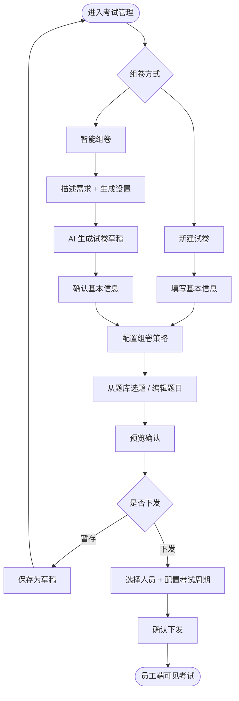
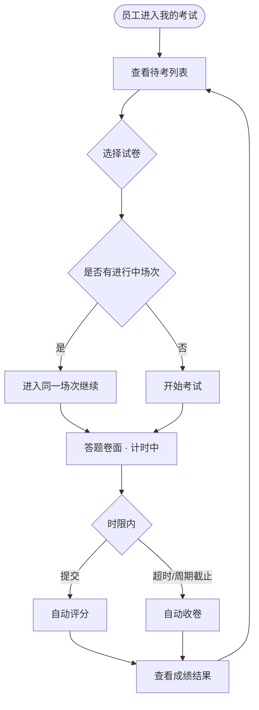
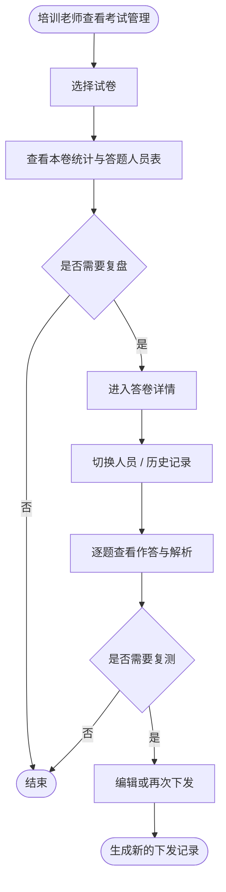

# 能力提升 - 考试管理模块需求说明

## 一、建设内容

- 完成试卷创建、下发、成绩跟踪
- 支持**智能组卷**（自然语言描述 + AI 生成草稿）与**手动组卷**（向导式新建）两条路径
- 试卷按考试目标、专业分类、适用岗位组织，题目来源于正式题库
- 下发后员工在「题库训练 → 我的考试」中作答，培训老师在管理端查看进度

## 二、用户角色

| ---- | ---------------------------------------------------------------- | --- |
| 普通员工 | 查看已下发考试、开始作答、提交答卷、查看本人历史成绩         |     |
| 培训老师 | 智能/手动组卷、编辑试卷、预览、下发、跟踪答题进度、查看答卷详情与错题分析 |     |

## 三、建设范围

### 3.1 高优先级

- 考试管理首页：概览统计、考试列表、选中试卷详情与答题人员表
- 智能组卷：AI 起草 → 基本信息 → 组卷策略 → 下发设置（四步向导）
- 新建试卷：基本信息 → 组卷策略 → 下发设置（三步向导）
- 编辑试卷：题目配置 + 试卷基本信息侧栏，支持暂存与保存并下发
- 试卷预览：只读卷面预览，草稿状态可直接下发
- 试卷下发：按姓名/班组/岗位筛选人员，批量选择下发对象，配置考试周期（开始/截止时间）
- 答卷详情：本卷人员导航 + 逐题作答回顾，支持多次下发记录切换
- 员工端我的考试：待考列表、历史记录、进入答题卷面（不支持暂存，须限时内提交）

### 3.2 暂缓

- 每人独立卷面、题目乱序、防作弊策略
- 逾期未答提醒推送（截止前 N 小时/天消息通知）
- 成绩报表导出、班组/岗位维度对比分析
- 基于错题的自动复测下发
- 历史试卷一键复制组卷
- 与能力画像、学习专题的自动联动推荐
- 案例分析，客观题题暂缓

## 四、功能模块说明

### 4.1 考试管理首页

**顶部概览统计：**

- 试卷总数（含草稿、已结束数量）
- 已下发试卷（进行中数量）
- 累计参考人次（含已完成人次）
- 答题完成率、平均正确率、平均用时

**左侧：考试列表**

- 试卷名称、状态标签（草稿 / 已下发 / 已结束）
- 参与人数、题目数量、创建日期
- 支持按考试名称搜索

**右侧：选中试卷详情**

- 试卷信息：考试目标、时长、下发状态
- 本卷统计：参与人数、完成人数、完成率、平均正确率、平均分、平均用时
- 快捷操作：编辑、下发、预览
- 答题人员表：姓名、班组、岗位、状态、得分、正确率、用时；点击「查看」进入答卷详情

**状态规则：**

- 草稿：已创建但未下发
- 已下发：已配置考试周期并推送给员工，周期内员工可见并可作答
- 已结束：考试周期截止后自动变为已结束；周期内未提交的员工记为「已过期」，不再允许进入作答

### 4.2 新建 / 编辑试卷

**新建试卷（手动路径，三步向导）：**

1. 基本信息：填写试卷名称（必填）、考试目标、分类、适用岗位、时长、及格线、难度、备注
2. 组卷策略：按题型模块组织题目，可从题库选题，支持题型分组排序、单题排序、删除
3. 下发设置：选择人员，配置考试周期下发

**编辑试卷（独立页面）：**

- 试卷基本信息编辑
- 卷面展示，支持对题目上下排序和删除，添加题目
- 顶部操作：返回、暂存试卷、保存试卷并下发

**组卷能力：**

- 支持题型：单选题、多选题、判断题、填空题、简答题
- 题目带来源、知识点标签
- 可从正式题库批量添加题目

### 4.3 智能组卷

通过自然语言描述考试需求，由 AI 生成试卷草稿，生成后仍可人工修改

**步骤 1：AI 起草**

**步骤 2～4：** 复用新建试卷步骤

- 基本信息：调整 AI 预填的试卷字段
- 组卷策略：按题型分组展示题目，可增删换题、调整分值与题目顺序
- 下发设置：选择下发对象，配置考试周期（开始/截止时间），支持「暂存草稿」或「确认下发」

### 4.4 试卷下发

下发按钮位置： 1.新建向导最后一步； 2. 编辑页保存并下发； 3.试卷列表的下发按钮

**下发面板：**

- 按用户名搜索、按班组/岗位筛选
- 人员列表多选，支持全选当前筛选结果
- **考试周期**：配置本次下发的开始时间、截止时间（必填）
- 展示已选人数
- 确认后向选中员工推送考试任务

### 4.5 答卷详情

- 总人数、已交 / 未交统计
- 人员卡片：姓名、班组岗位、状态（未开始 / 进行中 / 已提交 / 已过期）、得分、正确率、下发/提交时间
- 多次下发显示「历史 N 次」标签
- 人员信息与汇总：状态、得分、正确率、用时
- 多次记录 Tab 切换（如「复测」「首次下发」）
- 卷面形式显示，对员工答对/答错的选项进行高亮标记（答对绿色，打错红色）
- 打错的显示解析与资料依据

**统计口径：**

- 平均正确率：每人最新一次答卷中，答对题数 / 总题数，再取平均
- 平均分：每人最新一次答卷实际得分平均值

### 4.6 员工端作答规则

员工在「题库训练 → 我的考试」进入正式考试卷面。

**作答约束：**

- **不支持暂存**：不提供「保存进度」操作，进入卷面后即开始计时，须在答题时限内完成并提交
- 未提交前状态为「进行中」；提交后变为「已提交」，不可再次修改答案
- 考试周期截止后未提交，记为「已过期」

**意外退出：**

- 答题时限内若意外关闭页面，可重新进入**同一场次**继续作答（会话保持，非暂存）
- 答题时限耗尽或考试周期截止，系统自动收卷；已作答部分按客观题计分，未作答不计分

**卷面形态：**

- 左侧题目区 + 右侧答题卡
- 展示剩余答题时间，仅提供「提交答卷」，无暂存入口

## 五、业务流程图

### 5.1 组卷下发流程

### 5.2 员工作答流程

### 5.3 成绩跟踪流程

