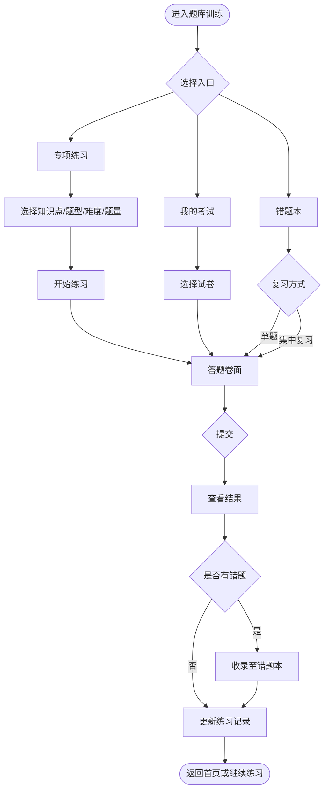

# 能力提升 - 题库训练模块需求说明

## 一、建设内容

- 以「题库训练」作为员工自主练题与巩固的主入口
- 支持**专项练习**：按知识点、题型、难度自由组卷练习
- 支持**我的考试**：承接考试管理下发的正式试卷作答
- 支持**错题本**：练习/考试答错题目自动收录，支持复习与错因查阅
- 练习结果联动错题本与个人沉淀（收藏、笔记）

## 二、用户角色

| 角色   | 主要能力                              |
| ---- | --------------------------------- |
| 普通员工 | 专项练习、参加考试、复习错题、查看练习记录与结果          |
| 培训老师 | 在考试管理侧组卷下发；题库训练侧以员工作答视角为主，不单独设管理端 |

## 三、建设范围

### 3.1 高优先级

- 题库训练首页：训练概览、训练入口、最近练习记录
- 专项练习：知识点多选、题型/难度/题量筛选、组卷预览、开始练习
- 我的考试：待考列表、试卷详情、历史成绩、进入正式考试卷面
- 错题本：错题列表、单题复习、集中复习、查看解析与依据
- 答题卷面：练习 / 考试 / 错题复习三种模式，提交后查看结果
- 练习记录：名称、来源、正确率、错题数，支持查看结果与再练一次

### 3.2 暂缓

- AI 推荐练习、今日智能推荐题单
- 错题掌握程度分级、艾宾浩斯记忆曲线与下次复习日期自动排期（后期一并建设）
- 智能问答生成题单、场景化 AI 组卷
- 能力画像联动推荐、个人成长看板深度分析

## 四、功能模块说明

### 4.1 题库训练首页

**训练概览：**

- 本周答题数、正确率、错题数、连续练习天数
- 错题数可跳转错题本

**训练入口：**

- 专项练习：按知识点定向强化
- 我的考试：培训老师下发的限时测评
- 错题本：错因分析与重复练习

**最近练习记录：**

- 练习名称、来源（专项练习 / 错题本 / 知识学习 / 考试等）
- 完成时间、正确率、错题数
- 操作：查看结果、再练一次（沿用上次筛选条件组卷）

### 4.2 专项练习

员工按条件自由组卷，不依赖 AI 推荐

**筛选条件：**

- 知识点：可多选，展示各知识点可选题数
- 题型：单选、多选、判断、简答（可多选）
- 难度：全部 / 基础 / 进阶
- 题量：5 / 10 / 15 / 20 / 50 /100 题等

**练习规则：**

- 从正式题库中按条件随机抽题
- 支持暂存进度（练习模式）
- 提交后自动判分，答错题目收录至错题本
- 生成一条练习记录

### 4.3 我的考试

承接「考试管理」下发试卷，员工在此作答

**列表与筛选：**

- 试卷名称、状态（未开始 / 已提交）
- 题量、时长、下发时间、考试周期
- 按试卷名称搜索，按状态、考试目标、下发时间筛选

**试卷详情：**

- 题量、时长、及格线、难度、知识范围
- 题型构成、评分规则说明
- 历史考试记录与最高分

**作答规则：**

- 进入卷面后开始计时，**不支持暂存（前端需缓存，防止界面误关）**
- 须在答题时限与考试周期内提交
- 提交后自动评分，答错题目收录至错题本

### 4.4 错题本

练习、考试场景答错的题目，**自动收录**至个人错题本

**列表展示：**

- 题型、知识点标签
- 题干、累计错误次数、最近答错时间
- 查看解析、查依据
- 单题操作：立即复习、收藏、移除

**筛选：**

- 按题型、知识点筛选
- 按最近答错时间排序

**复习方式：**

- **单题复习**：针对某一题进入答题
- **集中复习**：按当前列表范围批量出题复习

**收录规则：**

- 练习、考试答错自动收录；同一题再次答错则更新错误次数与最近答错时间
- 员工可手动从错题本移除

### 4.5 答题卷面与结果

**卷面能力：**

- 左侧题目区 + 右侧答题卡
- 单选 / 多选 / 判断 / 简答（客观题自动判分）
- 提交前可检查未答题

**结果页：**

- 正确率、用时、得分（考试模式）
- 错题列表：题干、正确答案、解析、依据
- 快捷入口：再练一次、返回错题本、返回首页

## 五、业务流程图

### 5.1 员工练题主流程

